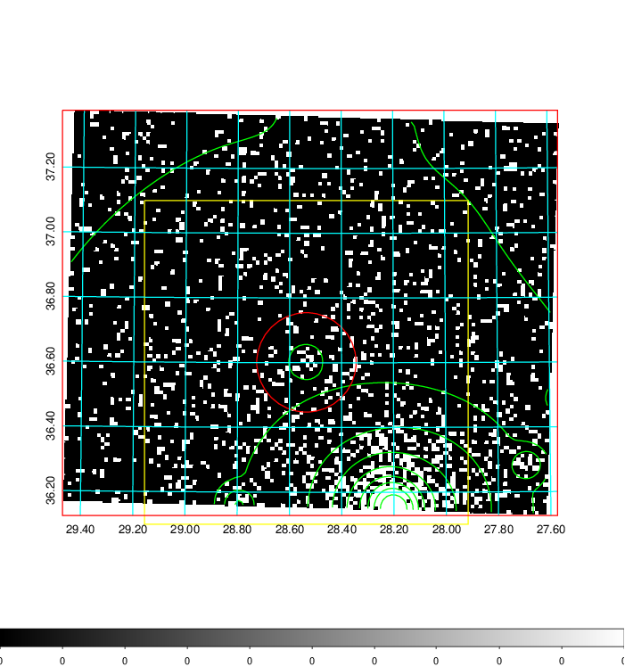
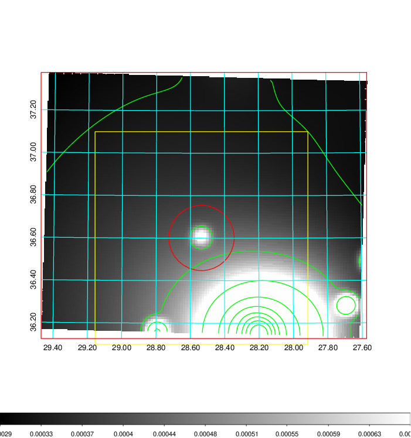
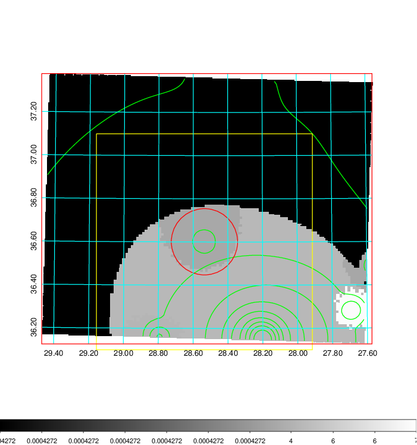
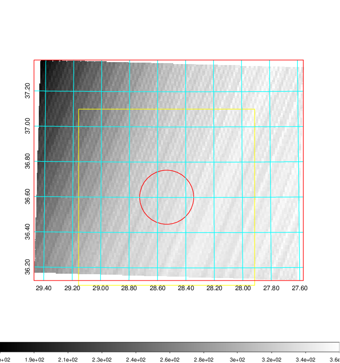
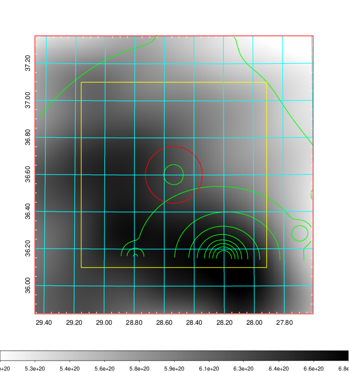
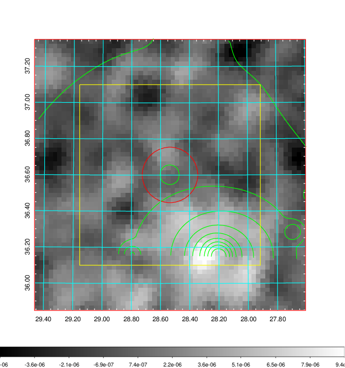
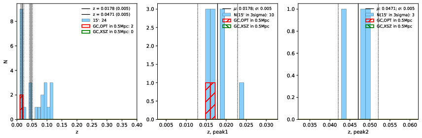
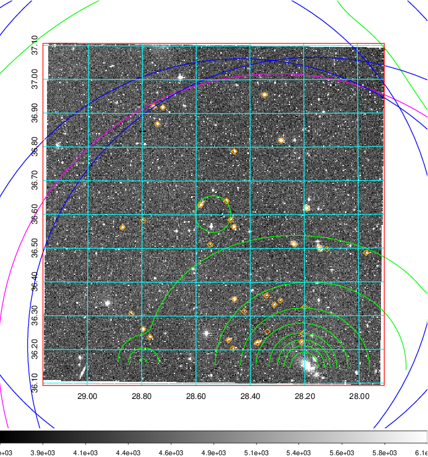
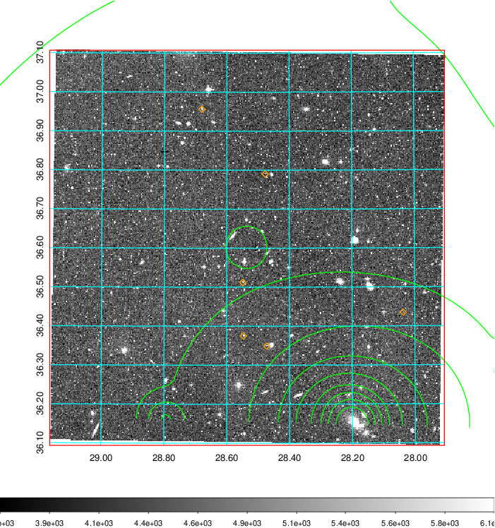
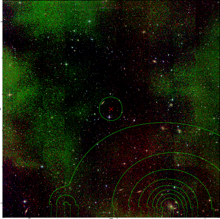

### 91

|Name|RAJ2000[deg]|DEJ2000[deg] |Ext[arcmin]| Ext,ml | z | z_src| C|GC(XSZ,Delta_z<0.01)| GC(OPT,Delta_z<0.01)|GC| R_sig[arcmin] | R500[arcmin] | R500[Mpc]| CRsig[c/s] | CR500[c/s] |L500[1E44 erg/s]|F500[1E-12 erg/s/cm^2]| M500[1E14 Msun]|Tx[keV]|Cnt_sig|Beta|Rc[arcmin]|Comment|Alias|
|---|---|---|---|---|---|------|---|--------|---------|----------|---|---|---|---|---|---|---|---|---|---|---|---|---|---|
|91| 28.535| 36.601| 9.21| 40.29| 0.0178(0.005)| z1, z_opt| S| -| N| N| 40.105| 24.626| 0.534| 0.505(0.123)| 0.474(0.115)| 0.048(0.008)| 6.685(1.062)| 0.44(0.04)| 1.30(0.07)| 968.7| 0.905(-0.120+0.095)| 23.140(-2.853+1.994)| -| t419|

|[RASS image](../image/91/91_img.pdf)|[filtered image](../image/91/91_fil.pdf)|[Segment image](../image/91/91_seg.pdf)|
|-------------------|--------------------|-------------------|
|   |    |   |

|[Exposure image](../image/91/91_mex.pdf)| [nH image](../image/91/91_nh.pdf)| [Planck image](../image/91/91_p.pdf)|
|-------------------|--------------------|-------------------|
|   |     |  |

|[Redshift Histogram](../image/91/91_zg.pdf) | [DSS image(z1)](../image/91/91_dss_z1.pdf)      |  [DSS image(z2)](../image/91/91_dss_z2.pdf)    |
|-------------------|--------------------|-------------------|
| |  Blue circle for optical clusters;  Magenta circle for XSZ clusters;  all with r=1Mpc;  Only GC with Delta_z<0.01 are shown. |  Blue circle for optical clusters;  Magenta circle for XSZ clusters;  all with r=1Mpc;  Only GC with Delta_z<0.01 are shown.  |

|[known Abell/XSZ clusters](../image/91/91_gc.pdf) | [2MASS image](../image/91/91_2mass.pdf)      |
|-------------------|-------------------|
|  Magenta, blue and green circles  for optical, X-ray and SZ clusters  respectively, with redshift of clusters  labelled. The radius of circles  are 1Mpc.|  |

|[PS1 image](../image/91/91_ps1.pdf)            |
|-------------------|
|   |
