

### 911

|Name|RAJ2000[deg]|DEJ2000[deg] |Ext[arcmin]| Ext,ml | z | z_src| C|GC(XSZ,Delta_z<0.01)| GC(OPT,Delta_z<0.01)|GC| R_sig[arcmin] | R500[arcmin] | R500[Mpc]| CRsig[c/s] | CR500[c/s] |L500[1E44 erg/s]|F500[1E-12 erg/s/cm^2]| M500[1E14 Msun]|Tx[keV]|Cnt_sig|Beta|Rc[arcmin]|Comment|Alias|
|---|---|---|---|---|---|------|---|--------|---------|----------|---|---|---|---|---|---|---|---|---|---|---|---|---|---|
|911| 346.058| 20.097| 4.19| 45.49| 0.0369(0.005)| z1, z_opt| S| -| N, W| F20, N, SPI, W| 9.775| 12.412| 0.546| 0.124(0.030)| 0.130(0.031)| 0.061(0.011)| 1.933(0.342)| 0.48(0.04)| 1.37(0.08)| 66.8| 0.805(-0.164+0.135)| 5.816(-1.594+1.227)| -| t211|

|[RASS image](../image/911/911_img.pdf)|[filtered image](../image/911/911_fil.pdf)|[Segment image](../image/911/911_seg.pdf)|
|-------------------|--------------------|-------------------|
| 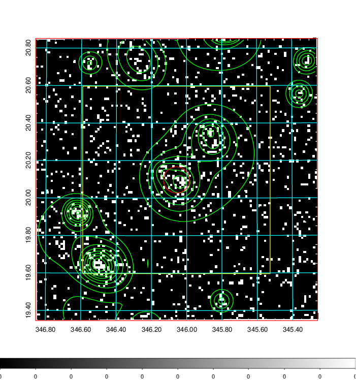  | 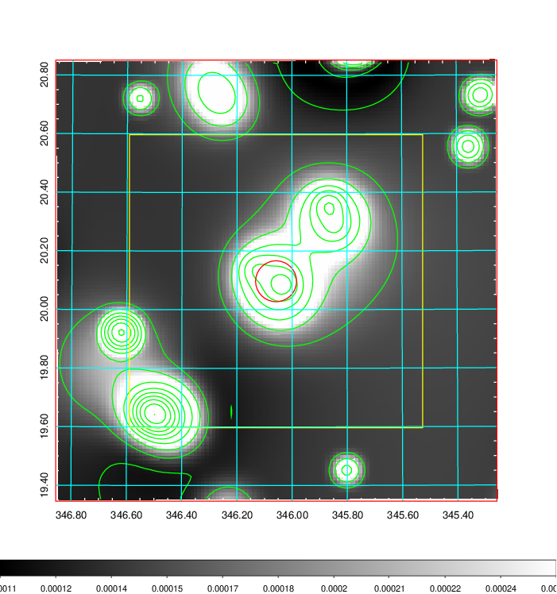   | 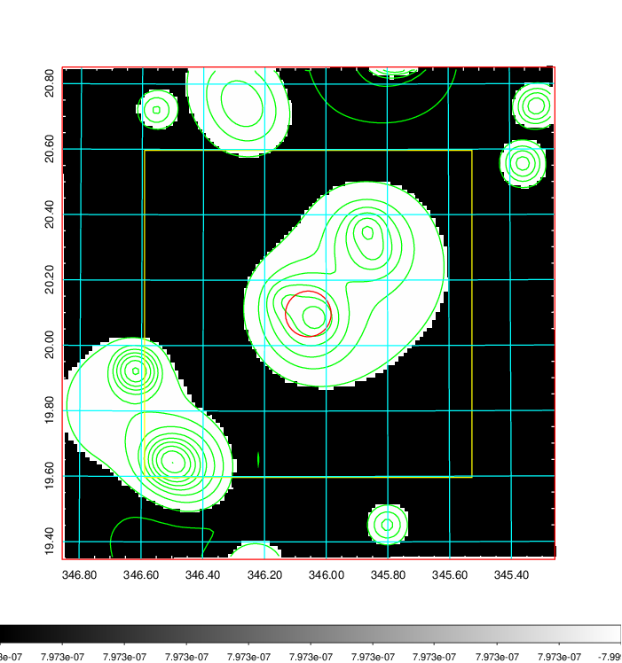  |

|[Exposure image](../image/911/911_mex.pdf)| [nH image](../image/911/911_nh.pdf)| [Planck image](../image/911/911_p.pdf)|
|-------------------|--------------------|-------------------|
|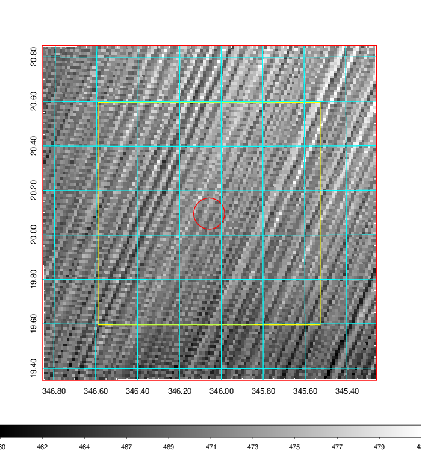   | 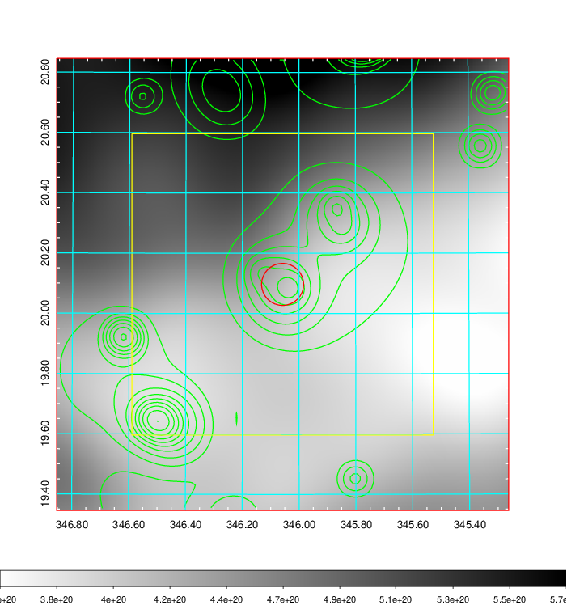    | 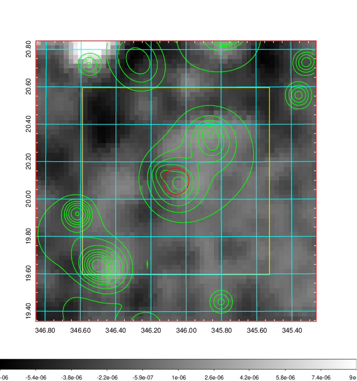 |

|[Redshift Histogram](../image/911/911_zg.pdf) | [DSS image(z1)](../image/911/911_dss_z1.pdf)      |  [DSS image(z2)](../image/911/911_dss_z2.pdf)    |
|-------------------|--------------------|-------------------|
|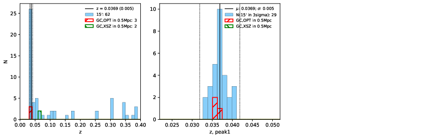 |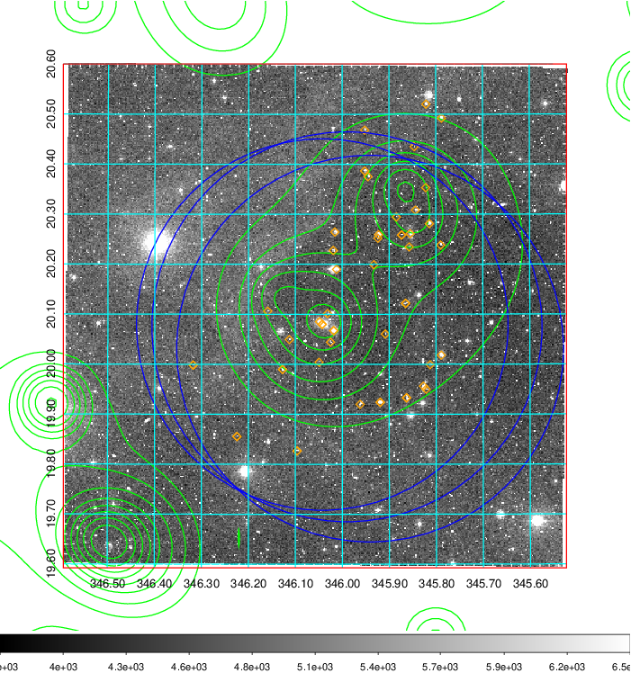  Blue circle for optical clusters;  Magenta circle for XSZ clusters;  all with r=1Mpc;  Only GC with Delta_z<0.01 are shown. | 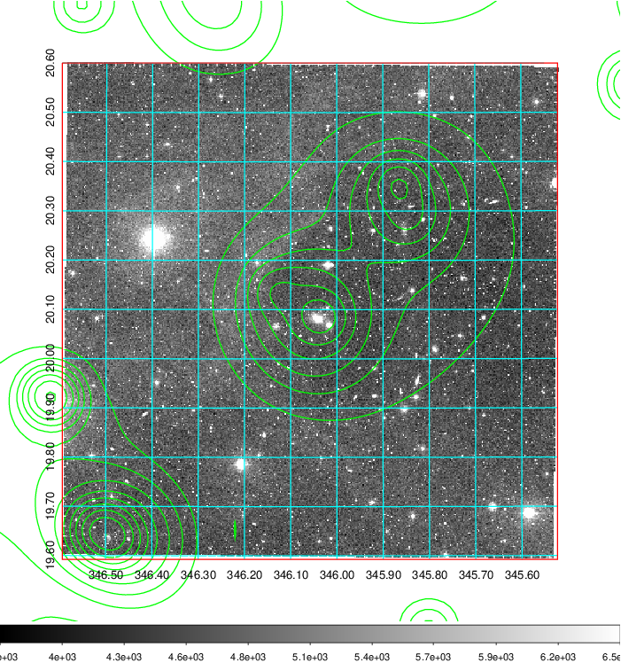 Blue circle for optical clusters;  Magenta circle for XSZ clusters;  all with r=1Mpc;  Only GC with Delta_z<0.01 are shown.  |

|[known Abell/XSZ clusters](../image/911/911_gc.pdf) | [2MASS image](../image/911/911_2mass.pdf)      |[SDSS image](../image/911/911_sdss.pdf)   |
|-------------------|-------------------|-------------------|
|  Magenta, blue and green circles  for optical, X-ray and SZ clusters  respectively, with redshift of clusters  labelled. The radius of circles  are 1Mpc.|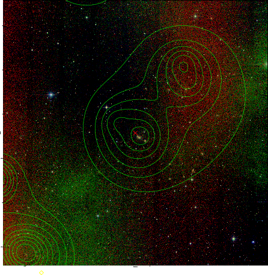  | 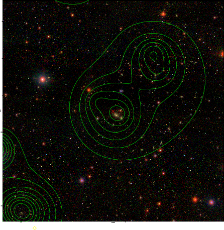  |

