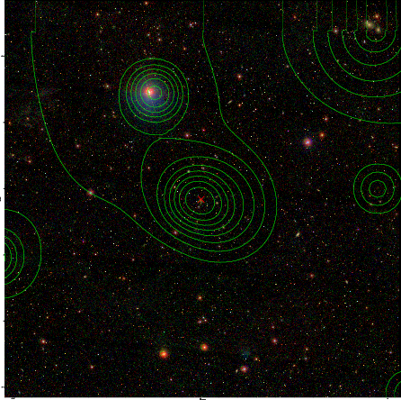

### 912

|Name|RAJ2000[deg]|DEJ2000[deg] |Ext[arcmin]| Ext,ml | z | z_src| C|GC(XSZ,Delta_z<0.01)| GC(OPT,Delta_z<0.01)|GC| R_sig[arcmin] | R500[arcmin] | R500[Mpc]| CRsig[c/s] | CR500[c/s] |L500[1E44 erg/s]|F500[1E-12 erg/s/cm^2]| M500[1E14 Msun]|Tx[keV]|Cnt_sig|Beta|Rc[arcmin]|Comment|Alias|
|---|---|---|---|---|---|------|---|--------|---------|----------|---|---|---|---|---|---|---|---|---|---|---|---|---|---|
|912| 346.494| 19.641| 2.00| 35.70| 0.1047(0.005)| z1, z_xsz| B| F20, SPI| C, W| A, C, F20, N, SPI, W| 6.850| 7.403| 0.853| 0.140(0.026)| 0.142(0.026)| 0.727(0.065)| 2.599(0.231)| 1.95(0.09)| 3.34(0.09)| 64.7| 0.865(-0.140+0.096)| 3.924(-0.870+0.650)| An X-ray cluster with $z$ = 0.1039 and offset = 0.63 Mpc(5.45 arcmin), an Abell cluster with no $z$ and offset = 0.30 Mpc| t061|

|[RASS image](../image/912/912_img.pdf)|[filtered image](../image/912/912_fil.pdf)|[Segment image](../image/912/912_seg.pdf)|
|-------------------|--------------------|-------------------|
|   |    |   |

|[Exposure image](../image/912/912_mex.pdf)| [nH image](../image/912/912_nh.pdf)| [Planck image](../image/912/912_p.pdf)|
|-------------------|--------------------|-------------------|
|   |     |  |

|[Redshift Histogram](../image/912/912_zg.pdf) | [DSS image(z1)](../image/912/912_dss_z1.pdf)      |  [DSS image(z2)](../image/912/912_dss_z2.pdf)    |
|-------------------|--------------------|-------------------|
| |  Blue circle for optical clusters;  Magenta circle for XSZ clusters;  all with r=1Mpc;  Only GC with Delta_z<0.01 are shown. |  Blue circle for optical clusters;  Magenta circle for XSZ clusters;  all with r=1Mpc;  Only GC with Delta_z<0.01 are shown.  |

|[Previous-identified clusters](../image/912/912_gc.pdf) | [2MASS image](../image/912/912_2mass.pdf)      |[SDSS image](../image/912/912_sdss.pdf)   |
|-------------------|-------------------|-------------------|
|  Green, magenta, and blue circles  for optical, X-ray and SZ clusters  respectively, with redshift of clusters  labelled. The radius of circles  are 1Mpc.|  |   |

