

### 915

|Name|RAJ2000[deg]|DEJ2000[deg] |Ext[arcmin]| Ext,ml | z | z_src| C|GC(XSZ,Delta_z<0.01)| GC(OPT,Delta_z<0.01)|GC| R_sig[arcmin] | R500[arcmin] | R500[Mpc]| CRsig[c/s] | CR500[c/s] |L500[1E44 erg/s]|F500[1E-12 erg/s/cm^2]| M500[1E14 Msun]|Tx[keV]|Cnt_sig|Beta|Rc[arcmin]|Comment|Alias|
|---|---|---|---|---|---|------|---|--------|---------|----------|---|---|---|---|---|---|---|---|---|---|---|---|---|---|
|915| 348.496| -42.733| 0.67| 47.84| 0.0568(0.005)| z1, z_xsz| B| B15, MCXC, PSZ2, Tar| A, N| A, B15, MCXC, N, PSZ2, Tar| 6.362| 16.447| 1.087| 1.150(0.089)| 1.555(0.117)| 2.437(0.117)| 31.629(1.520)| 3.86(0.09)| 5.01(0.08)| 214.4| 0.898(-0.095+0.070)| 2.433(-0.413+0.301)| -| k001|

|[RASS image](../image/915/915_img.pdf)|[filtered image](../image/915/915_fil.pdf)|[Segment image](../image/915/915_seg.pdf)|
|-------------------|--------------------|-------------------|
| 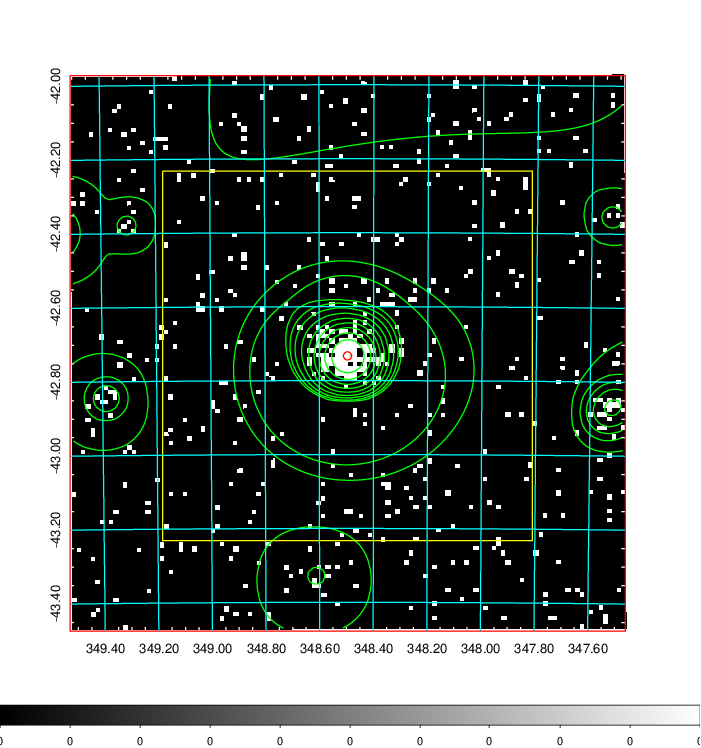  | 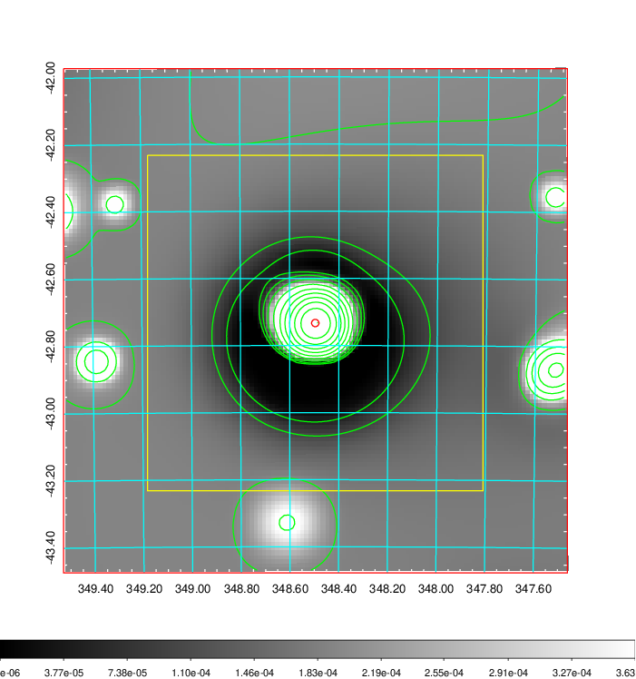   | 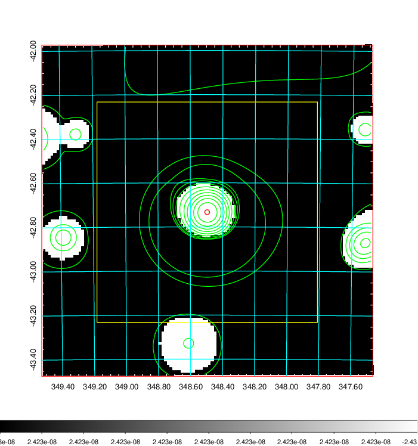  |

|[Exposure image](../image/915/915_mex.pdf)| [nH image](../image/915/915_nh.pdf)| [Planck image](../image/915/915_p.pdf)|
|-------------------|--------------------|-------------------|
|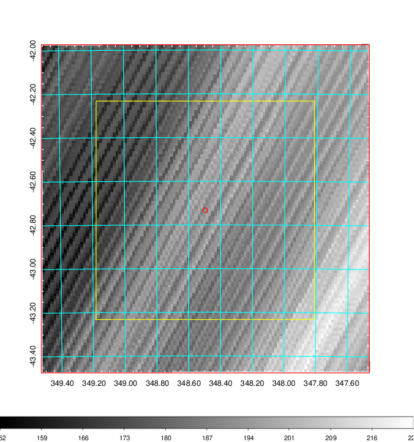   | 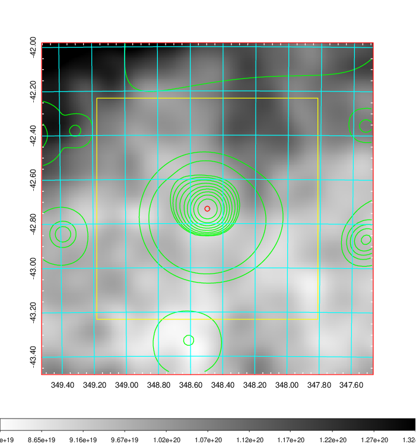    | 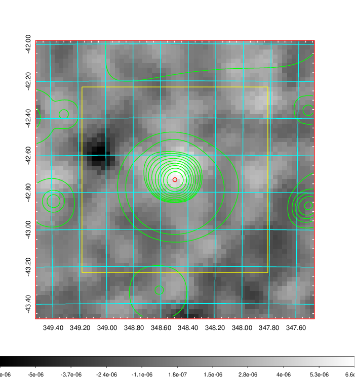 |

|[Redshift Histogram](../image/915/915_zg.pdf) | [DSS image(z1)](../image/915/915_dss_z1.pdf)      |  [DSS image(z2)](../image/915/915_dss_z2.pdf)    |
|-------------------|--------------------|-------------------|
|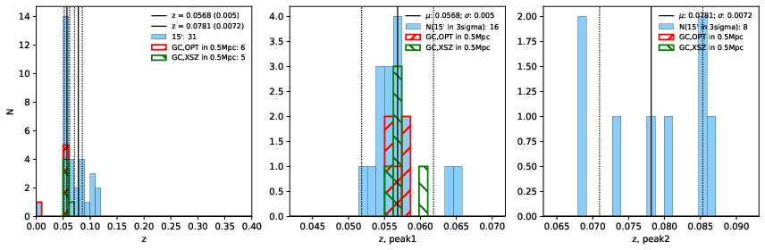 |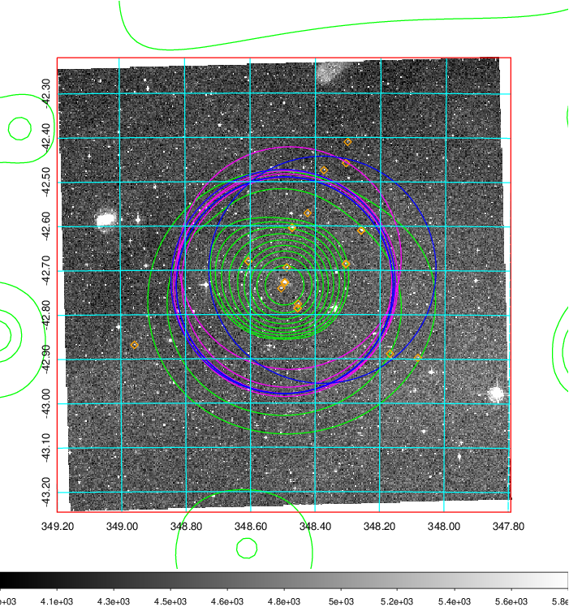  Blue circle for optical clusters;  Magenta circle for XSZ clusters;  all with r=1Mpc;  Only GC with Delta_z<0.01 are shown. | 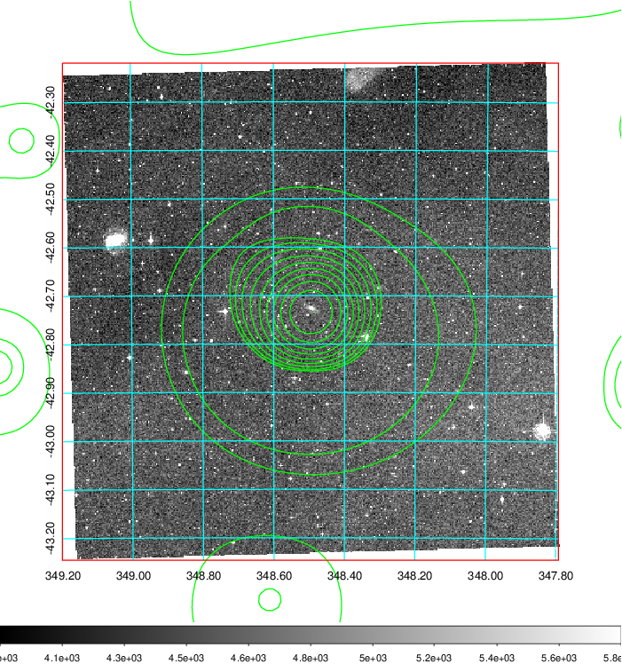 Blue circle for optical clusters;  Magenta circle for XSZ clusters;  all with r=1Mpc;  Only GC with Delta_z<0.01 are shown.  |

|[Previous-identified clusters](../image/915/915_gc.pdf) | [2MASS image](../image/915/915_2mass.pdf)      |
|-------------------|-------------------|
|  Green, magenta, and blue circles  for optical, X-ray and SZ clusters  respectively, with redshift of clusters  labelled. The radius of circles  are 1Mpc.|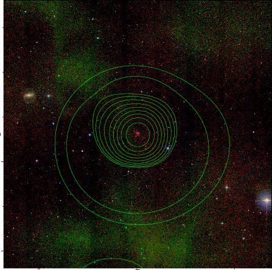  |

|[DES image](../image/915/915_des.pdf)   |
|-------------------|
| 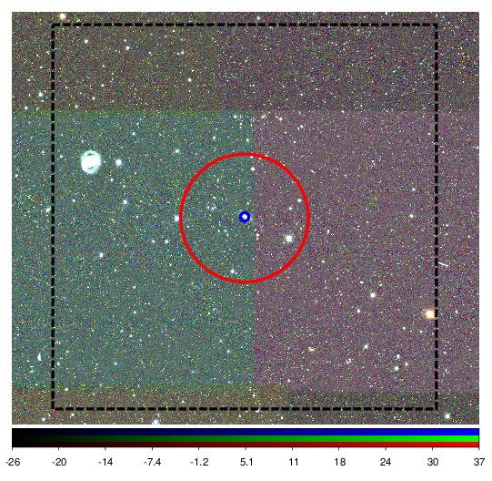  |
