

### 916

|Name|RAJ2000[deg]|DEJ2000[deg] |Ext[arcmin]| Ext,ml | z | z_src| C|GC(XSZ,Delta_z<0.01)| GC(OPT,Delta_z<0.01)|GC| R_sig[arcmin] | R500[arcmin] | R500[Mpc]| CRsig[c/s] | CR500[c/s] |L500[1E44 erg/s]|F500[1E-12 erg/s/cm^2]| M500[1E14 Msun]|Tx[keV]|Cnt_sig|Beta|Rc[arcmin]|Comment|Alias|
|---|---|---|---|---|---|------|---|--------|---------|----------|---|---|---|---|---|---|---|---|---|---|---|---|---|---|
|916| 348.944| -2.367| 2.53| 67.99| 0.0253(0.005)| z1, z_xsz| B| MCXC| N| C, F20, MCXC, N, W| 14.331| 17.724| 0.542| 0.254(0.046)| 0.264(0.048)| 0.059(0.007)| 4.037(0.511)| 0.46(0.03)| 1.34(0.06)| 112.7| 0.734(-0.078+0.114)| 2.756(-0.640+0.792)| -| k303|

|[RASS image](../image/916/916_img.pdf)|[filtered image](../image/916/916_fil.pdf)|[Segment image](../image/916/916_seg.pdf)|
|-------------------|--------------------|-------------------|
| 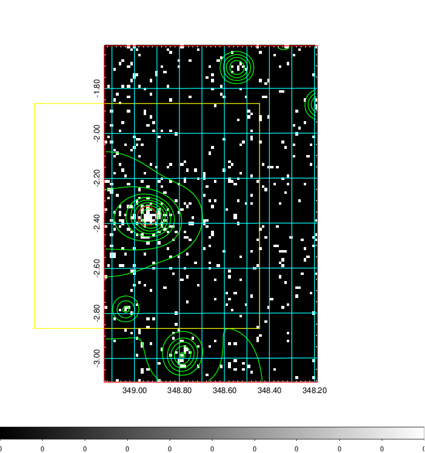  | 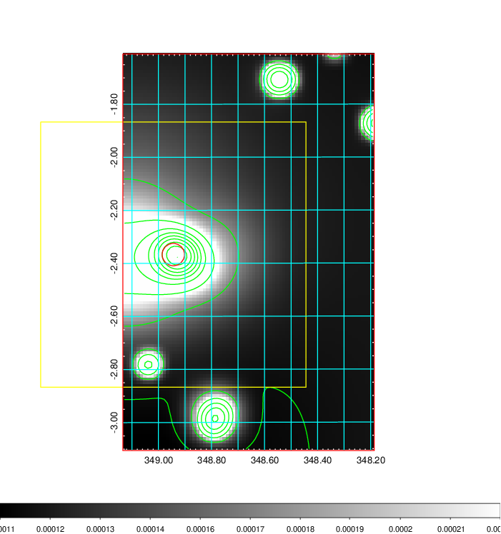   | 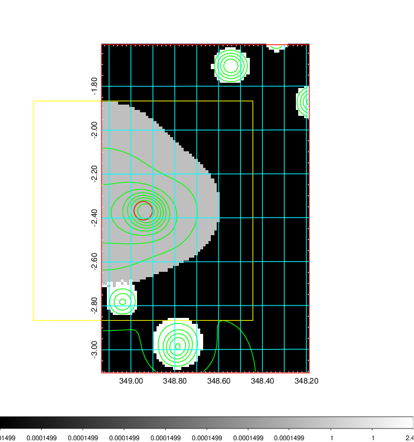  |

|[Exposure image](../image/916/916_mex.pdf)| [nH image](../image/916/916_nh.pdf)| [Planck image](../image/916/916_p.pdf)|
|-------------------|--------------------|-------------------|
|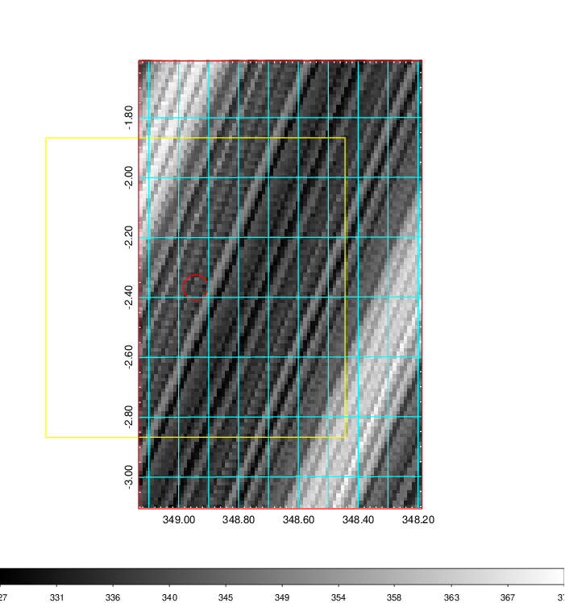   | 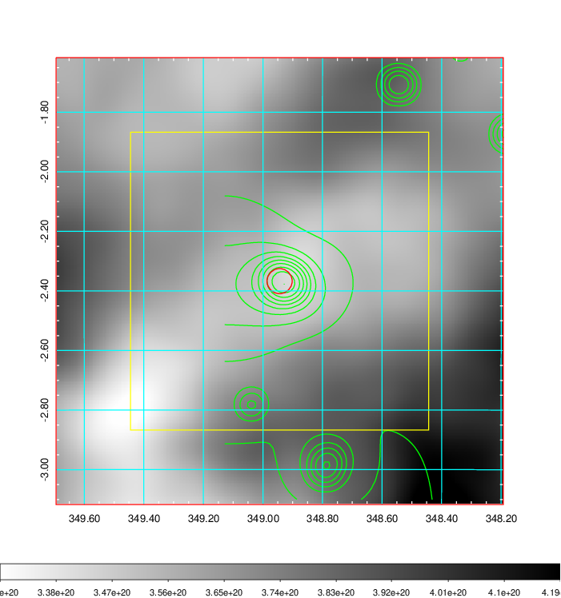    | 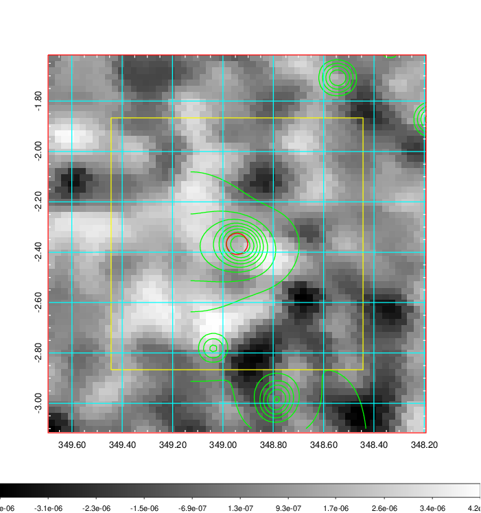 |

|[Redshift Histogram](../image/916/916_zg.pdf) | [DSS image(z1)](../image/916/916_dss_z1.pdf)      |  [DSS image(z2)](../image/916/916_dss_z2.pdf)    |
|-------------------|--------------------|-------------------|
|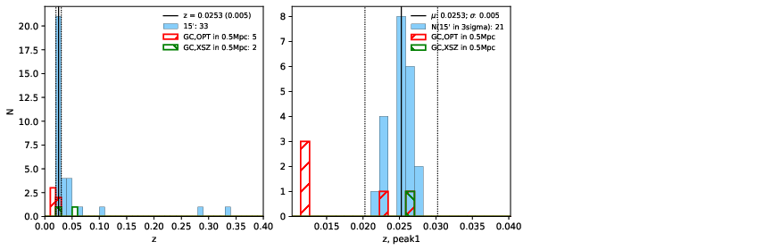 |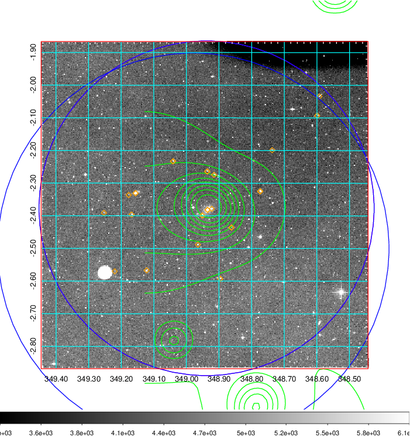  Blue circle for optical clusters;  Magenta circle for XSZ clusters;  all with r=1Mpc;  Only GC with Delta_z<0.01 are shown. | 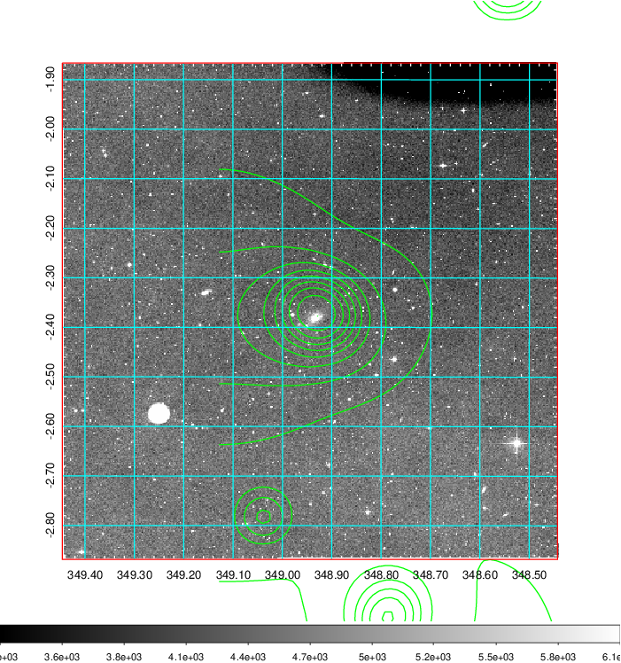 Blue circle for optical clusters;  Magenta circle for XSZ clusters;  all with r=1Mpc;  Only GC with Delta_z<0.01 are shown.  |

|[known Abell/XSZ clusters](../image/916/916_gc.pdf) | [2MASS image](../image/916/916_2mass.pdf)      |[SDSS image](../image/916/916_sdss.pdf)   |
|-------------------|-------------------|-------------------|
|  Magenta, blue and green circles  for optical, X-ray and SZ clusters  respectively, with redshift of clusters  labelled. The radius of circles  are 1Mpc.|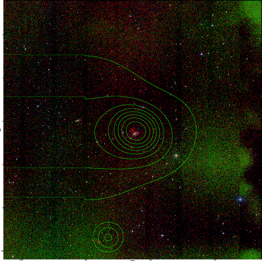  | 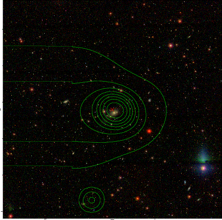  |

