

### 917

|Name|RAJ2000[deg]|DEJ2000[deg] |Ext[arcmin]| Ext,ml | z | z_src| C|GC(XSZ,Delta_z<0.01)| GC(OPT,Delta_z<0.01)|GC| R_sig[arcmin] | R500[arcmin] | R500[Mpc]| CRsig[c/s] | CR500[c/s] |L500[1E44 erg/s]|F500[1E-12 erg/s/cm^2]| M500[1E14 Msun]|Tx[keV]|Cnt_sig|Beta|Rc[arcmin]|Comment|Alias|
|---|---|---|---|---|---|------|---|--------|---------|----------|---|---|---|---|---|---|---|---|---|---|---|---|---|---|
|917| 349.305| 18.699| 3.45| 253.36| 0.0396(0.005)| z1, z_xsz| B| MCXC, PSZ2, Tar, XB| A, N| A, F20, MCXC, N, PSZ2, SPI, Tar, W, XB| 22.725| 17.203| 0.809| 0.746(0.066)| 0.717(0.063)| 0.462(0.023)| 12.642(0.619)| 1.56(0.04)| 2.86(0.04)| 470.2| 0.599(-0.026+0.030)| 3.739(-0.422+0.473)| -| k422|

|[RASS image](../image/917/917_img.pdf)|[filtered image](../image/917/917_fil.pdf)|[Segment image](../image/917/917_seg.pdf)|
|-------------------|--------------------|-------------------|
| 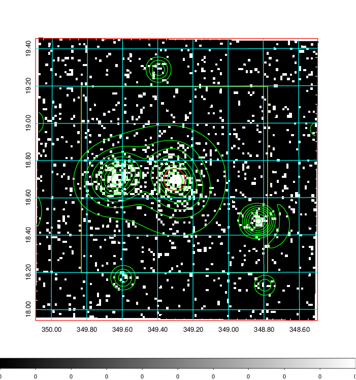  | 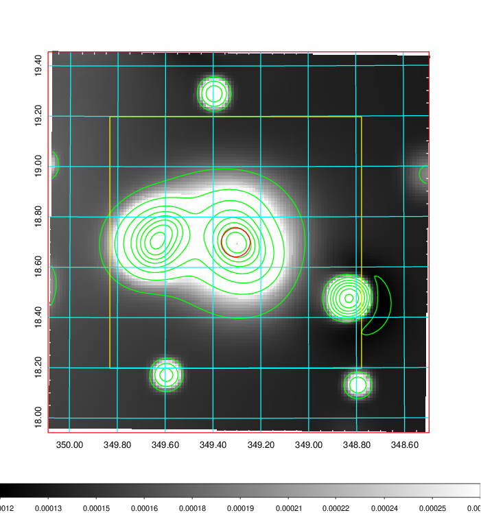   | 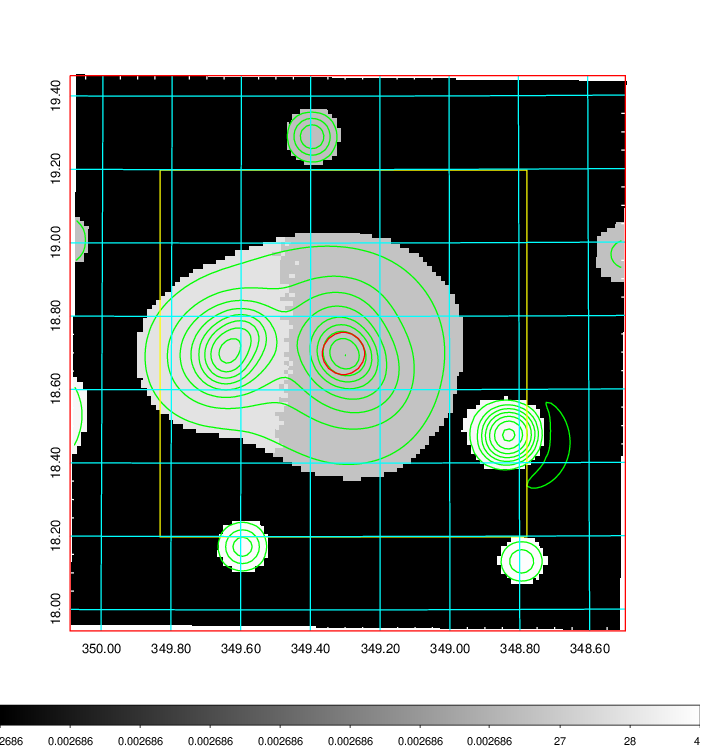  |

|[Exposure image](../image/917/917_mex.pdf)| [nH image](../image/917/917_nh.pdf)| [Planck image](../image/917/917_p.pdf)|
|-------------------|--------------------|-------------------|
|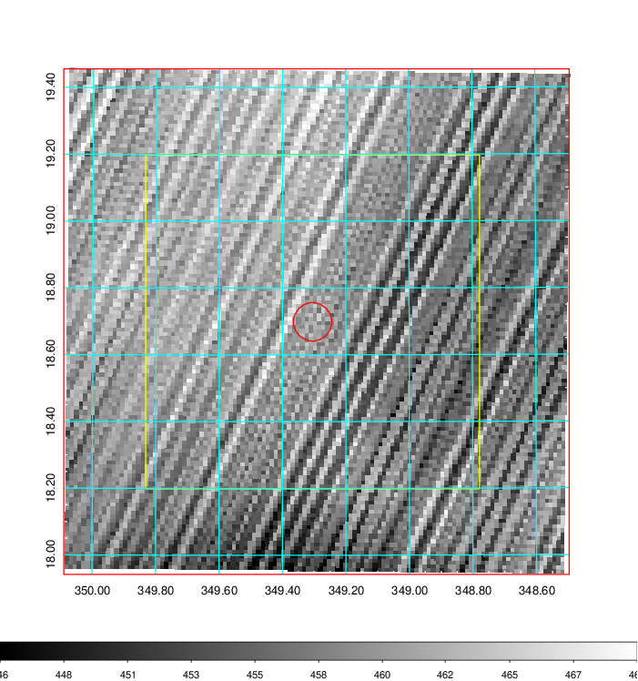   | 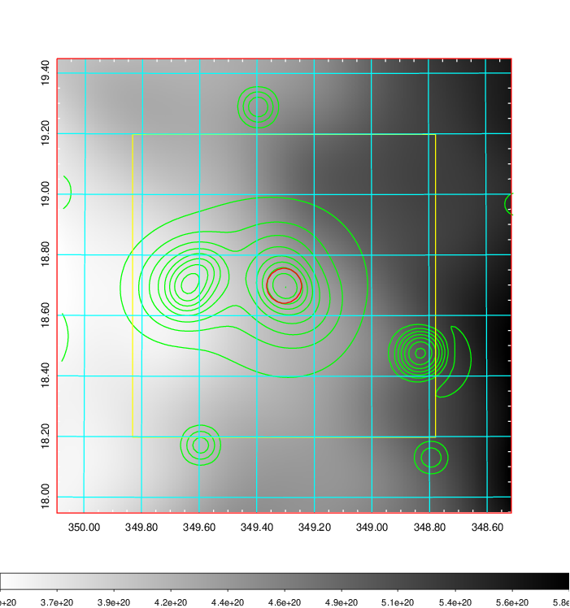    | 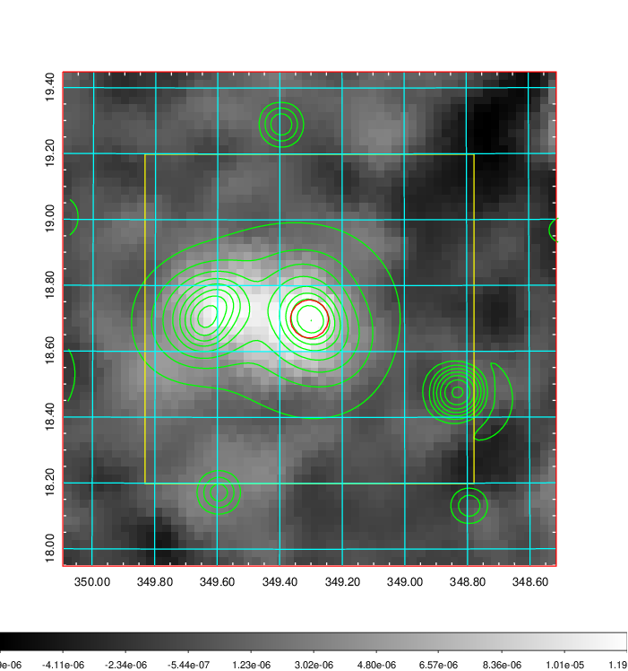 |

|[Redshift Histogram](../image/917/917_zg.pdf) | [DSS image(z1)](../image/917/917_dss_z1.pdf)      |  [DSS image(z2)](../image/917/917_dss_z2.pdf)    |
|-------------------|--------------------|-------------------|
|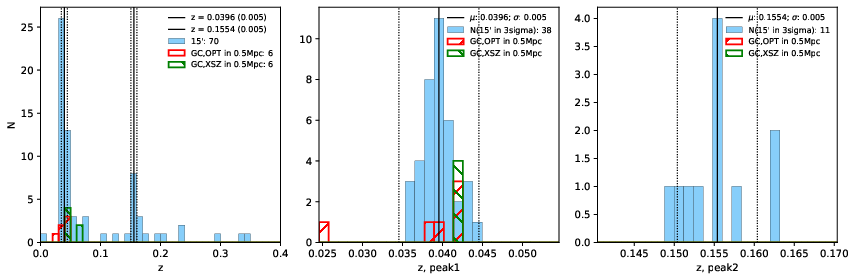 |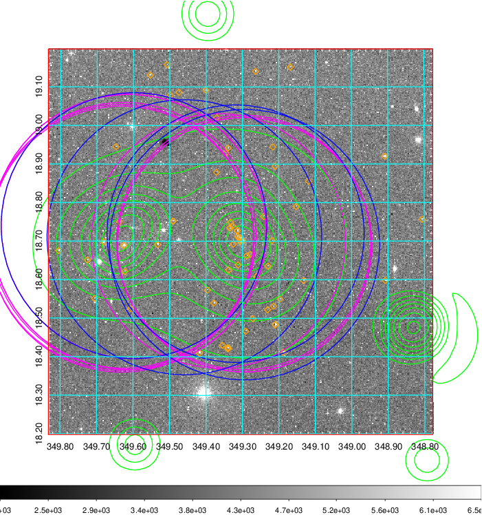  Blue circle for optical clusters;  Magenta circle for XSZ clusters;  all with r=1Mpc;  Only GC with Delta_z<0.01 are shown. | 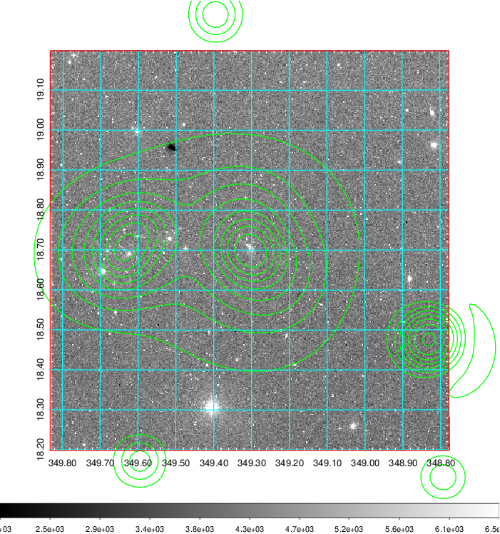 Blue circle for optical clusters;  Magenta circle for XSZ clusters;  all with r=1Mpc;  Only GC with Delta_z<0.01 are shown.  |

|[Previous-identified clusters](../image/917/917_gc.pdf) | [2MASS image](../image/917/917_2mass.pdf)      |[SDSS image](../image/917/917_sdss.pdf)   |
|-------------------|-------------------|-------------------|
|  Green, magenta, and blue circles  for optical, X-ray and SZ clusters  respectively, with redshift of clusters  labelled. The radius of circles  are 1Mpc.|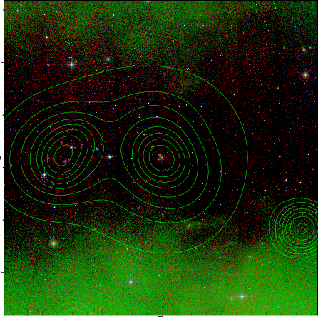  | 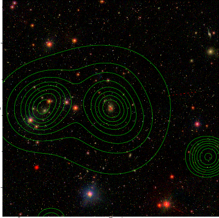  |

