

### 918

|Name|RAJ2000[deg]|DEJ2000[deg] |Ext[arcmin]| Ext,ml | z | z_src| C|GC(XSZ,Delta_z<0.01)| GC(OPT,Delta_z<0.01)|GC| R_sig[arcmin] | R500[arcmin] | R500[Mpc]| CRsig[c/s] | CR500[c/s] |L500[1E44 erg/s]|F500[1E-12 erg/s/cm^2]| M500[1E14 Msun]|Tx[keV]|Cnt_sig|Beta|Rc[arcmin]|Comment|Alias|
|---|---|---|---|---|---|------|---|--------|---------|----------|---|---|---|---|---|---|---|---|---|---|---|---|---|---|
|918| 349.357| 29.042| 10.02| 33.31| 0.0251(0.005)| z1, z_opt| S| -| N, Zw| C, N, W| 29.638| 18.676| 0.566| 0.326(0.057)| 0.307(0.053)| 0.066(0.011)| 4.623(0.738)| 0.53(0.04)| 1.46(0.08)| 173.6| 0.509(-0.007+0.014)| 8.419(-0.313+0.347)| -| t440|

|[RASS image](../image/918/918_img.pdf)|[filtered image](../image/918/918_fil.pdf)|[Segment image](../image/918/918_seg.pdf)|
|-------------------|--------------------|-------------------|
| 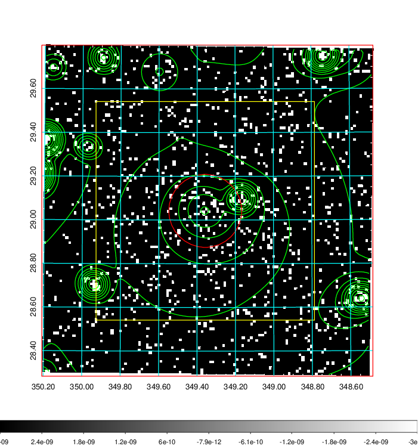  | 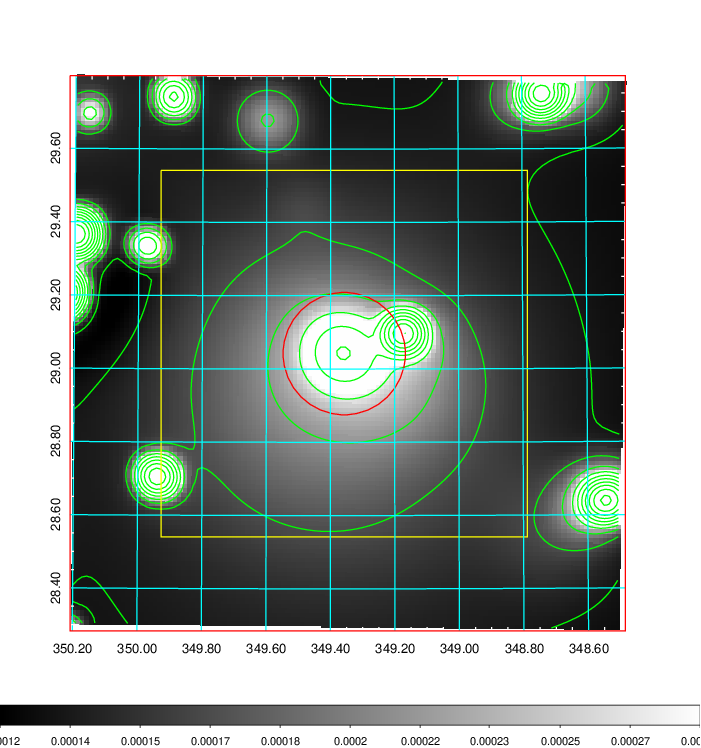   | 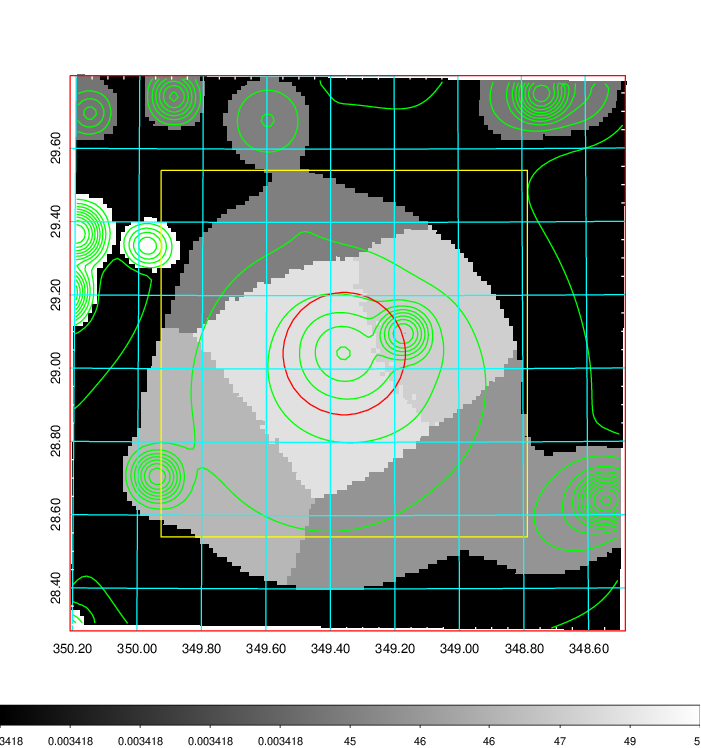  |

|[Exposure image](../image/918/918_mex.pdf)| [nH image](../image/918/918_nh.pdf)| [Planck image](../image/918/918_p.pdf)|
|-------------------|--------------------|-------------------|
|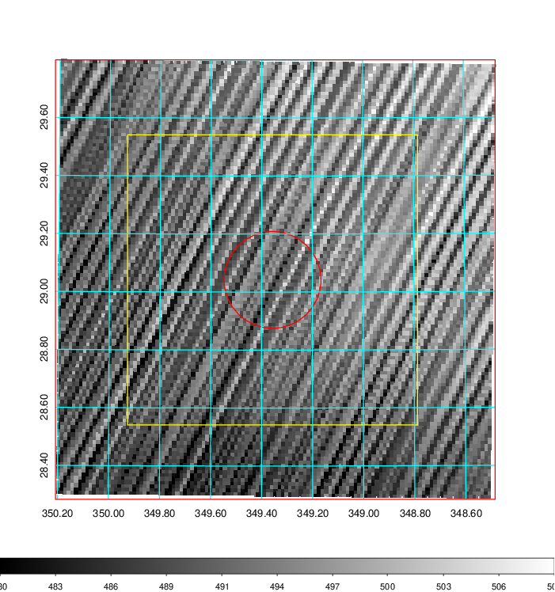   | 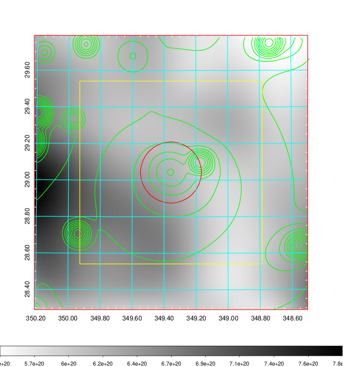    | 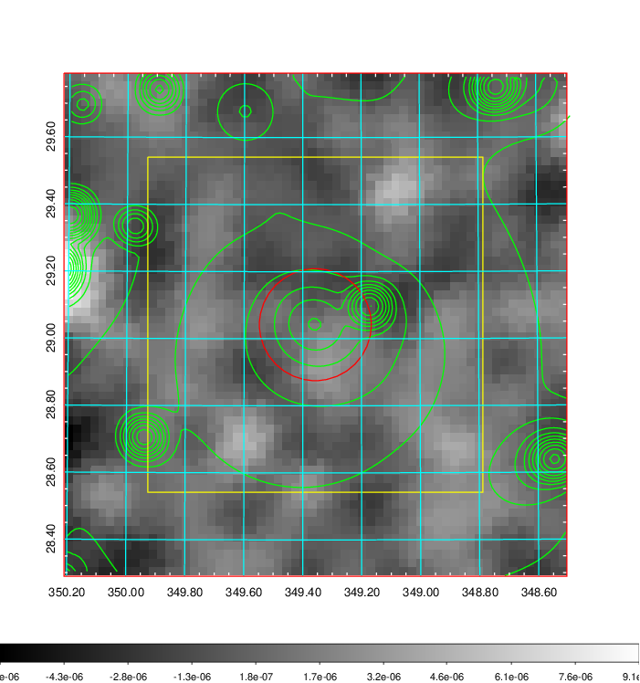 |

|[Redshift Histogram](../image/918/918_zg.pdf) | [DSS image(z1)](../image/918/918_dss_z1.pdf)      |  [DSS image(z2)](../image/918/918_dss_z2.pdf)    |
|-------------------|--------------------|-------------------|
|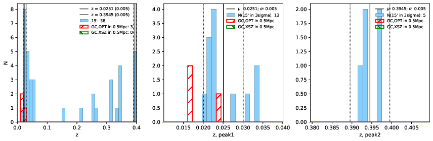 |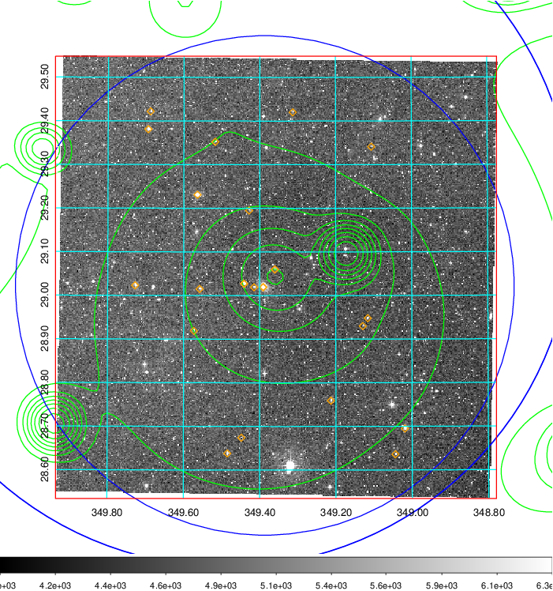  Blue circle for optical clusters;  Magenta circle for XSZ clusters;  all with r=1Mpc;  Only GC with Delta_z<0.01 are shown. | 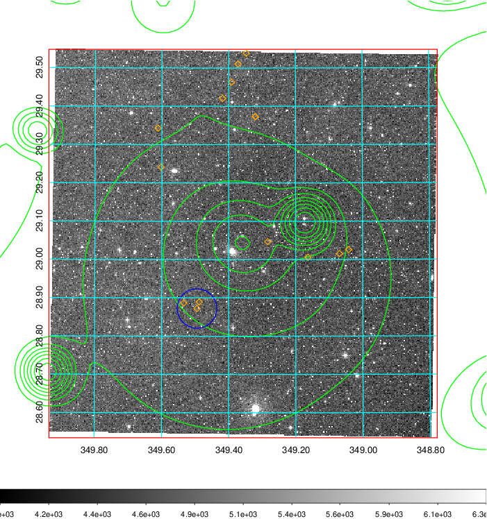 Blue circle for optical clusters;  Magenta circle for XSZ clusters;  all with r=1Mpc;  Only GC with Delta_z<0.01 are shown.  |

|[known Abell/XSZ clusters](../image/918/918_gc.pdf) | [2MASS image](../image/918/918_2mass.pdf)      |[SDSS image](../image/918/918_sdss.pdf)   |
|-------------------|-------------------|-------------------|
|  Magenta, blue and green circles  for optical, X-ray and SZ clusters  respectively, with redshift of clusters  labelled. The radius of circles  are 1Mpc.|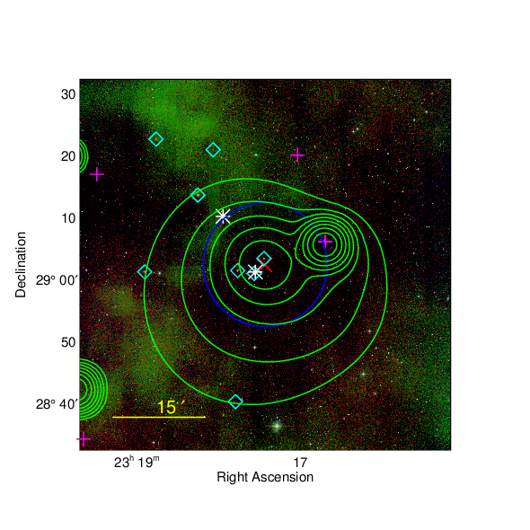  | 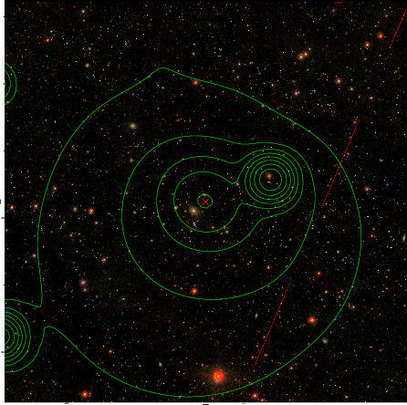  |

