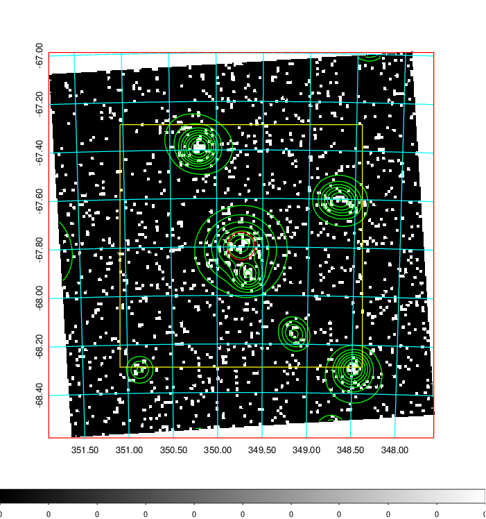
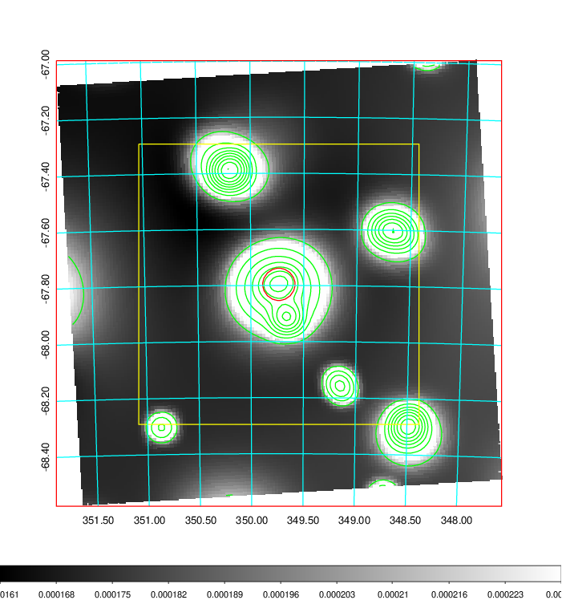
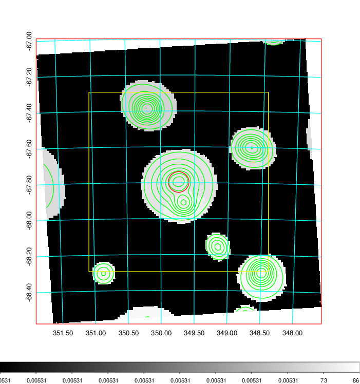
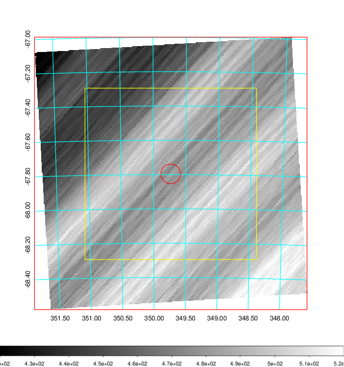
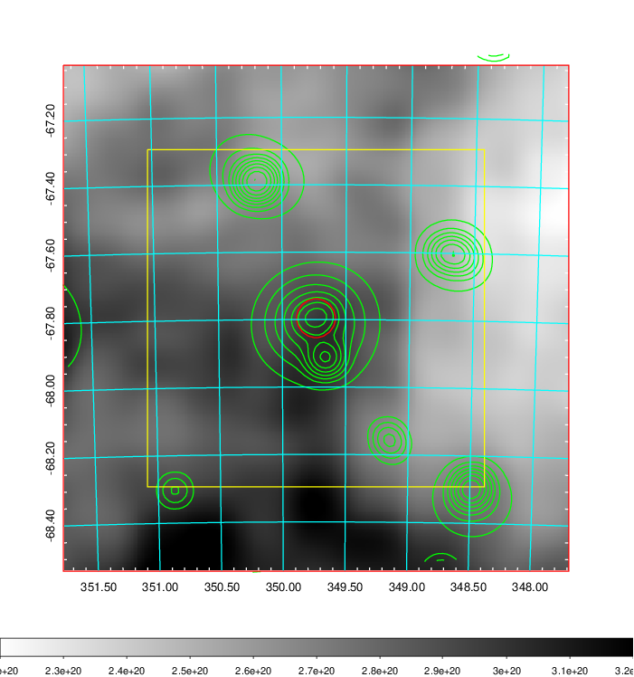
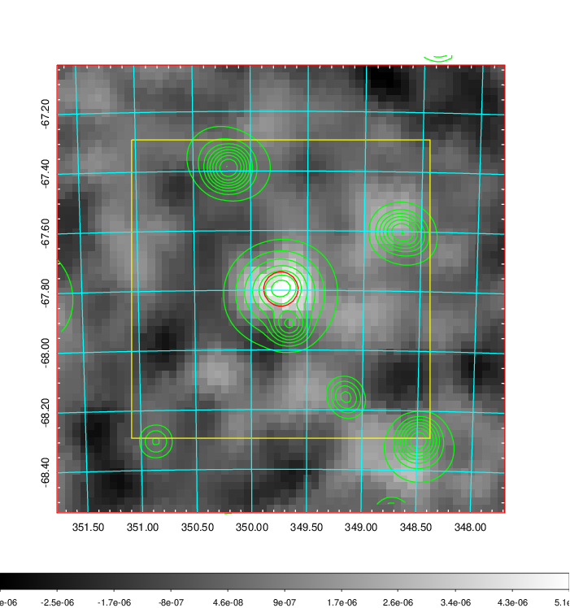
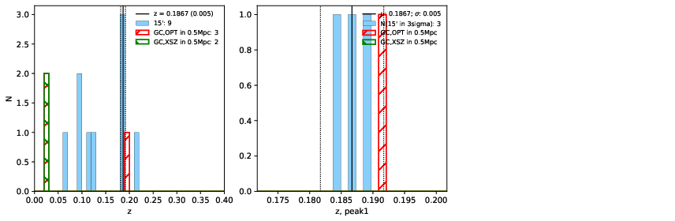
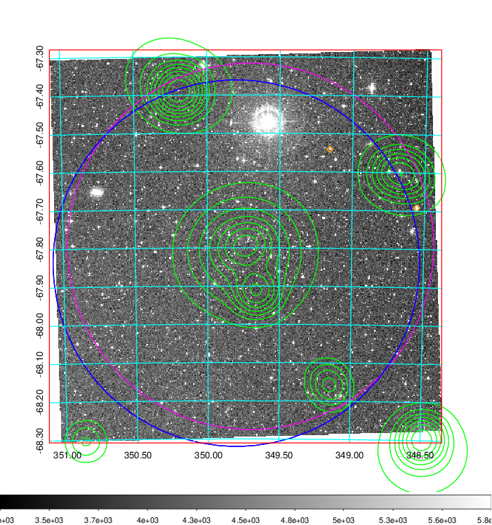
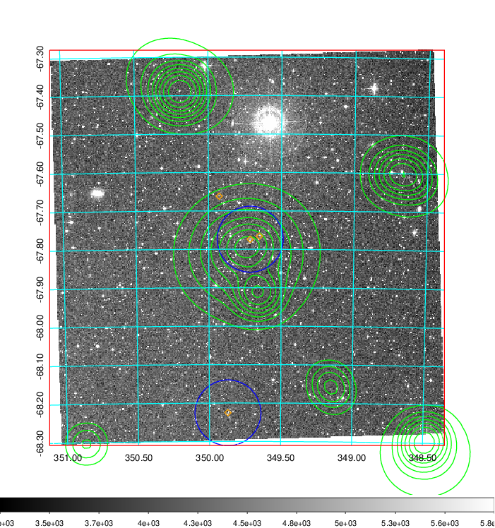
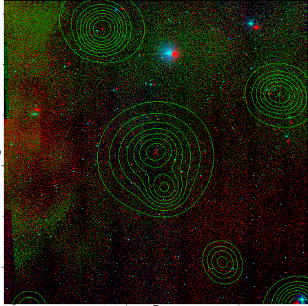

### 919

|Name|RAJ2000[deg]|DEJ2000[deg] |Ext[arcmin]| Ext,ml | z | z_src| C|GC(XSZ,Delta_z<0.01)| GC(OPT,Delta_z<0.01)|GC| R_sig[arcmin] | R500[arcmin] | R500[Mpc]| CRsig[c/s] | CR500[c/s] |L500[1E44 erg/s]|F500[1E-12 erg/s/cm^2]| M500[1E14 Msun]|Tx[keV]|Cnt_sig|Beta|Rc[arcmin]|Comment|Alias|
|---|---|---|---|---|---|------|---|--------|---------|----------|---|---|---|---|---|---|---|---|---|---|---|---|---|---|
|919| 349.735| -67.796| 3.45| 35.01| 0.0286(0.000)| z_xsz| B| MCXC, Tar| A| A, MCXC, Tar, W| 8.800| 14.519| 0.500| 0.130(0.031)| 0.146(0.035)| 0.039(0.007)| 2.102(0.373)| 0.36(0.03)| 1.16(0.07)| 71.2| 0.865(-0.140+0.096)| 5.155(-1.098+0.797)| -| k423|

|[RASS image](../image/919/919_img.pdf)|[filtered image](../image/919/919_fil.pdf)|[Segment image](../image/919/919_seg.pdf)|
|-------------------|--------------------|-------------------|
|   |    |   |

|[Exposure image](../image/919/919_mex.pdf)| [nH image](../image/919/919_nh.pdf)| [Planck image](../image/919/919_p.pdf)|
|-------------------|--------------------|-------------------|
|   |     |  |

|[Redshift Histogram](../image/919/919_zg.pdf) | [DSS image(z1)](../image/919/919_dss_z1.pdf)      |  [DSS image(z2)](../image/919/919_dss_z2.pdf)    |
|-------------------|--------------------|-------------------|
| |  Blue circle for optical clusters;  Magenta circle for XSZ clusters;  all with r=1Mpc;  Only GC with Delta_z<0.01 are shown. |  Blue circle for optical clusters;  Magenta circle for XSZ clusters;  all with r=1Mpc;  Only GC with Delta_z<0.01 are shown.  |

|[known Abell/XSZ clusters](../image/919/919_gc.pdf) | [2MASS image](../image/919/919_2mass.pdf)      |
|-------------------|-------------------|
|  Magenta, blue and green circles  for optical, X-ray and SZ clusters  respectively, with redshift of clusters  labelled. The radius of circles  are 1Mpc.|  |

