

### 92

|Name|RAJ2000[deg]|DEJ2000[deg] |Ext[arcmin]| Ext,ml | z | z_src| C|GC(XSZ,Delta_z<0.01)| GC(OPT,Delta_z<0.01)|GC| R_sig[arcmin] | R500[arcmin] | R500[Mpc]| CRsig[c/s] | CR500[c/s] |L500[1E44 erg/s]|F500[1E-12 erg/s/cm^2]| M500[1E14 Msun]|Tx[keV]|Cnt_sig|Beta|Rc[arcmin]|Comment|Alias|
|---|---|---|---|---|---|------|---|--------|---------|----------|---|---|---|---|---|---|---|---|---|---|---|---|---|---|
|92| 28.765| 33.905| 2.35| 93.10| 0.0857(0.006)| z1, z_xsz| B| L03, MCXC, PSZ2, Tar, XB| A, N, W| A, L03, MCXC, N, PSZ2, SWXCS, Tar, W, XB| 7.338| 9.719| 0.937| 0.303(0.049)| 0.321(0.052)| 1.053(0.074)| 5.768(0.406)| 2.54(0.09)| 3.91(0.09)| 113.2| 0.943(-0.075+0.041)| 4.105(-0.424+0.347)| -| k270|

|[RASS image](../image/92/92_img.pdf)|[filtered image](../image/92/92_fil.pdf)|[Segment image](../image/92/92_seg.pdf)|
|-------------------|--------------------|-------------------|
| 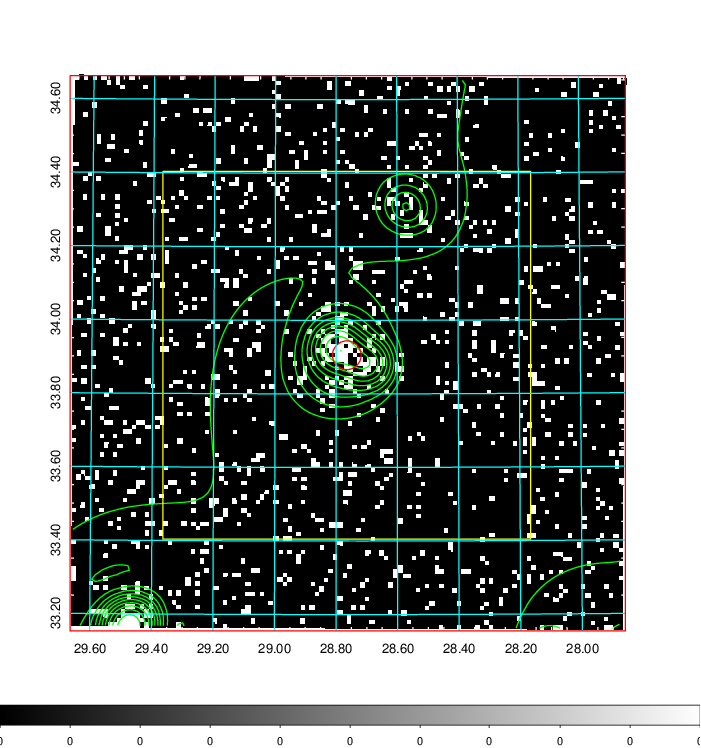  | 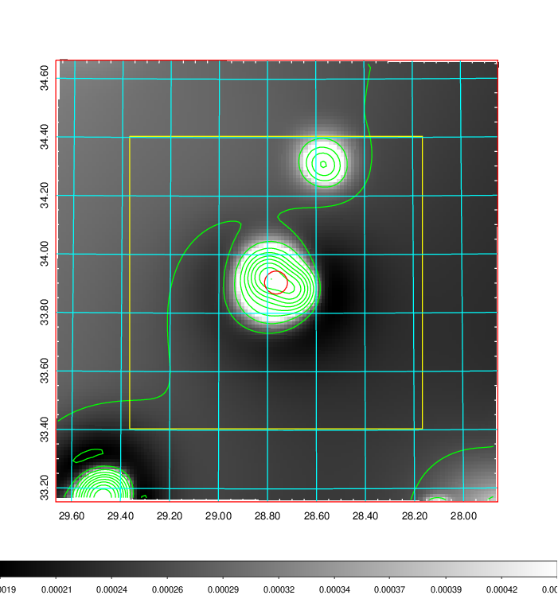   | 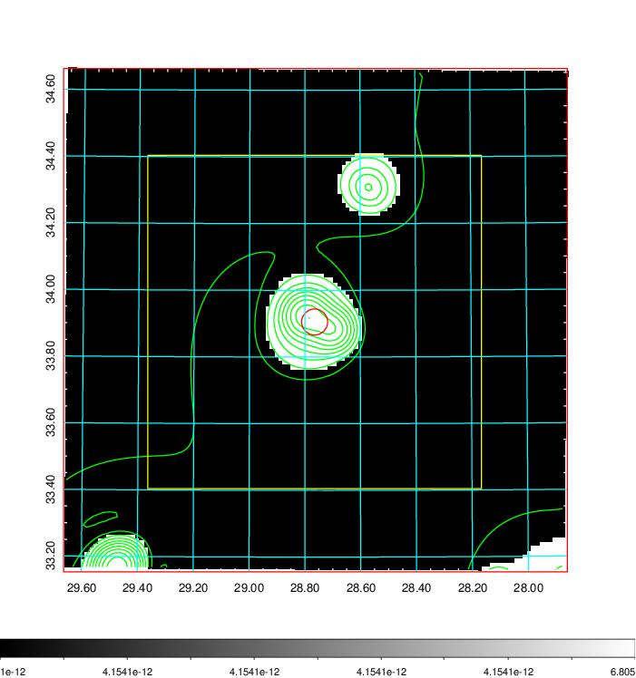  |

|[Exposure image](../image/92/92_mex.pdf)| [nH image](../image/92/92_nh.pdf)| [Planck image](../image/92/92_p.pdf)|
|-------------------|--------------------|-------------------|
|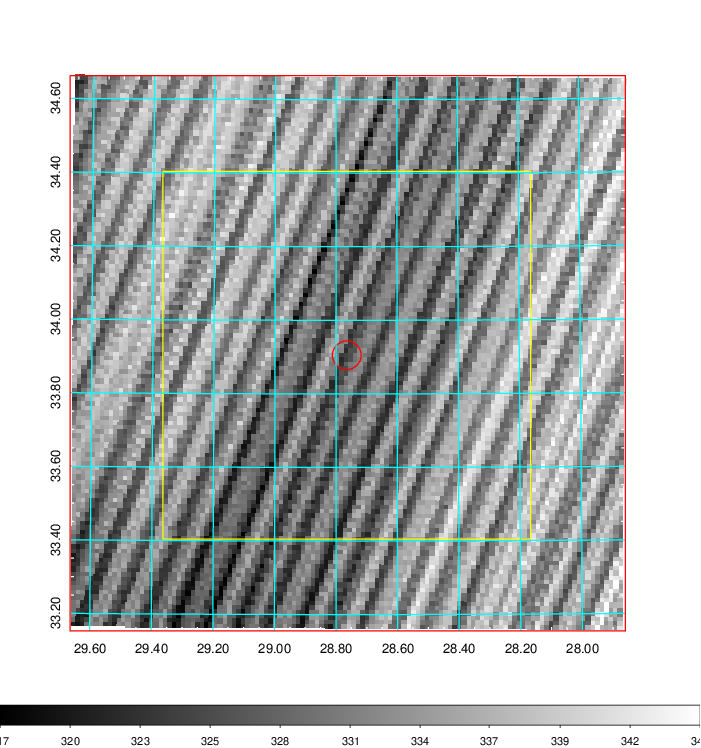   | 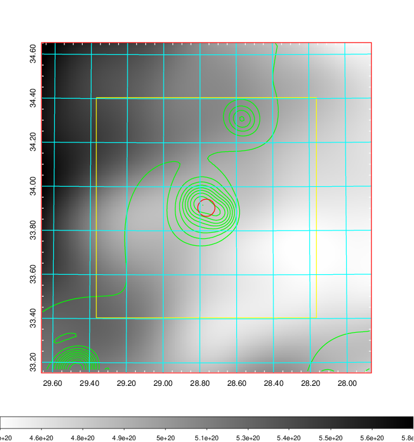    | 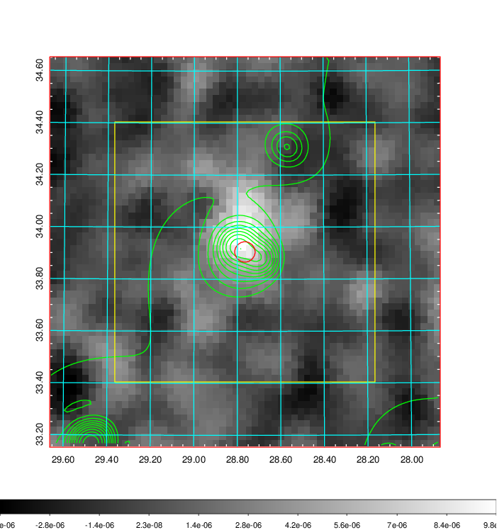 |

|[Redshift Histogram](../image/92/92_zg.pdf) | [DSS image(z1)](../image/92/92_dss_z1.pdf)      |  [DSS image(z2)](../image/92/92_dss_z2.pdf)    |
|-------------------|--------------------|-------------------|
|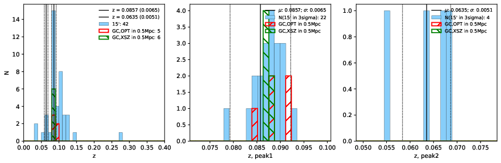 |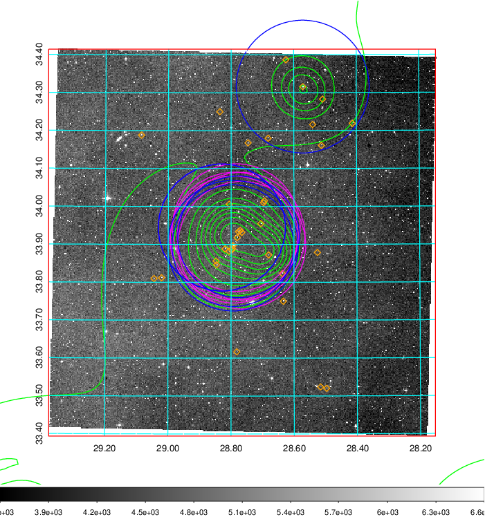  Blue circle for optical clusters;  Magenta circle for XSZ clusters;  all with r=1Mpc;  Only GC with Delta_z<0.01 are shown. | 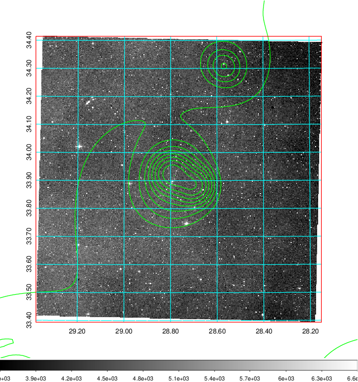 Blue circle for optical clusters;  Magenta circle for XSZ clusters;  all with r=1Mpc;  Only GC with Delta_z<0.01 are shown.  |

|[Previous-identified clusters](../image/92/92_gc.pdf) | [2MASS image](../image/92/92_2mass.pdf)      |[SDSS image](../image/92/92_sdss.pdf)   |
|-------------------|-------------------|-------------------|
|  Green, magenta, and blue circles  for optical, X-ray and SZ clusters  respectively, with redshift of clusters  labelled. The radius of circles  are 1Mpc.|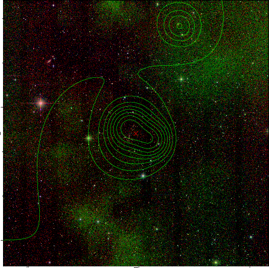  | 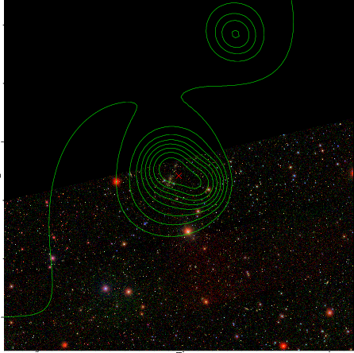  |

