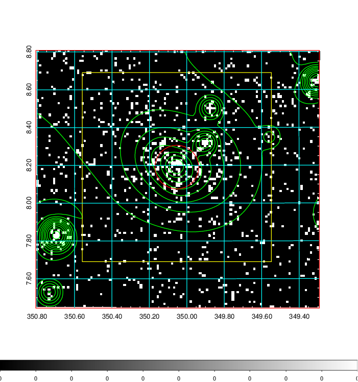
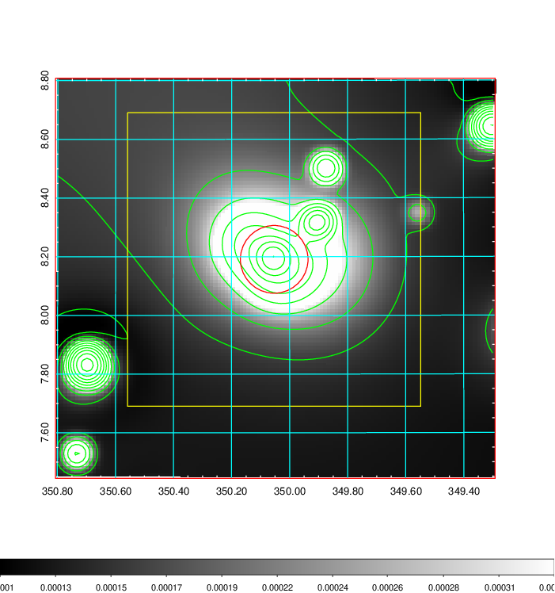
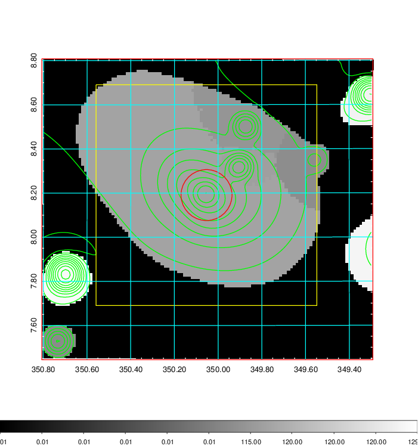
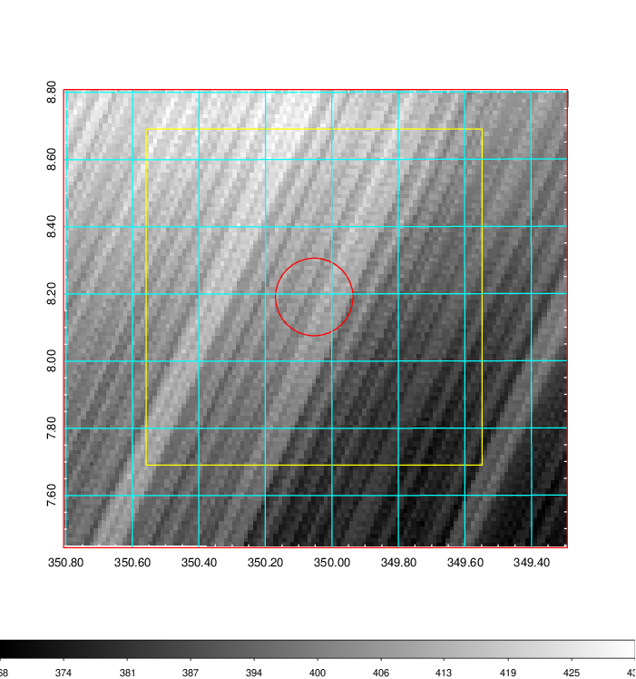
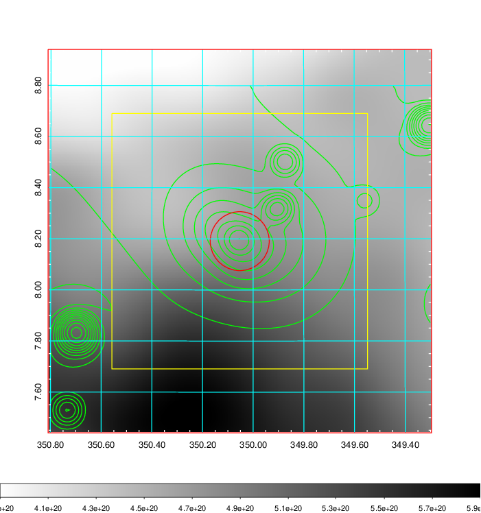
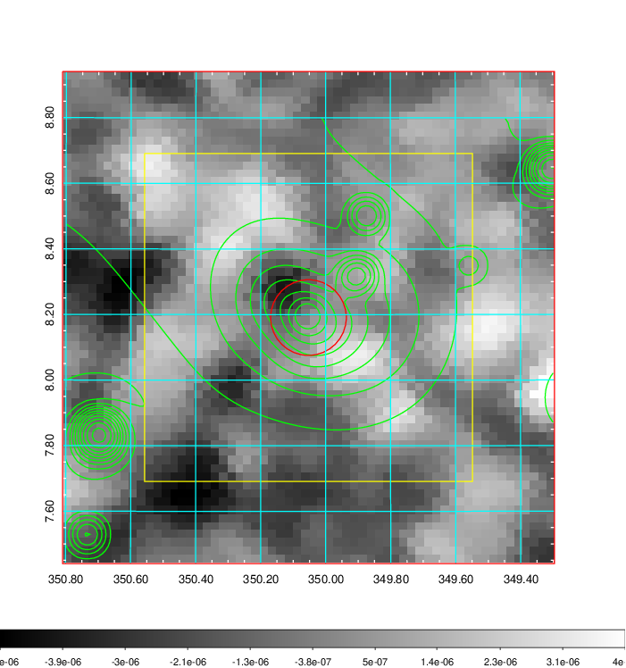
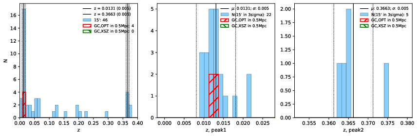
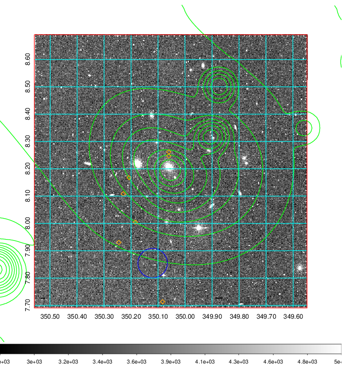
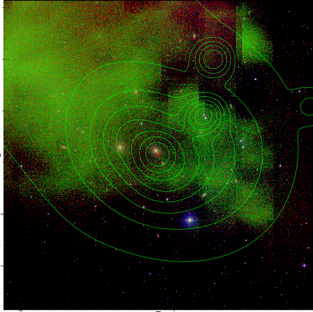
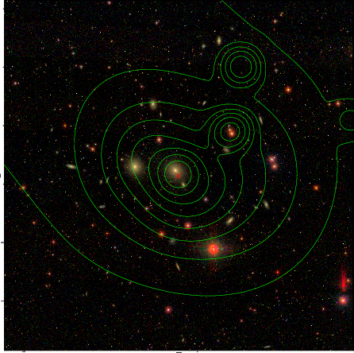

### 920

|Name|RAJ2000[deg]|DEJ2000[deg] |Ext[arcmin]| Ext,ml | z | z_src| C|GC(XSZ,Delta_z<0.01)| GC(OPT,Delta_z<0.01)|GC| R_sig[arcmin] | R500[arcmin] | R500[Mpc]| CRsig[c/s] | CR500[c/s] |L500[1E44 erg/s]|F500[1E-12 erg/s/cm^2]| M500[1E14 Msun]|Tx[keV]|Cnt_sig|Beta|Rc[arcmin]|Comment|Alias|
|---|---|---|---|---|---|------|---|--------|---------|----------|---|---|---|---|---|---|---|---|---|---|---|---|---|---|
|920| 350.053| 8.191| 6.92| 184.98| 0.0131(0.005)| z1, z_opt| S| -| N| N, W| 22.231| 29.513| 0.474| 0.498(0.064)| 0.526(0.067)| 0.026(0.002)| 6.776(0.607)| 0.31(0.01)| 1.04(0.03)| 229.5| 0.653(-0.056+0.077)| 6.372(-1.068+1.323)| -| t345|

|[RASS image](../image/920/920_img.pdf)|[filtered image](../image/920/920_fil.pdf)|[Segment image](../image/920/920_seg.pdf)|
|-------------------|--------------------|-------------------|
|   |    |   |

|[Exposure image](../image/920/920_mex.pdf)| [nH image](../image/920/920_nh.pdf)| [Planck image](../image/920/920_p.pdf)|
|-------------------|--------------------|-------------------|
|   |     |  |

|[Redshift Histogram](../image/920/920_zg.pdf) | [DSS image(z1)](../image/920/920_dss_z1.pdf)      |  [DSS image(z2)](../image/920/920_dss_z2.pdf)    |
|-------------------|--------------------|-------------------|
| |  Blue circle for optical clusters;  Magenta circle for XSZ clusters;  all with r=1Mpc;  Only GC with Delta_z<0.01 are shown. |  Blue circle for optical clusters;  Magenta circle for XSZ clusters;  all with r=1Mpc;  Only GC with Delta_z<0.01 are shown.  |

|[known Abell/XSZ clusters](../image/920/920_gc.pdf) | [2MASS image](../image/920/920_2mass.pdf)      |[SDSS image](../image/920/920_sdss.pdf)   |
|-------------------|-------------------|-------------------|
|  Magenta, blue and green circles  for optical, X-ray and SZ clusters  respectively, with redshift of clusters  labelled. The radius of circles  are 1Mpc.|  |   |

