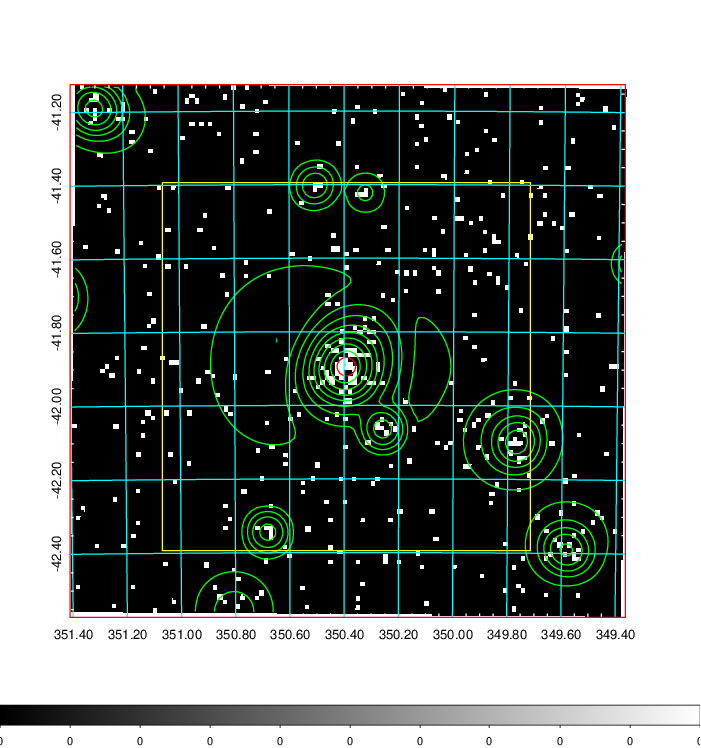
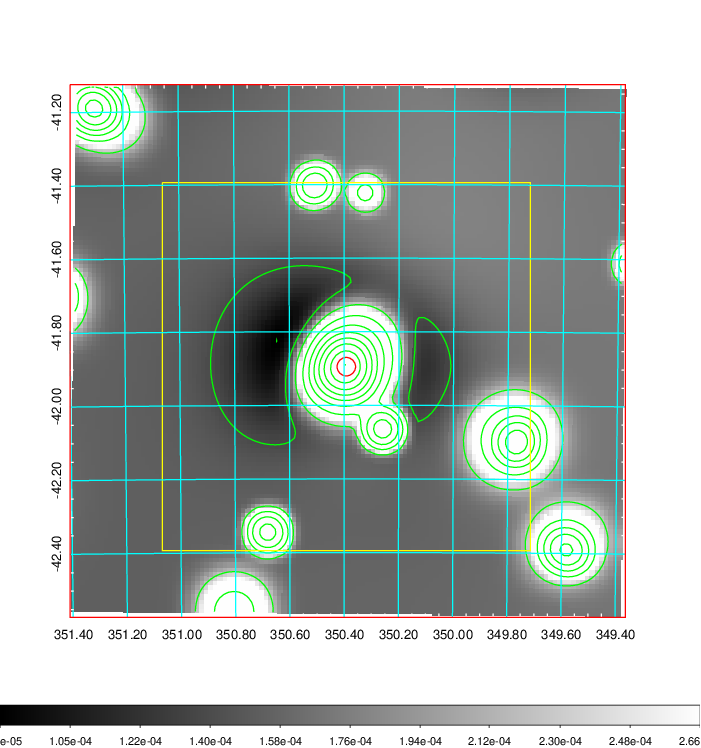
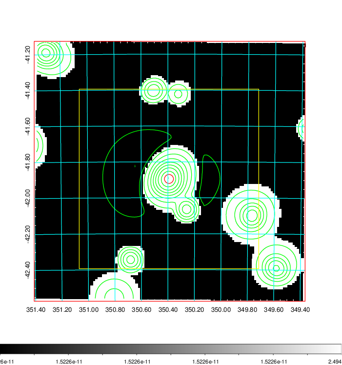
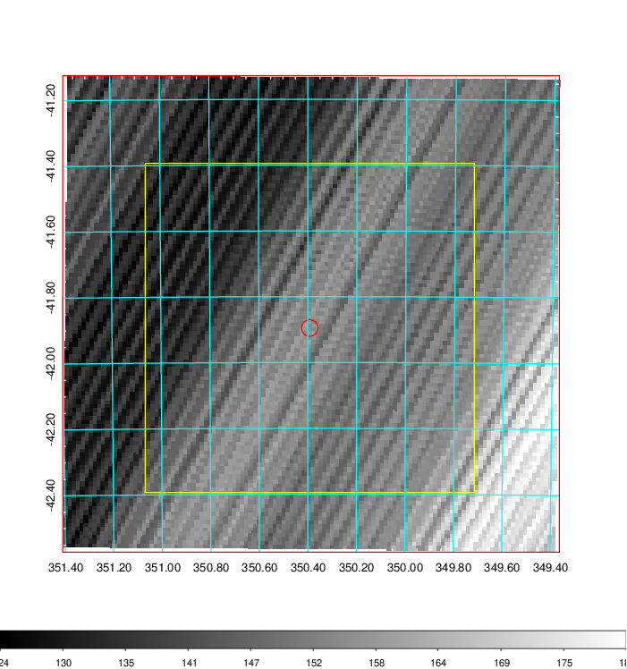
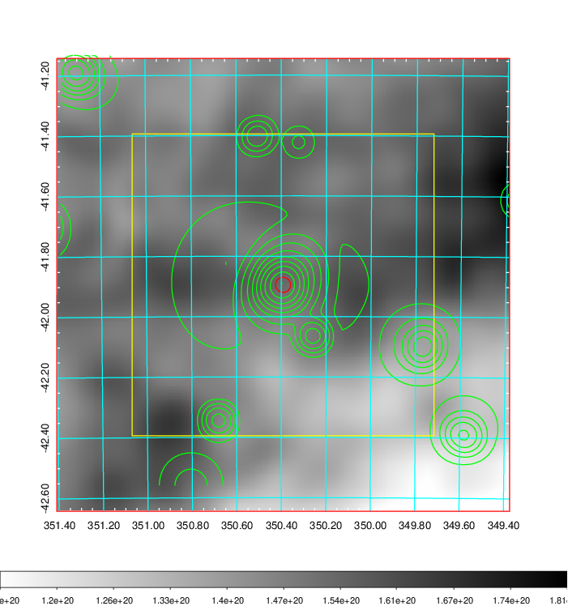
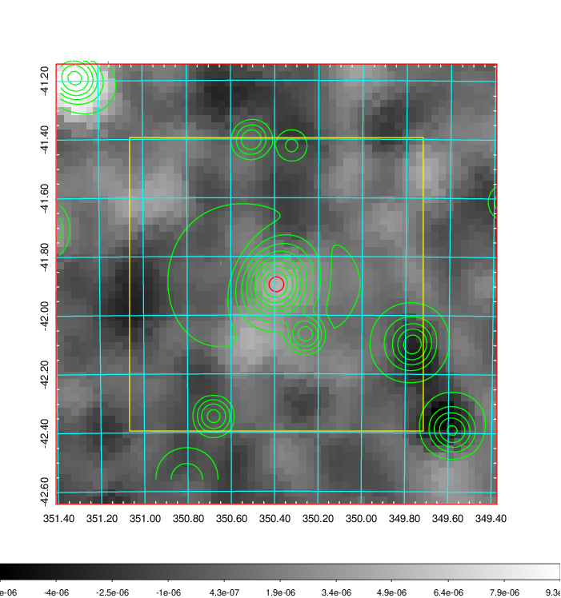
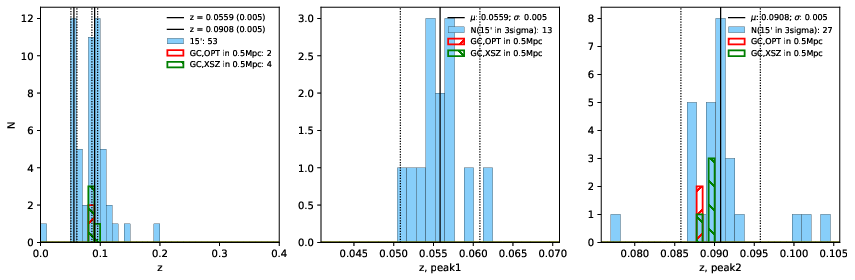
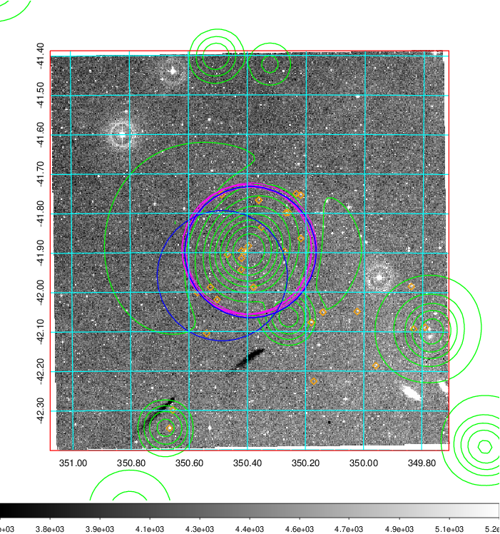
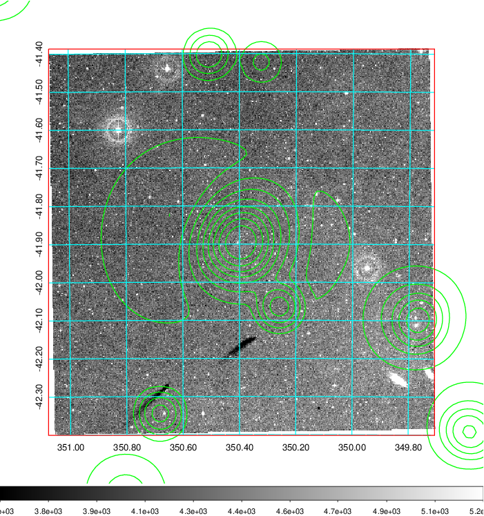
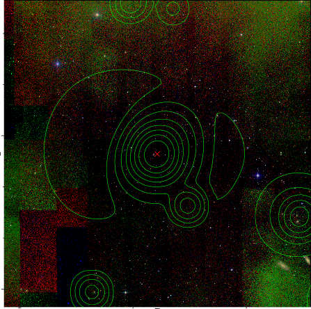

### 921

|Name|RAJ2000[deg]|DEJ2000[deg] |Ext[arcmin]| Ext,ml | z | z_src| C|GC(XSZ,Delta_z<0.01)| GC(OPT,Delta_z<0.01)|GC| R_sig[arcmin] | R500[arcmin] | R500[Mpc]| CRsig[c/s] | CR500[c/s] |L500[1E44 erg/s]|F500[1E-12 erg/s/cm^2]| M500[1E14 Msun]|Tx[keV]|Cnt_sig|Beta|Rc[arcmin]|Comment|Alias|
|---|---|---|---|---|---|------|---|--------|---------|----------|---|---|---|---|---|---|---|---|---|---|---|---|---|---|
|921| 350.392| -41.895| 1.51| 35.50| 0.0908(0.005)| z2, z_xsz| B| MCXC, Tar, XB| A| A, MCXC, N, Tar, XB| 9.288| 10.080| 1.024| 0.457(0.073)| 0.464(0.075)| 1.912(0.160)| 9.264(0.774)| 3.33(0.14)| 4.62(0.12)| 64.0| 0.891(-0.116+0.078)| 3.540(-0.657+0.487)| -| k116|

|[RASS image](../image/921/921_img.pdf)|[filtered image](../image/921/921_fil.pdf)|[Segment image](../image/921/921_seg.pdf)|
|-------------------|--------------------|-------------------|
|   |    |   |

|[Exposure image](../image/921/921_mex.pdf)| [nH image](../image/921/921_nh.pdf)| [Planck image](../image/921/921_p.pdf)|
|-------------------|--------------------|-------------------|
|   |     |  |

|[Redshift Histogram](../image/921/921_zg.pdf) | [DSS image(z1)](../image/921/921_dss_z1.pdf)      |  [DSS image(z2)](../image/921/921_dss_z2.pdf)    |
|-------------------|--------------------|-------------------|
| |  Blue circle for optical clusters;  Magenta circle for XSZ clusters;  all with r=1Mpc;  Only GC with Delta_z<0.01 are shown. |  Blue circle for optical clusters;  Magenta circle for XSZ clusters;  all with r=1Mpc;  Only GC with Delta_z<0.01 are shown.  |

|[known Abell/XSZ clusters](../image/921/921_gc.pdf) | [2MASS image](../image/921/921_2mass.pdf)      |
|-------------------|-------------------|
|  Magenta, blue and green circles  for optical, X-ray and SZ clusters  respectively, with redshift of clusters  labelled. The radius of circles  are 1Mpc.|  |

|[DES image](../image/921/921_des.pdf)   |
|-------------------|
|   |
