

### 922

|Name|RAJ2000[deg]|DEJ2000[deg] |Ext[arcmin]| Ext,ml | z | z_src| C|GC(XSZ,Delta_z<0.01)| GC(OPT,Delta_z<0.01)|GC| R_sig[arcmin] | R500[arcmin] | R500[Mpc]| CRsig[c/s] | CR500[c/s] |L500[1E44 erg/s]|F500[1E-12 erg/s/cm^2]| M500[1E14 Msun]|Tx[keV]|Cnt_sig|Beta|Rc[arcmin]|Comment|Alias|
|---|---|---|---|---|---|------|---|--------|---------|----------|---|---|---|---|---|---|---|---|---|---|---|---|---|---|
|922| 350.981| 16.762| 2.32| 510.03| 0.0421(0.005)| z1, z_xsz| B| L03, MCXC, PSZ2, Tar, XB| A, N, W| A, C, F20, L03, MCXC, N, PSZ2, Tar, W, XB| 25.194| 18.123| 0.903| 1.167(0.078)| 1.115(0.075)| 0.845(0.027)| 20.402(0.641)| 2.18(0.03)| 3.51(0.04)| 577.8| 0.654(-0.022+0.025)| 2.901(-0.256+0.276)| -| k267|

|[RASS image](../image/922/922_img.pdf)|[filtered image](../image/922/922_fil.pdf)|[Segment image](../image/922/922_seg.pdf)|
|-------------------|--------------------|-------------------|
| 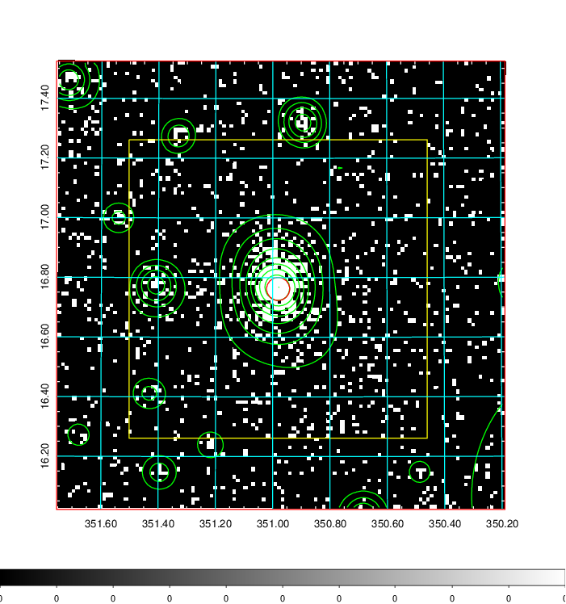  | 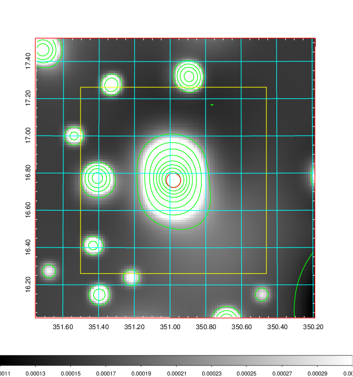   | 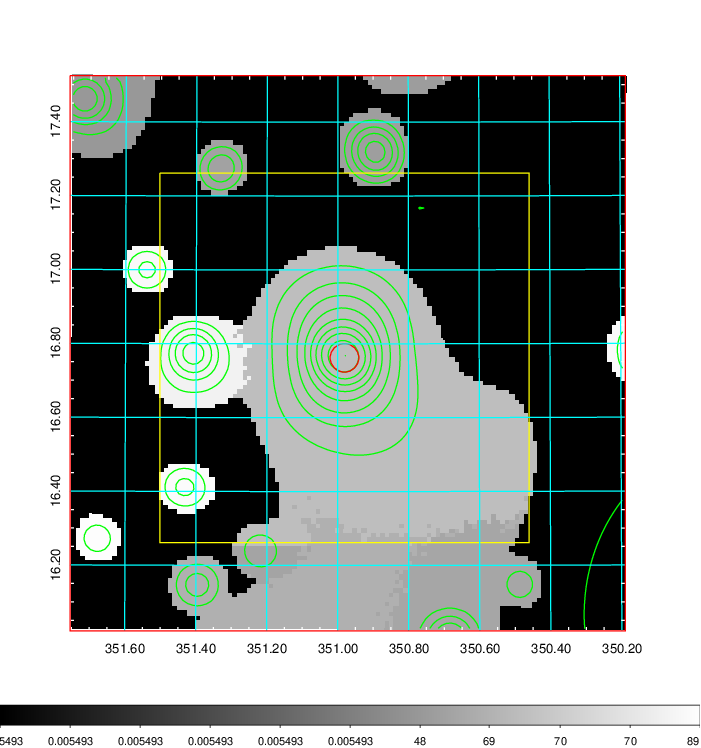  |

|[Exposure image](../image/922/922_mex.pdf)| [nH image](../image/922/922_nh.pdf)| [Planck image](../image/922/922_p.pdf)|
|-------------------|--------------------|-------------------|
|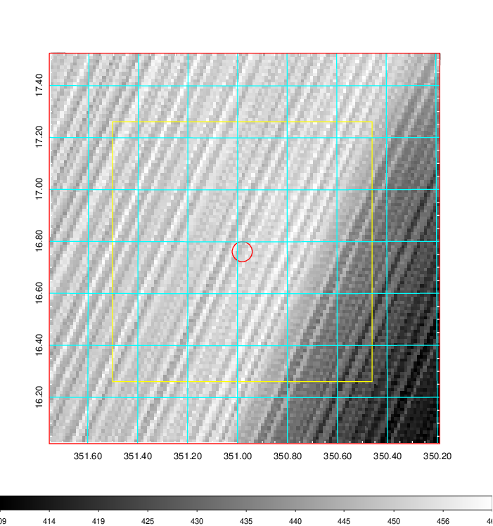   | 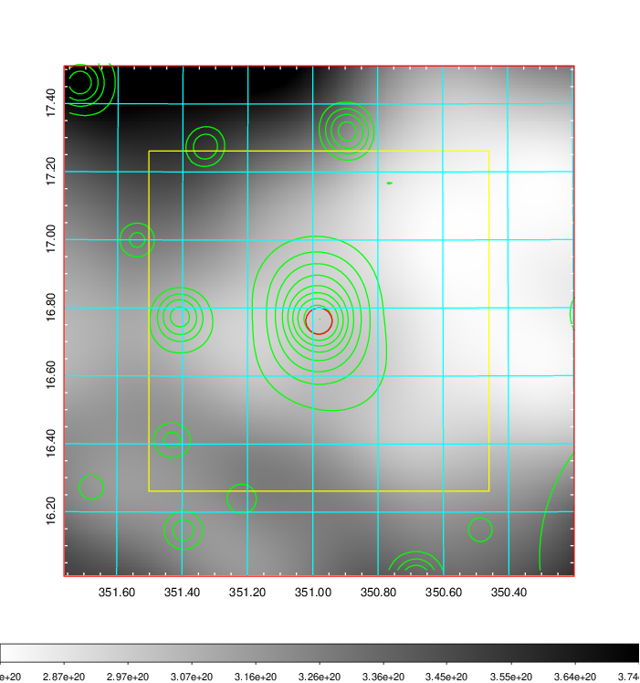    | 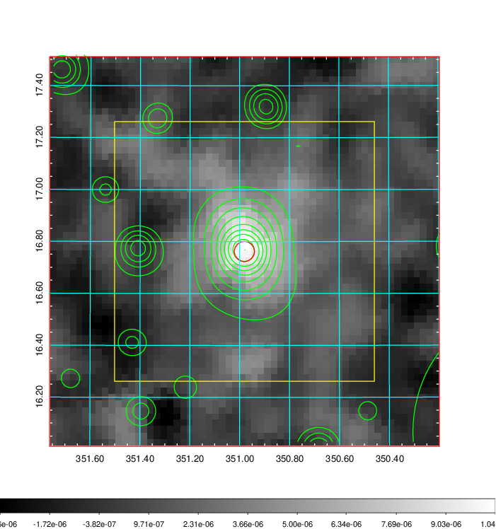 |

|[Redshift Histogram](../image/922/922_zg.pdf) | [DSS image(z1)](../image/922/922_dss_z1.pdf)      |  [DSS image(z2)](../image/922/922_dss_z2.pdf)    |
|-------------------|--------------------|-------------------|
|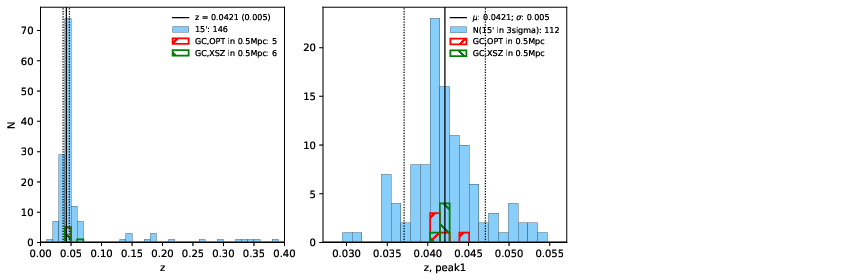 |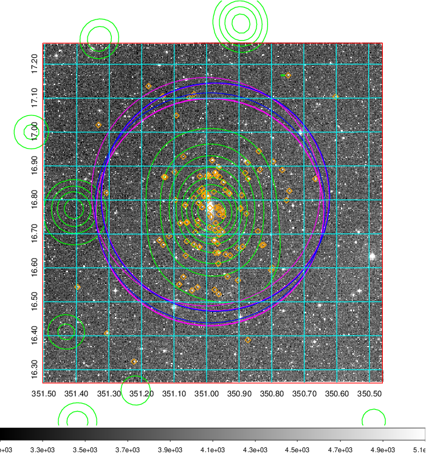  Blue circle for optical clusters;  Magenta circle for XSZ clusters;  all with r=1Mpc;  Only GC with Delta_z<0.01 are shown. | 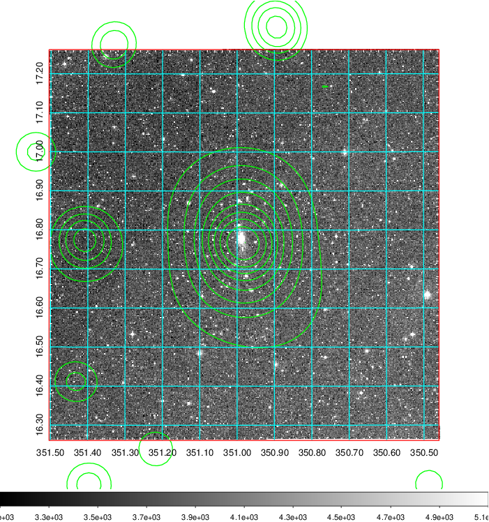 Blue circle for optical clusters;  Magenta circle for XSZ clusters;  all with r=1Mpc;  Only GC with Delta_z<0.01 are shown.  |

|[known Abell/XSZ clusters](../image/922/922_gc.pdf) | [2MASS image](../image/922/922_2mass.pdf)      |[SDSS image](../image/922/922_sdss.pdf)   |
|-------------------|-------------------|-------------------|
|  Magenta, blue and green circles  for optical, X-ray and SZ clusters  respectively, with redshift of clusters  labelled. The radius of circles  are 1Mpc.|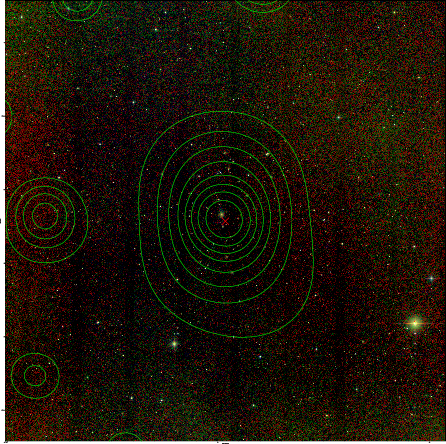  | 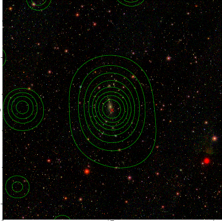  |

