

### 923

|Name|RAJ2000[deg]|DEJ2000[deg] |Ext[arcmin]| Ext,ml | z | z_src| C|GC(XSZ,Delta_z<0.01)| GC(OPT,Delta_z<0.01)|GC| R_sig[arcmin] | R500[arcmin] | R500[Mpc]| CRsig[c/s] | CR500[c/s] |L500[1E44 erg/s]|F500[1E-12 erg/s/cm^2]| M500[1E14 Msun]|Tx[keV]|Cnt_sig|Beta|Rc[arcmin]|Comment|Alias|
|---|---|---|---|---|---|------|---|--------|---------|----------|---|---|---|---|---|---|---|---|---|---|---|---|---|---|
|923| 351.097| 14.639| 3.95| 369.73| 0.0411(0.005)| z1, z_xsz| B| L03, MCXC, PSZ2, Tar, XB| A, N, W| A, F20, L03, MCXC, N, PSZ2, Tar, W, XB| 14.162| 16.665| 0.812| 0.659(0.050)| 0.679(0.051)| 0.474(0.019)| 12.010(0.475)| 1.58(0.03)| 2.88(0.04)| 269.3| 0.928(-0.083+0.052)| 7.295(-0.704+0.466)| -| k474|

|[RASS image](../image/923/923_img.pdf)|[filtered image](../image/923/923_fil.pdf)|[Segment image](../image/923/923_seg.pdf)|
|-------------------|--------------------|-------------------|
| 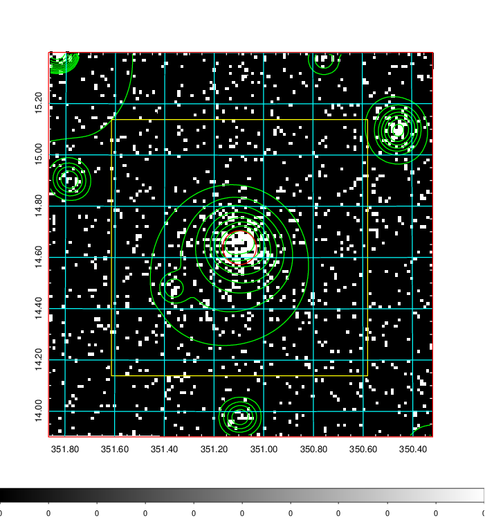  | 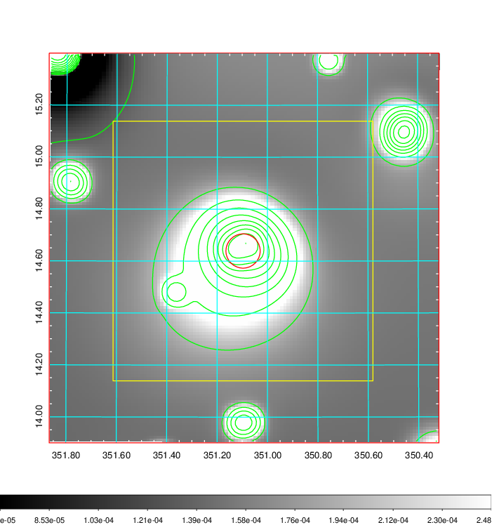   | 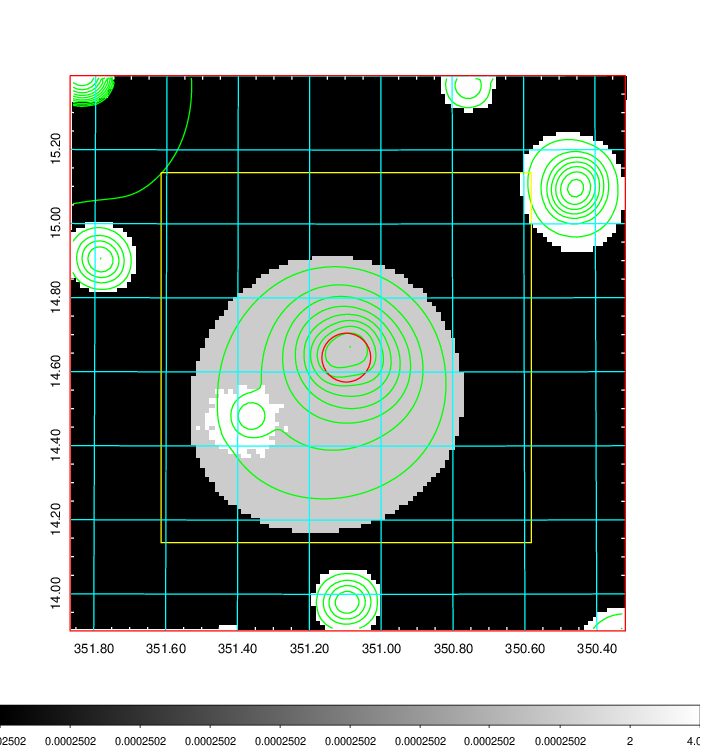  |

|[Exposure image](../image/923/923_mex.pdf)| [nH image](../image/923/923_nh.pdf)| [Planck image](../image/923/923_p.pdf)|
|-------------------|--------------------|-------------------|
|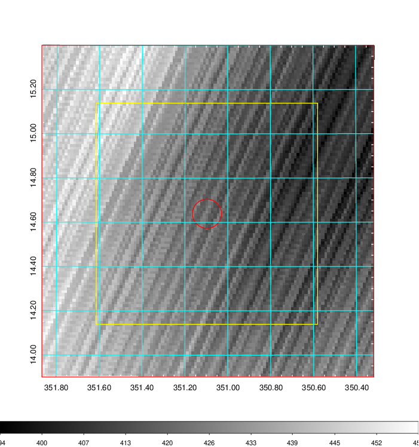   | 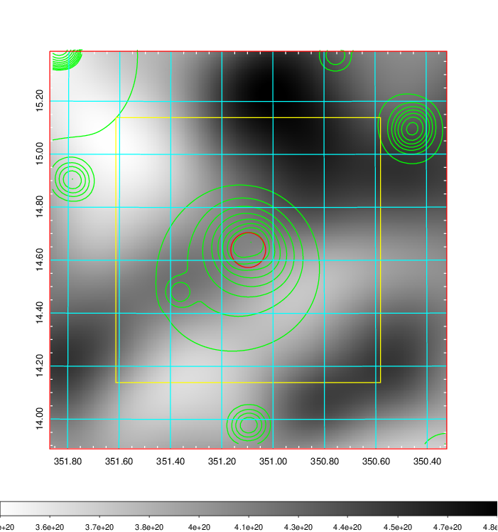    | 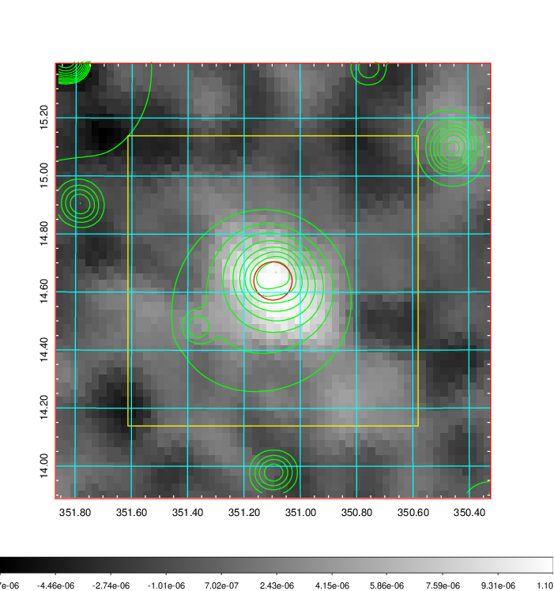 |

|[Redshift Histogram](../image/923/923_zg.pdf) | [DSS image(z1)](../image/923/923_dss_z1.pdf)      |  [DSS image(z2)](../image/923/923_dss_z2.pdf)    |
|-------------------|--------------------|-------------------|
|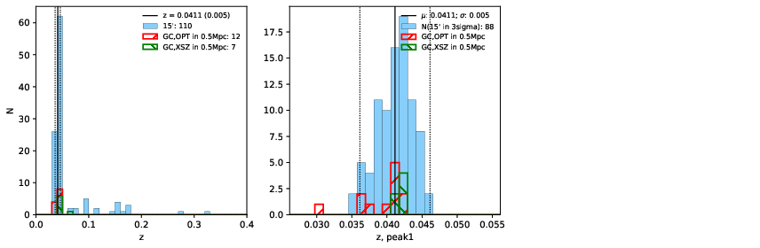 |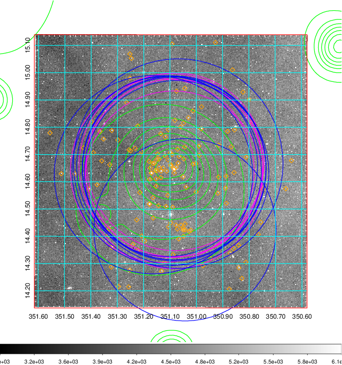  Blue circle for optical clusters;  Magenta circle for XSZ clusters;  all with r=1Mpc;  Only GC with Delta_z<0.01 are shown. | 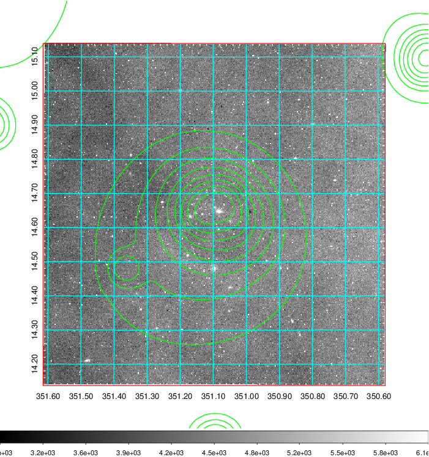 Blue circle for optical clusters;  Magenta circle for XSZ clusters;  all with r=1Mpc;  Only GC with Delta_z<0.01 are shown.  |

|[Previous-identified clusters](../image/923/923_gc.pdf) | [2MASS image](../image/923/923_2mass.pdf)      |[SDSS image](../image/923/923_sdss.pdf)   |
|-------------------|-------------------|-------------------|
|  Green, magenta, and blue circles  for optical, X-ray and SZ clusters  respectively, with redshift of clusters  labelled. The radius of circles  are 1Mpc.|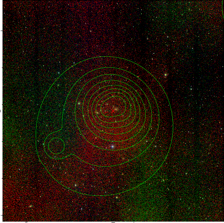  | 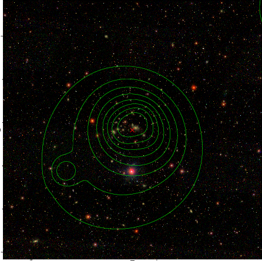  |

