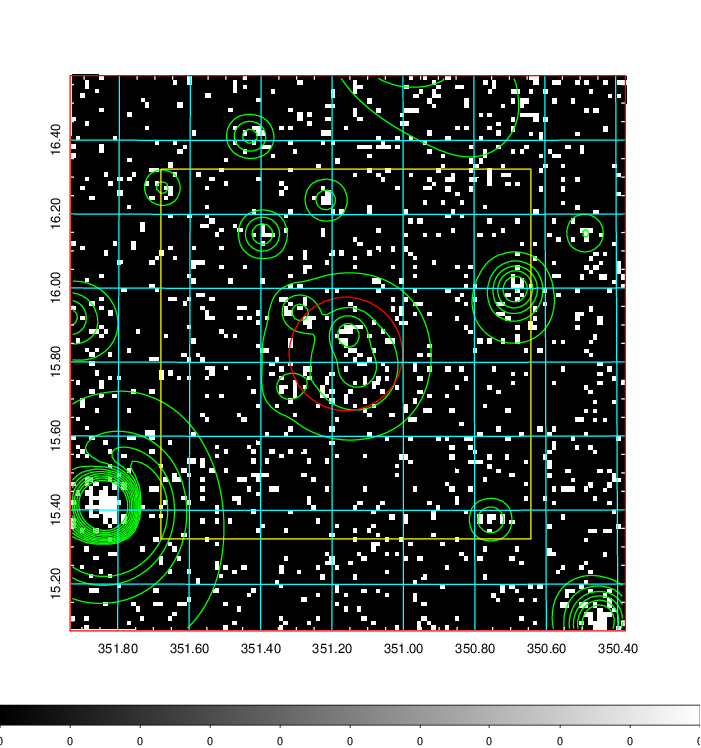
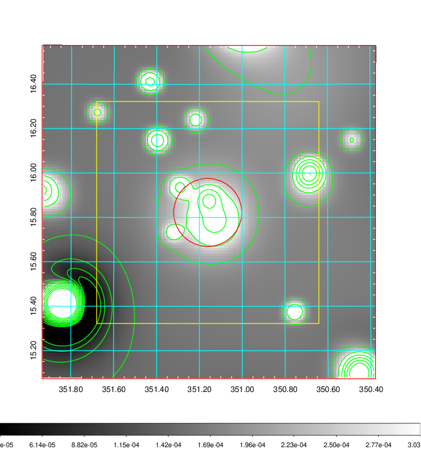
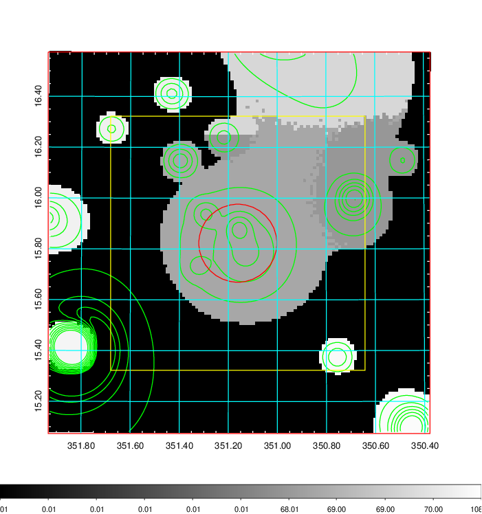
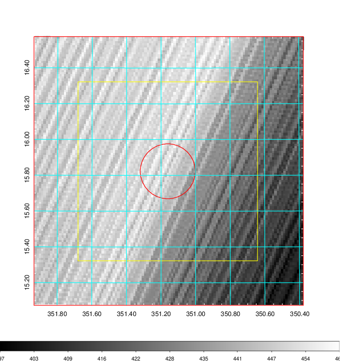
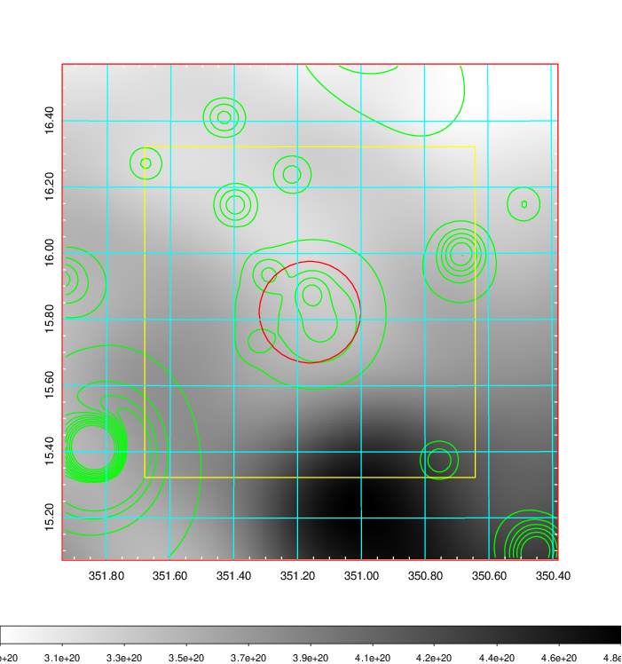
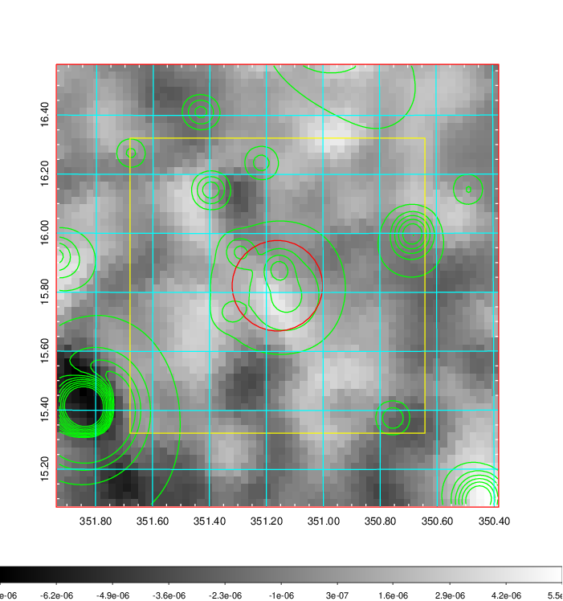
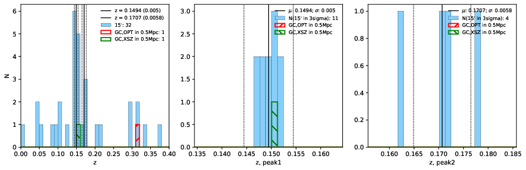
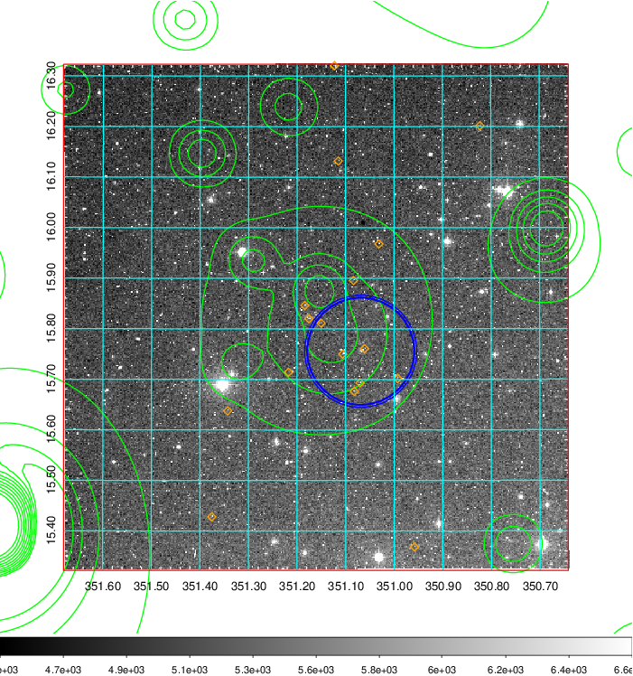
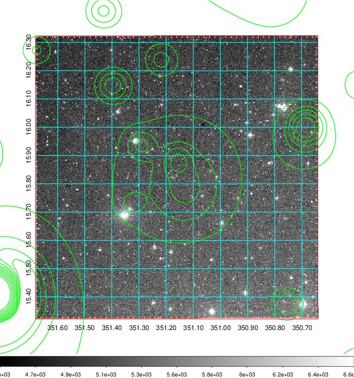
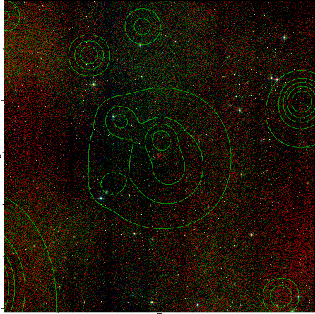

### 924

|Name|RAJ2000[deg]|DEJ2000[deg] |Ext[arcmin]| Ext,ml | z | z_src| C|GC(XSZ,Delta_z<0.01)| GC(OPT,Delta_z<0.01)|GC| R_sig[arcmin] | R500[arcmin] | R500[Mpc]| CRsig[c/s] | CR500[c/s] |L500[1E44 erg/s]|F500[1E-12 erg/s/cm^2]| M500[1E14 Msun]|Tx[keV]|Cnt_sig|Beta|Rc[arcmin]|Comment|Alias|
|---|---|---|---|---|---|------|---|--------|---------|----------|---|---|---|---|---|---|---|---|---|---|---|---|---|---|
|924| 351.161| 15.823| 9.21| 35.61| 0.1494(0.005)| z1, z_xsz| B| F20| -| C, F20, N, W| 11.725| 5.462| 0.854| 0.082(0.032)| 0.075(0.029)| 0.844(0.316)| 1.400(0.524)| 2.05(0.38)| 3.49(0.41)| 51.7| 0.815(-0.171+0.130)| 7.808(-1.839+1.355)| -| t418|

|[RASS image](../image/924/924_img.pdf)|[filtered image](../image/924/924_fil.pdf)|[Segment image](../image/924/924_seg.pdf)|
|-------------------|--------------------|-------------------|
|   |    |   |

|[Exposure image](../image/924/924_mex.pdf)| [nH image](../image/924/924_nh.pdf)| [Planck image](../image/924/924_p.pdf)|
|-------------------|--------------------|-------------------|
|   |     |  |

|[Redshift Histogram](../image/924/924_zg.pdf) | [DSS image(z1)](../image/924/924_dss_z1.pdf)      |  [DSS image(z2)](../image/924/924_dss_z2.pdf)    |
|-------------------|--------------------|-------------------|
| |  Blue circle for optical clusters;  Magenta circle for XSZ clusters;  all with r=1Mpc;  Only GC with Delta_z<0.01 are shown. |  Blue circle for optical clusters;  Magenta circle for XSZ clusters;  all with r=1Mpc;  Only GC with Delta_z<0.01 are shown.  |

|[known Abell/XSZ clusters](../image/924/924_gc.pdf) | [2MASS image](../image/924/924_2mass.pdf)      |[SDSS image](../image/924/924_sdss.pdf)   |
|-------------------|-------------------|-------------------|
|  Magenta, blue and green circles  for optical, X-ray and SZ clusters  respectively, with redshift of clusters  labelled. The radius of circles  are 1Mpc.|  |   |

