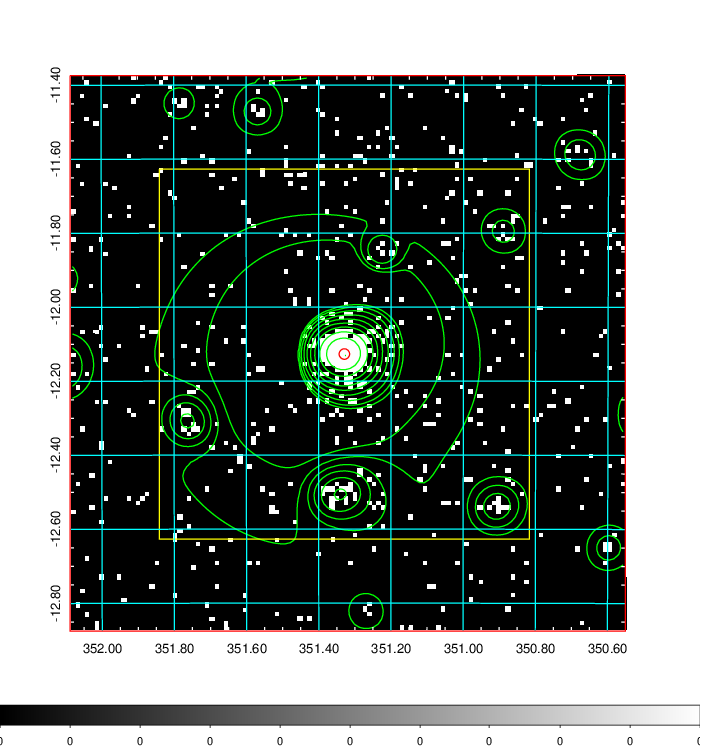
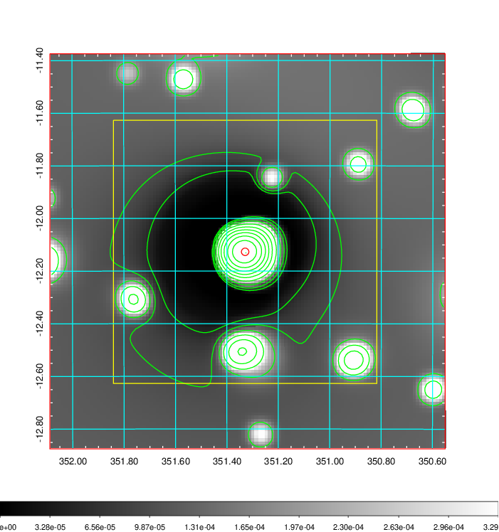
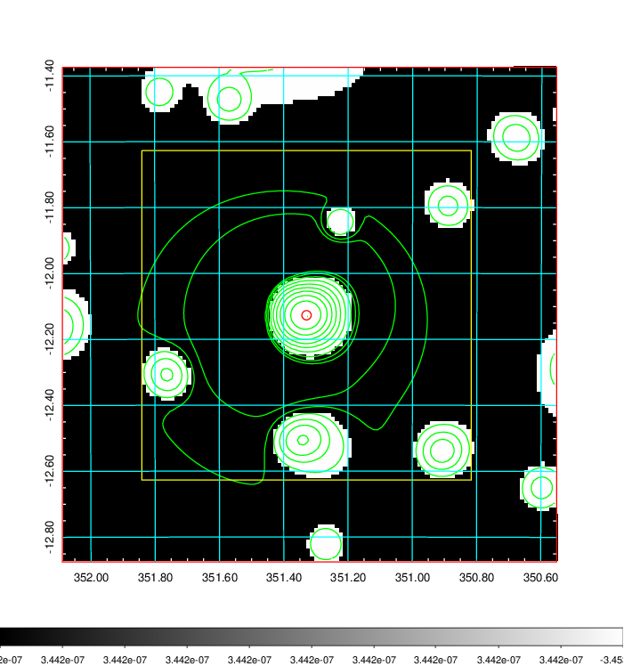
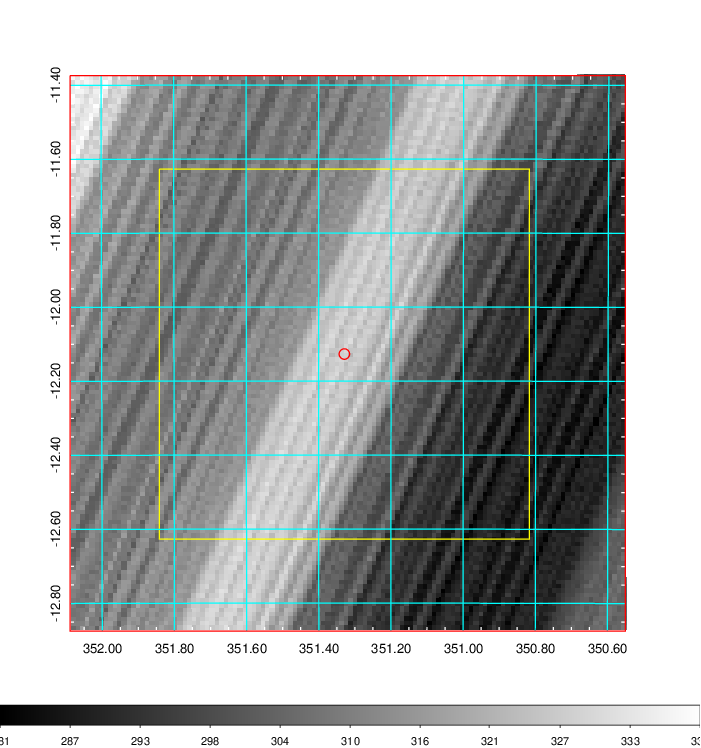
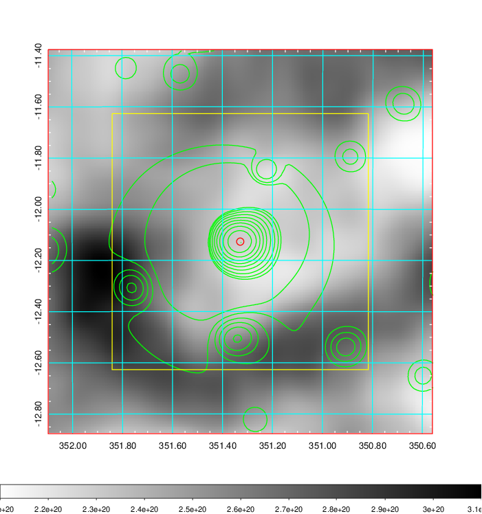
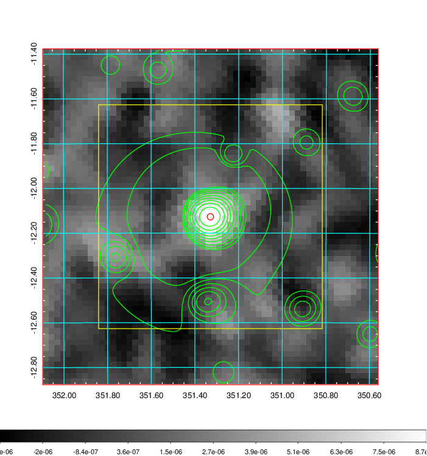
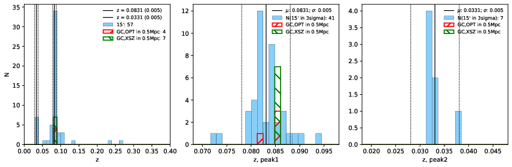
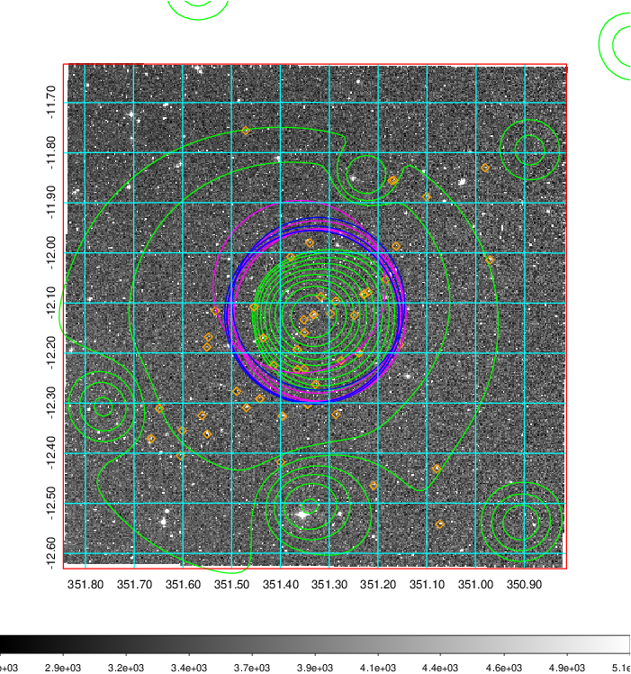
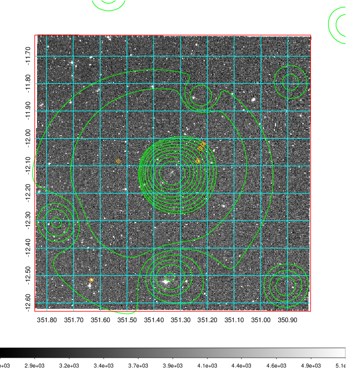
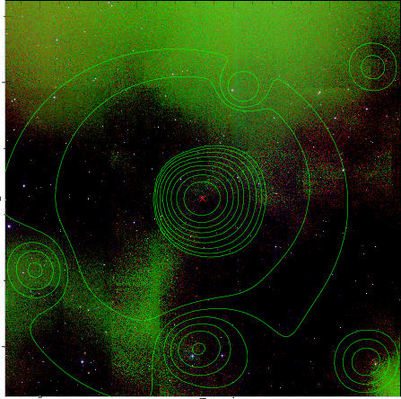

### 925

|Name|RAJ2000[deg]|DEJ2000[deg] |Ext[arcmin]| Ext,ml | z | z_src| C|GC(XSZ,Delta_z<0.01)| GC(OPT,Delta_z<0.01)|GC| R_sig[arcmin] | R500[arcmin] | R500[Mpc]| CRsig[c/s] | CR500[c/s] |L500[1E44 erg/s]|F500[1E-12 erg/s/cm^2]| M500[1E14 Msun]|Tx[keV]|Cnt_sig|Beta|Rc[arcmin]|Comment|Alias|
|---|---|---|---|---|---|------|---|--------|---------|----------|---|---|---|---|---|---|---|---|---|---|---|---|---|---|
|925| 351.329| -12.127| 0.85| 93.54| 0.0831(0.005)| z1, z_xsz| B| L03, MCXC, PSZ2, SPI, Tar, XB| A, N, W| A, L03, MCXC, N, PSZ2, SPI, Tar, W, XB| 23.712| 12.349| 1.158| 1.048(0.082)| 0.971(0.076)| 3.245(0.100)| 18.966(0.587)| 4.78(0.07)| 5.77(0.06)| 350.0| 0.826(-0.069+0.086)| 2.390(-0.374+0.412)| -| k019|

|[RASS image](../image/925/925_img.pdf)|[filtered image](../image/925/925_fil.pdf)|[Segment image](../image/925/925_seg.pdf)|
|-------------------|--------------------|-------------------|
|   |    |   |

|[Exposure image](../image/925/925_mex.pdf)| [nH image](../image/925/925_nh.pdf)| [Planck image](../image/925/925_p.pdf)|
|-------------------|--------------------|-------------------|
|   |     |  |

|[Redshift Histogram](../image/925/925_zg.pdf) | [DSS image(z1)](../image/925/925_dss_z1.pdf)      |  [DSS image(z2)](../image/925/925_dss_z2.pdf)    |
|-------------------|--------------------|-------------------|
| |  Blue circle for optical clusters;  Magenta circle for XSZ clusters;  all with r=1Mpc;  Only GC with Delta_z<0.01 are shown. |  Blue circle for optical clusters;  Magenta circle for XSZ clusters;  all with r=1Mpc;  Only GC with Delta_z<0.01 are shown.  |

|[known Abell/XSZ clusters](../image/925/925_gc.pdf) | [2MASS image](../image/925/925_2mass.pdf)      |
|-------------------|-------------------|
|  Magenta, blue and green circles  for optical, X-ray and SZ clusters  respectively, with redshift of clusters  labelled. The radius of circles  are 1Mpc.|  |

|[ATLAS image](../image/925/925_s.pdf)        |
|-------------------|
|   |
