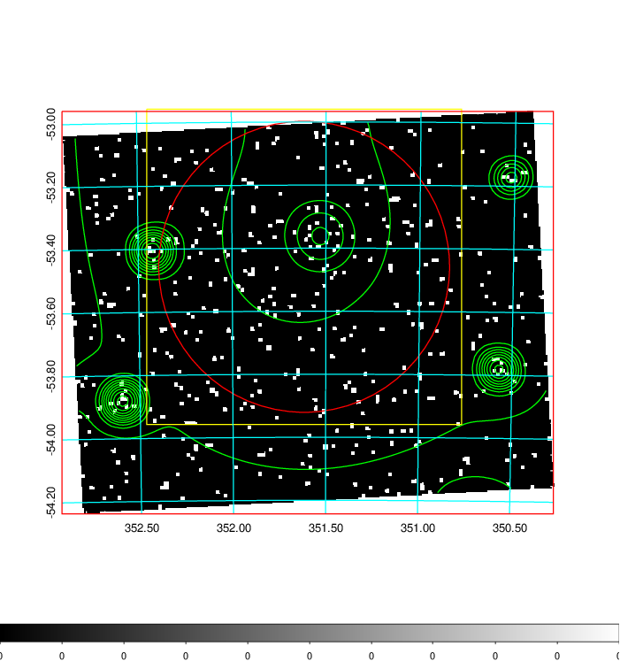
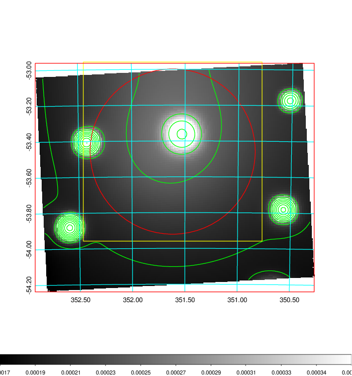
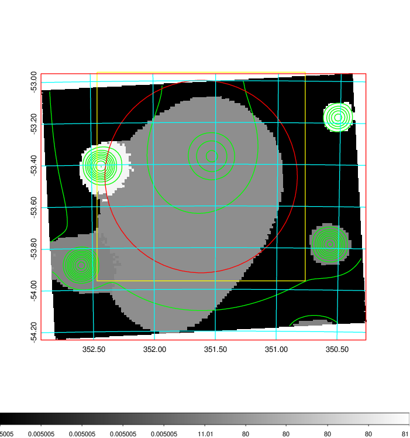
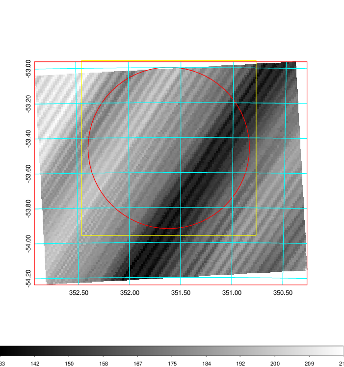
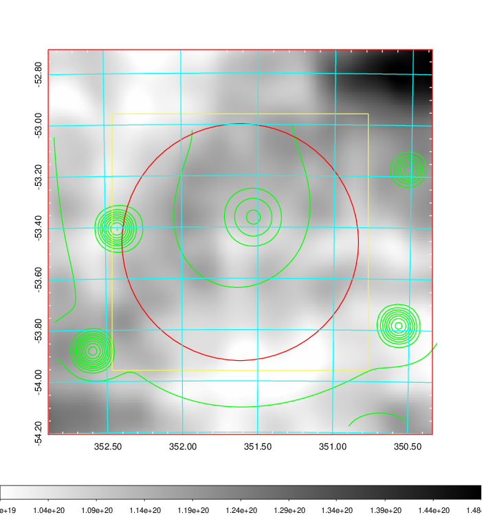
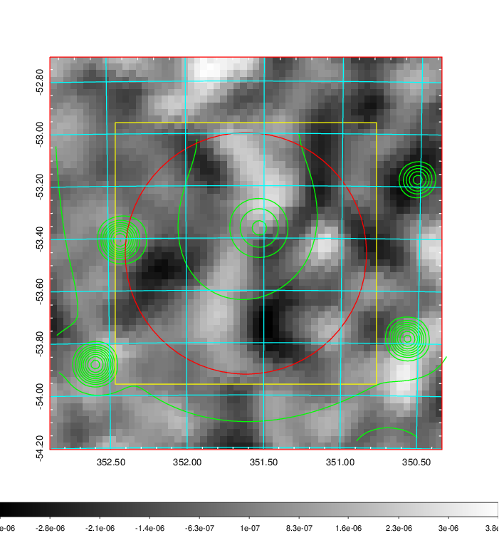
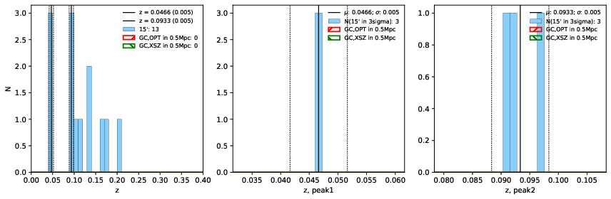
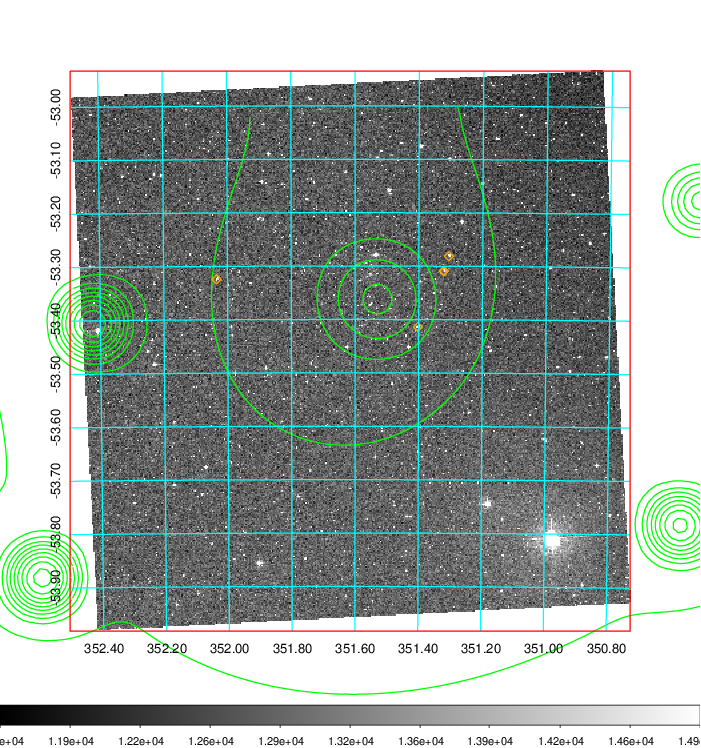
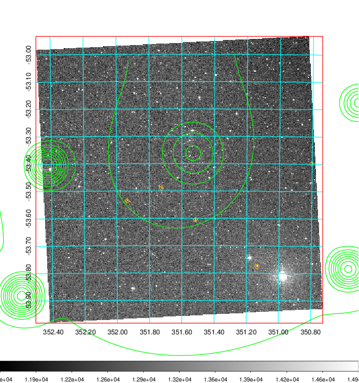
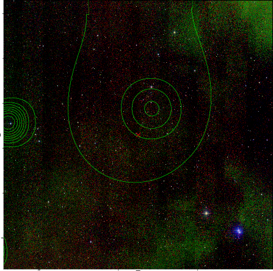

### 926

|Name|RAJ2000[deg]|DEJ2000[deg] |Ext[arcmin]| Ext,ml | z | z_src| C|GC(XSZ,Delta_z<0.01)| GC(OPT,Delta_z<0.01)|GC| R_sig[arcmin] | R500[arcmin] | R500[Mpc]| CRsig[c/s] | CR500[c/s] |L500[1E44 erg/s]|F500[1E-12 erg/s/cm^2]| M500[1E14 Msun]|Tx[keV]|Cnt_sig|Beta|Rc[arcmin]|Comment|Alias|
|---|---|---|---|---|---|------|---|--------|---------|----------|---|---|---|---|---|---|---|---|---|---|---|---|---|---|
|926| 351.616| -53.459| 27.70| 44.67| 0.1700(0.000)| -| G| -| -| A, N, W, XLSSC| 41.590| 7.780| 1.353| 0.638(0.123)| 0.562(0.108)| 9.337(7.609)| 11.654(9.498)| 8.32(3.18)| 8.36(2.05)| 119.1| 0.861(-0.149+0.100)| 34.842(-6.083+4.052)| $z$ of X-ray cluster; An X-ray cluster with $z$ = 0.17 and offset = 0.97 Mpc; An Abell cluster with $z$ = 0.2101 and offset = 1.27 Mpc(7.22arcmin)| t630|

|[RASS image](../image/926/926_img.pdf)|[filtered image](../image/926/926_fil.pdf)|[Segment image](../image/926/926_seg.pdf)|
|-------------------|--------------------|-------------------|
|   |    |   |

|[Exposure image](../image/926/926_mex.pdf)| [nH image](../image/926/926_nh.pdf)| [Planck image](../image/926/926_p.pdf)|
|-------------------|--------------------|-------------------|
|   |     |  |

|[Redshift Histogram](../image/926/926_zg.pdf) | [DSS image(z1)](../image/926/926_dss_z1.pdf)      |  [DSS image(z2)](../image/926/926_dss_z2.pdf)    |
|-------------------|--------------------|-------------------|
| |  Blue circle for optical clusters;  Magenta circle for XSZ clusters;  all with r=1Mpc;  Only GC with Delta_z<0.01 are shown. |  Blue circle for optical clusters;  Magenta circle for XSZ clusters;  all with r=1Mpc;  Only GC with Delta_z<0.01 are shown.  |

|[known Abell/XSZ clusters](../image/926/926_gc.pdf) | [2MASS image](../image/926/926_2mass.pdf)      |
|-------------------|-------------------|
|  Magenta, blue and green circles  for optical, X-ray and SZ clusters  respectively, with redshift of clusters  labelled. The radius of circles  are 1Mpc.|  |

|[DES image](../image/926/926_des.pdf)   |
|-------------------|
|   |
