

### 928

|Name|RAJ2000[deg]|DEJ2000[deg] |Ext[arcmin]| Ext,ml | z | z_src| C|GC(XSZ,Delta_z<0.01)| GC(OPT,Delta_z<0.01)|GC| R_sig[arcmin] | R500[arcmin] | R500[Mpc]| CRsig[c/s] | CR500[c/s] |L500[1E44 erg/s]|F500[1E-12 erg/s/cm^2]| M500[1E14 Msun]|Tx[keV]|Cnt_sig|Beta|Rc[arcmin]|Comment|Alias|
|---|---|---|---|---|---|------|---|--------|---------|----------|---|---|---|---|---|---|---|---|---|---|---|---|---|---|
|928| 353.356| 9.433| 3.97| 25.87| 0.1619(0.005)| z1, z_xsz| B| F20, SPI, Tar| A, C, N, RM, W| A, C, F20, N, SPI, Tar, W| 12.212| 5.895| 0.985| 0.135(0.034)| 0.124(0.031)| 1.661(0.315)| 2.309(0.438)| 3.18(0.29)| 4.61(0.27)| 62.7| 0.624(-0.093+0.189)| 3.806(-1.150+1.858)| -| t193|

|[RASS image](../image/928/928_img.pdf)|[filtered image](../image/928/928_fil.pdf)|[Segment image](../image/928/928_seg.pdf)|
|-------------------|--------------------|-------------------|
| 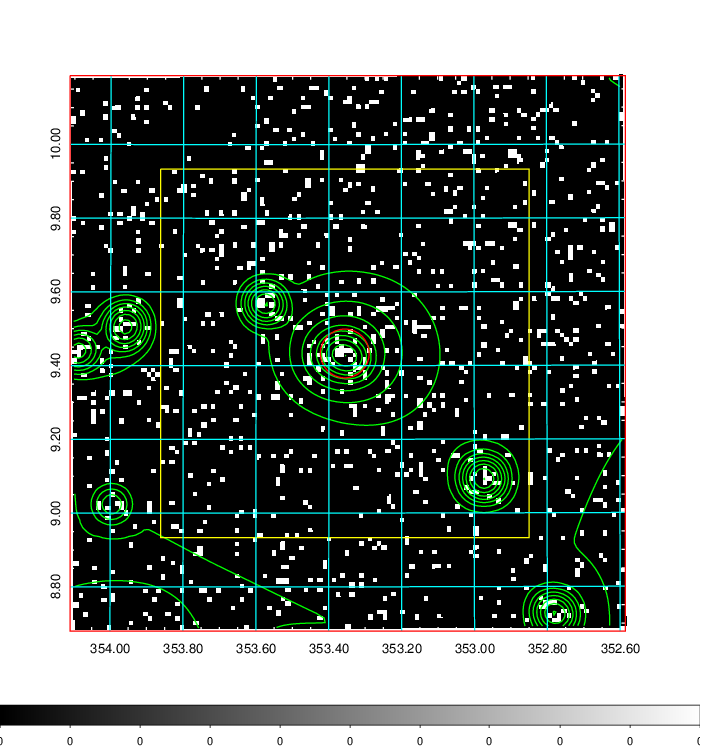  | 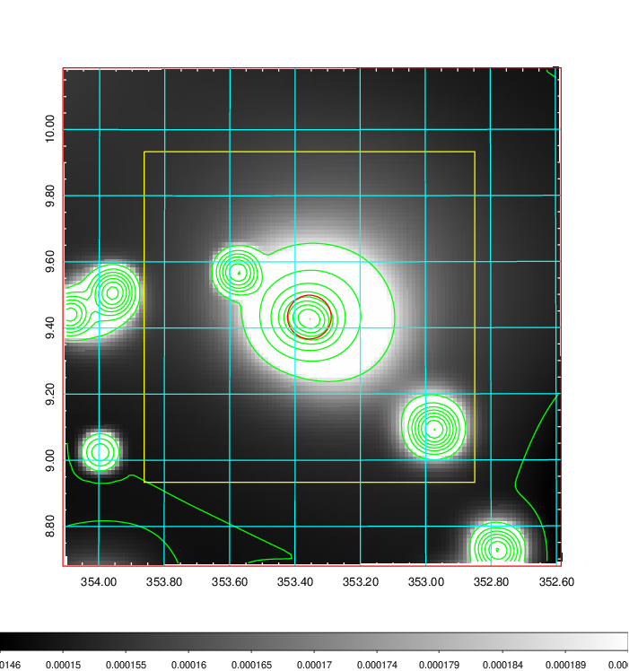   | 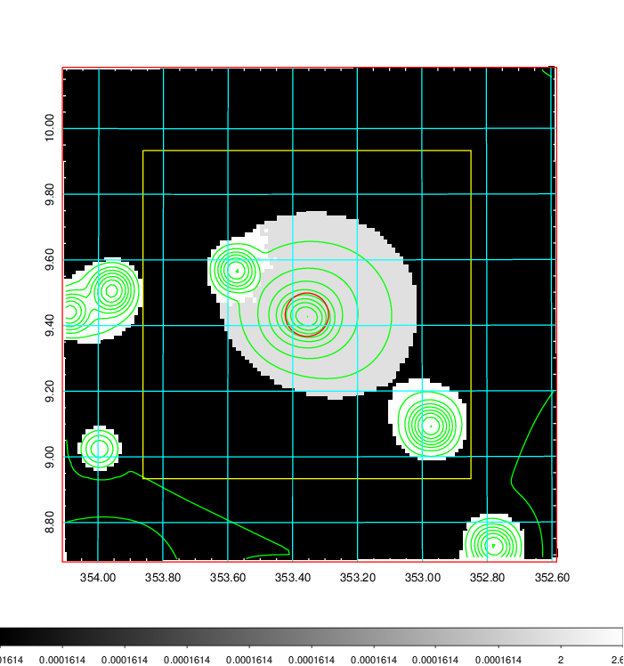  |

|[Exposure image](../image/928/928_mex.pdf)| [nH image](../image/928/928_nh.pdf)| [Planck image](../image/928/928_p.pdf)|
|-------------------|--------------------|-------------------|
|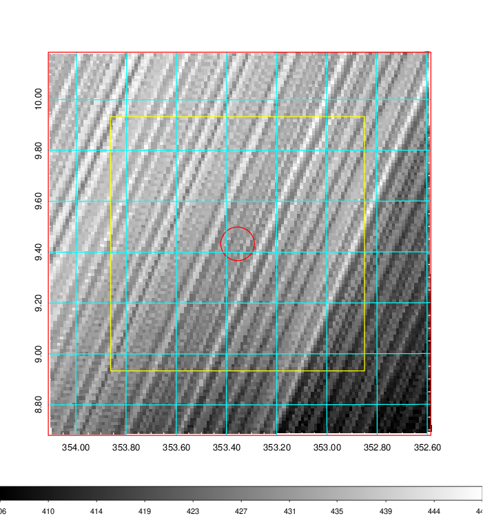   | 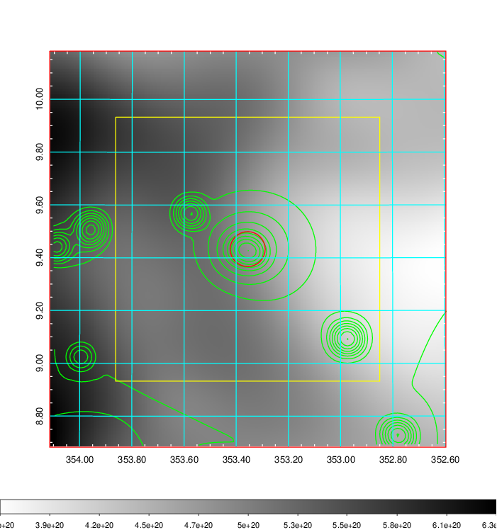    | 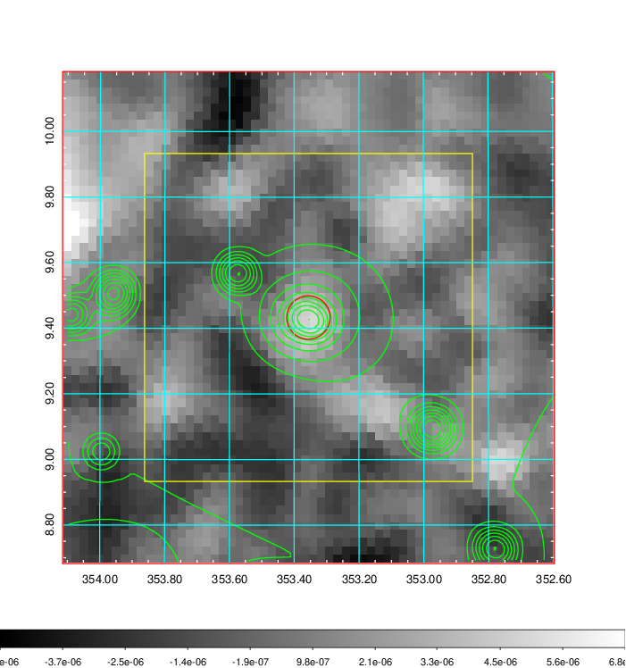 |

|[Redshift Histogram](../image/928/928_zg.pdf) | [DSS image(z1)](../image/928/928_dss_z1.pdf)      |  [DSS image(z2)](../image/928/928_dss_z2.pdf)    |
|-------------------|--------------------|-------------------|
|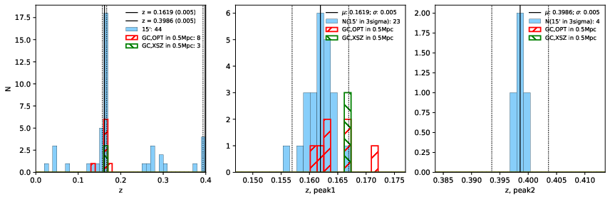 |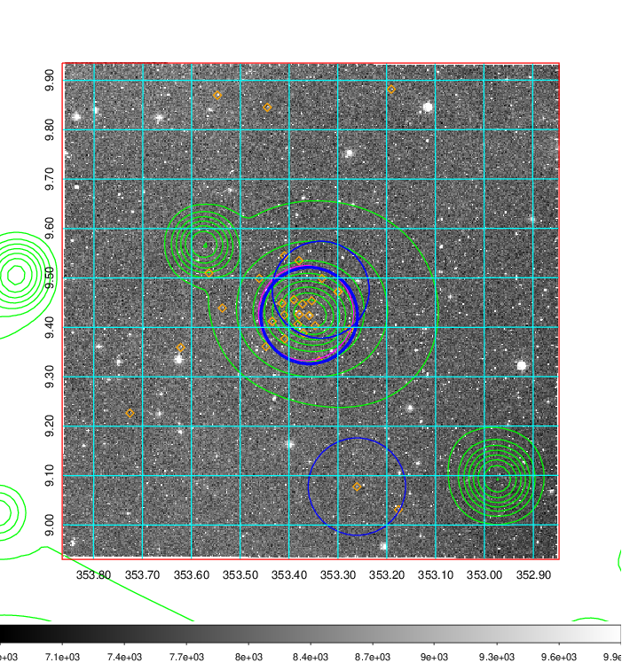  Blue circle for optical clusters;  Magenta circle for XSZ clusters;  all with r=1Mpc;  Only GC with Delta_z<0.01 are shown. | 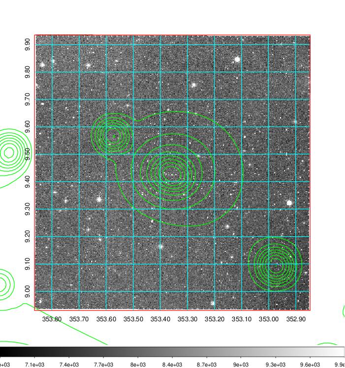 Blue circle for optical clusters;  Magenta circle for XSZ clusters;  all with r=1Mpc;  Only GC with Delta_z<0.01 are shown.  |

|[Previous-identified clusters](../image/928/928_gc.pdf) | [2MASS image](../image/928/928_2mass.pdf)      |[SDSS image](../image/928/928_sdss.pdf)   |
|-------------------|-------------------|-------------------|
|  Green, magenta, and blue circles  for optical, X-ray and SZ clusters  respectively, with redshift of clusters  labelled. The radius of circles  are 1Mpc.|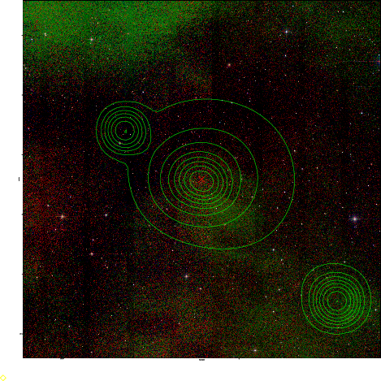  | 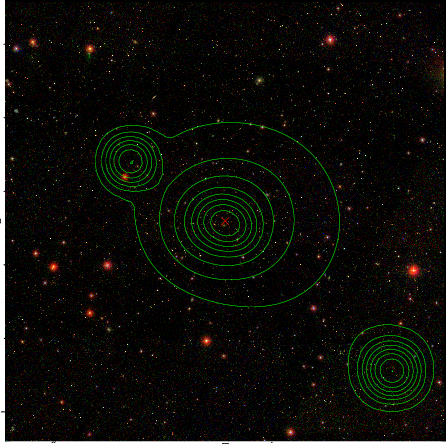  |

