

### 929

|Name|RAJ2000[deg]|DEJ2000[deg] |Ext[arcmin]| Ext,ml | z | z_src| C|GC(XSZ,Delta_z<0.01)| GC(OPT,Delta_z<0.01)|GC| R_sig[arcmin] | R500[arcmin] | R500[Mpc]| CRsig[c/s] | CR500[c/s] |L500[1E44 erg/s]|F500[1E-12 erg/s/cm^2]| M500[1E14 Msun]|Tx[keV]|Cnt_sig|Beta|Rc[arcmin]|Comment|Alias|
|---|---|---|---|---|---|------|---|--------|---------|----------|---|---|---|---|---|---|---|---|---|---|---|---|---|---|
|929| 353.753| 27.377| 2.53| 95.46| 0.0614(0.005)| z1, z_xsz| B| F20, L03, MCXC, SPI, XB| A, N, W| A, C, F20, L03, MCXC, N, SPI, W, XB| 10.750| 11.104| 0.789| 0.266(0.033)| 0.268(0.033)| 0.430(0.027)| 4.748(0.298)| 1.48(0.05)| 2.78(0.06)| 137.7| 0.813(-0.117+0.117)| 4.215(-0.878+0.788)| -| k301|

|[RASS image](../image/929/929_img.pdf)|[filtered image](../image/929/929_fil.pdf)|[Segment image](../image/929/929_seg.pdf)|
|-------------------|--------------------|-------------------|
| 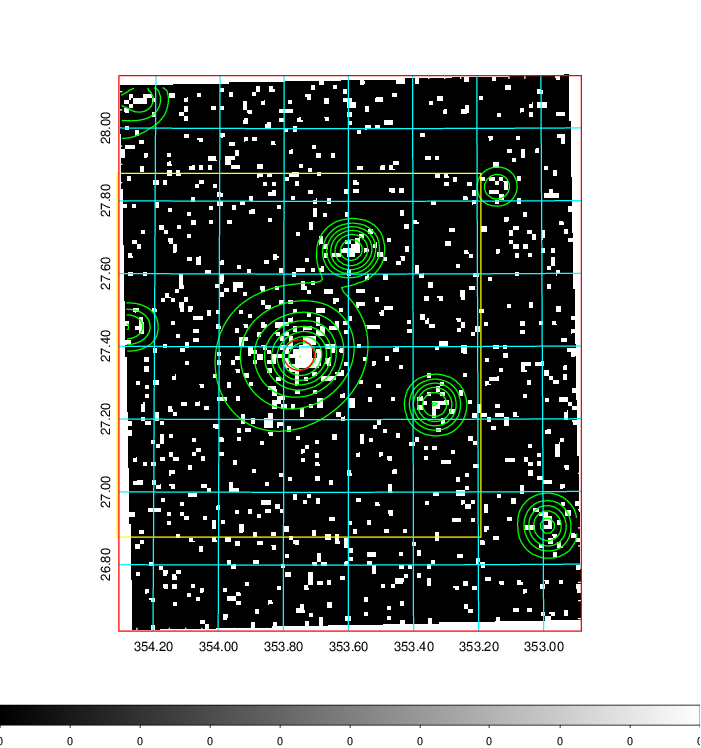  | 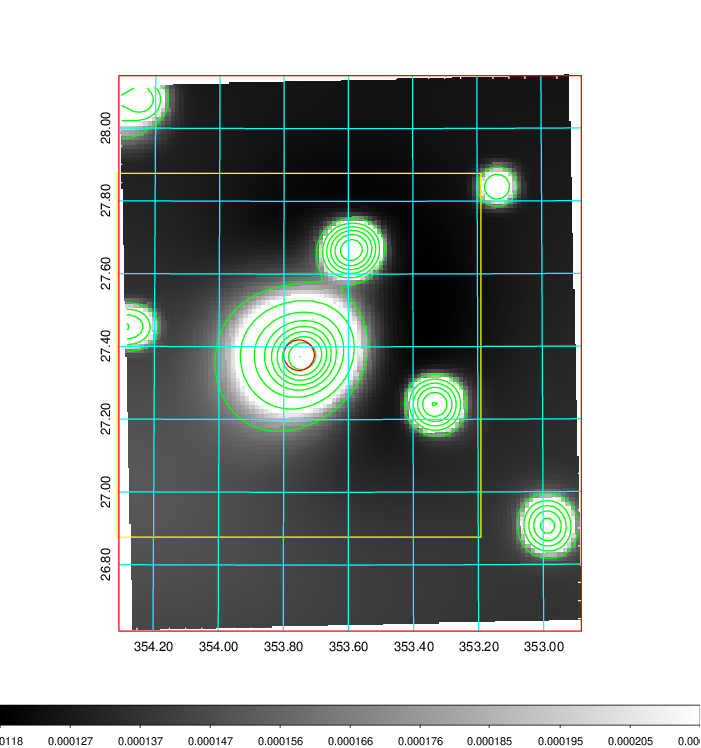   | 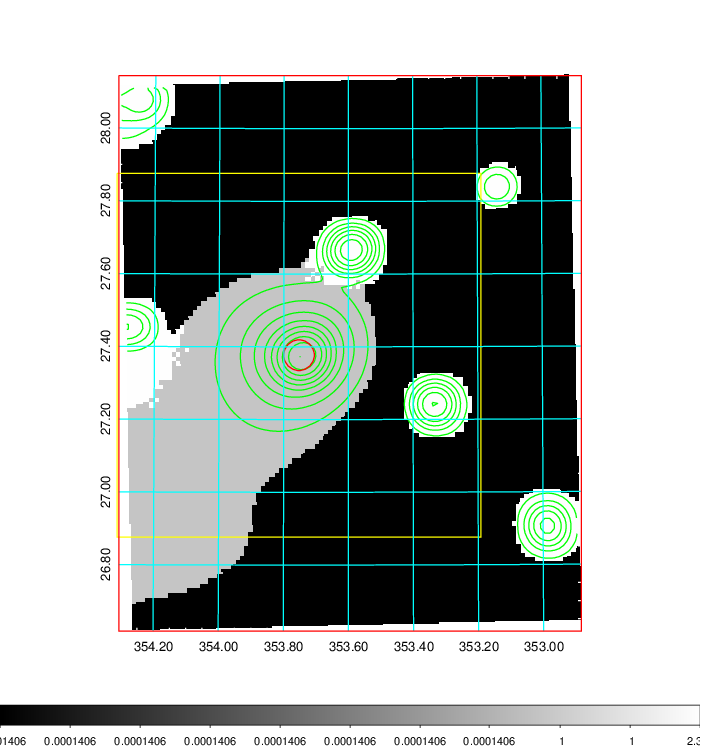  |

|[Exposure image](../image/929/929_mex.pdf)| [nH image](../image/929/929_nh.pdf)| [Planck image](../image/929/929_p.pdf)|
|-------------------|--------------------|-------------------|
|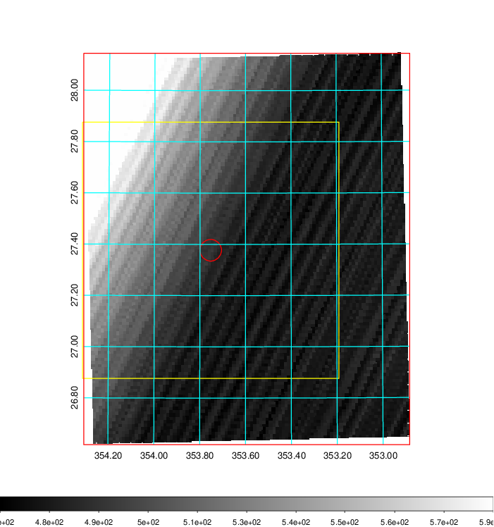   | 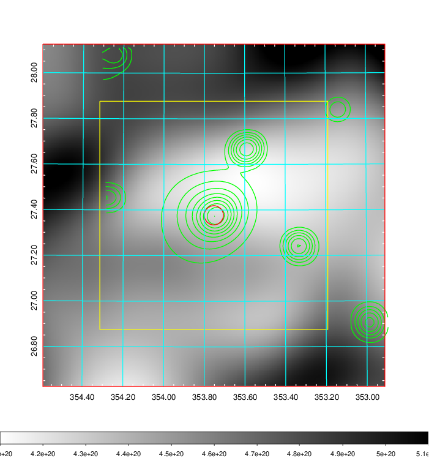    | 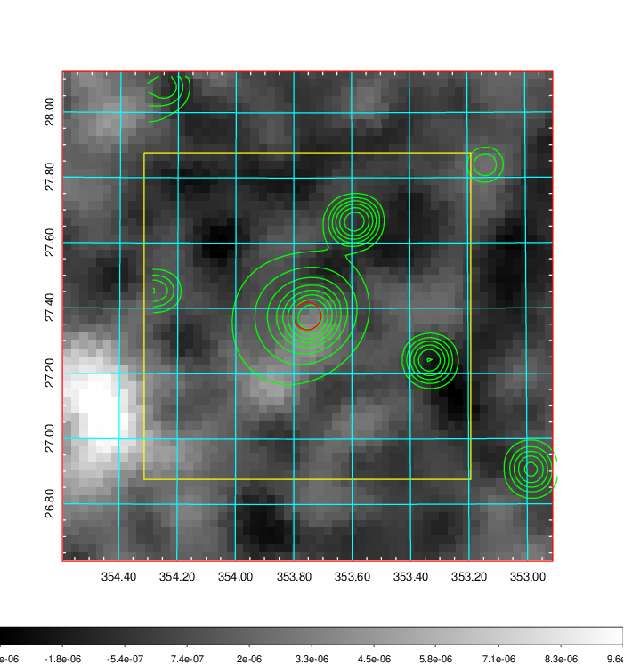 |

|[Redshift Histogram](../image/929/929_zg.pdf) | [DSS image(z1)](../image/929/929_dss_z1.pdf)      |  [DSS image(z2)](../image/929/929_dss_z2.pdf)    |
|-------------------|--------------------|-------------------|
|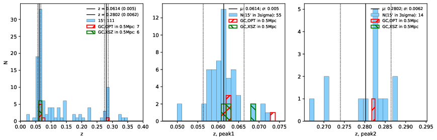 |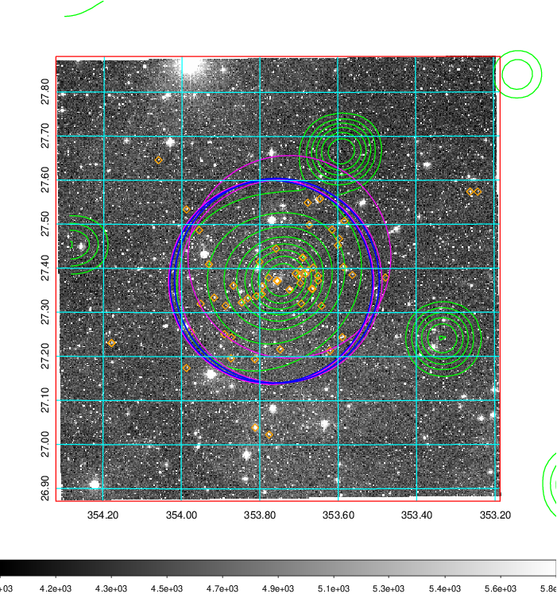  Blue circle for optical clusters;  Magenta circle for XSZ clusters;  all with r=1Mpc;  Only GC with Delta_z<0.01 are shown. | 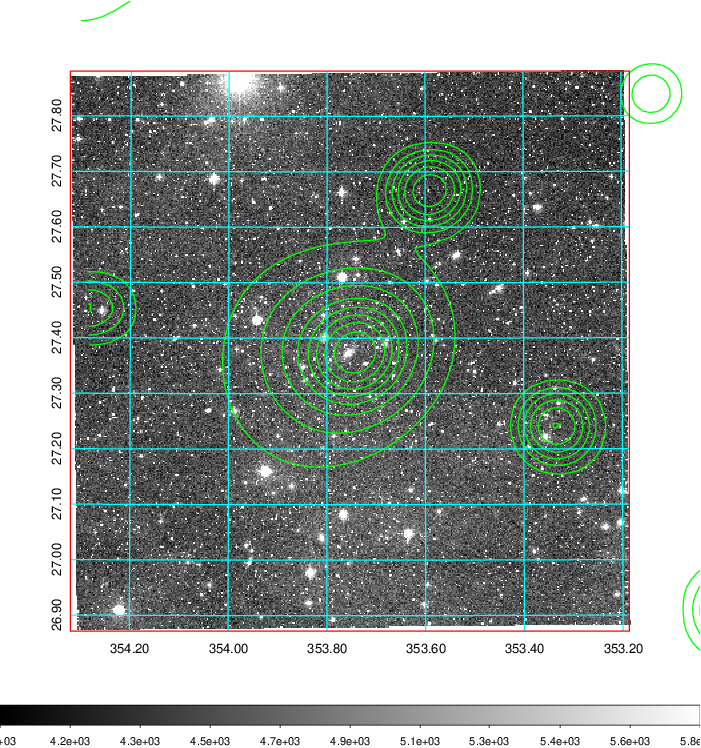 Blue circle for optical clusters;  Magenta circle for XSZ clusters;  all with r=1Mpc;  Only GC with Delta_z<0.01 are shown.  |

|[known Abell/XSZ clusters](../image/929/929_gc.pdf) | [2MASS image](../image/929/929_2mass.pdf)      |[SDSS image](../image/929/929_sdss.pdf)   |
|-------------------|-------------------|-------------------|
|  Magenta, blue and green circles  for optical, X-ray and SZ clusters  respectively, with redshift of clusters  labelled. The radius of circles  are 1Mpc.|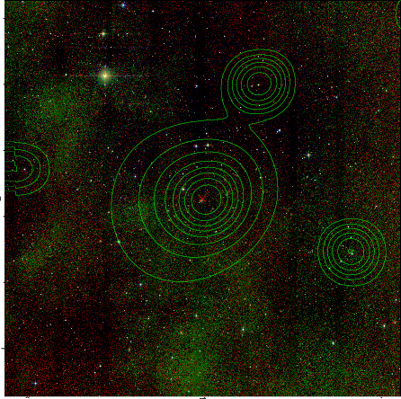  | 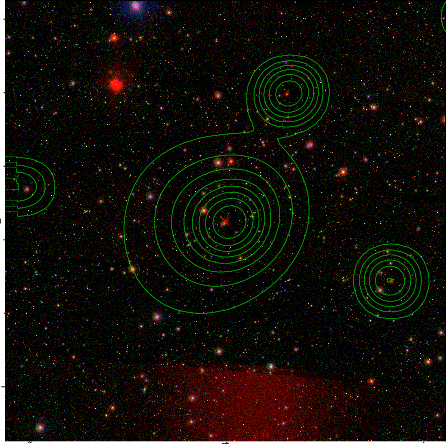  |

