

### 93

|Name|RAJ2000[deg]|DEJ2000[deg] |Ext[arcmin]| Ext,ml | z | z_src| C|GC(XSZ,Delta_z<0.01)| GC(OPT,Delta_z<0.01)|GC| R_sig[arcmin] | R500[arcmin] | R500[Mpc]| CRsig[c/s] | CR500[c/s] |L500[1E44 erg/s]|F500[1E-12 erg/s/cm^2]| M500[1E14 Msun]|Tx[keV]|Cnt_sig|Beta|Rc[arcmin]|Comment|Alias|
|---|---|---|---|---|---|------|---|--------|---------|----------|---|---|---|---|---|---|---|---|---|---|---|---|---|---|
|93| 29.059| 5.646| 5.59| 70.44| 0.0186(0.005)| z1, z_opt| S| -| N| C, F20, N, Tak, W, XCS| 18.281| 20.028| 0.454| 0.205(0.047)| 0.209(0.048)| 0.021(0.003)| 2.718(0.359)| 0.27(0.02)| 0.96(0.04)| 125.7| 0.616(-0.076+0.134)| 5.317(-1.300+2.009)| An X-ray cluster with $z$ = 0.4499 and offset = 0.18 Mpc| t286|

|[RASS image](../image/93/93_img.pdf)|[filtered image](../image/93/93_fil.pdf)|[Segment image](../image/93/93_seg.pdf)|
|-------------------|--------------------|-------------------|
| 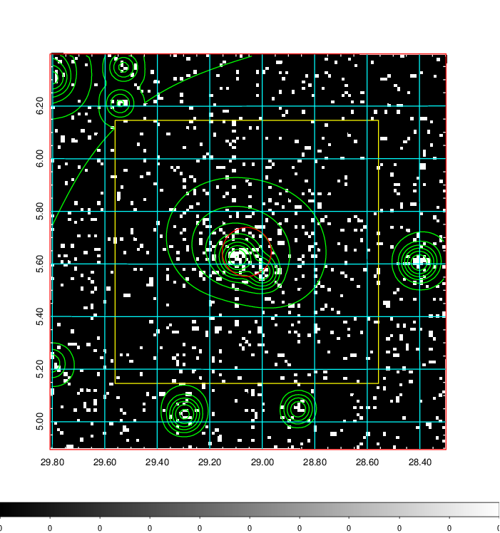  | 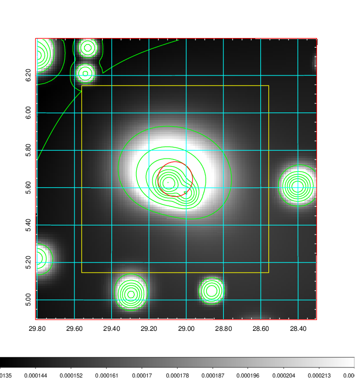   | 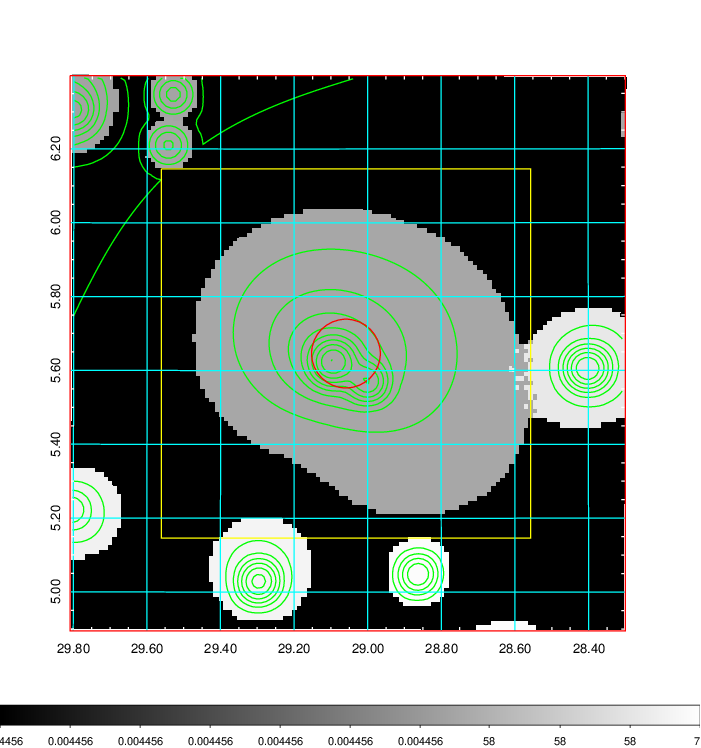  |

|[Exposure image](../image/93/93_mex.pdf)| [nH image](../image/93/93_nh.pdf)| [Planck image](../image/93/93_p.pdf)|
|-------------------|--------------------|-------------------|
|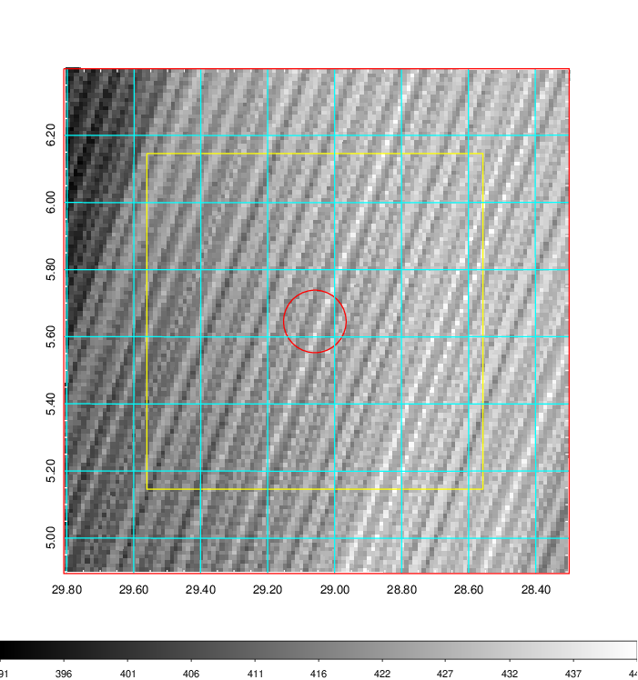   | 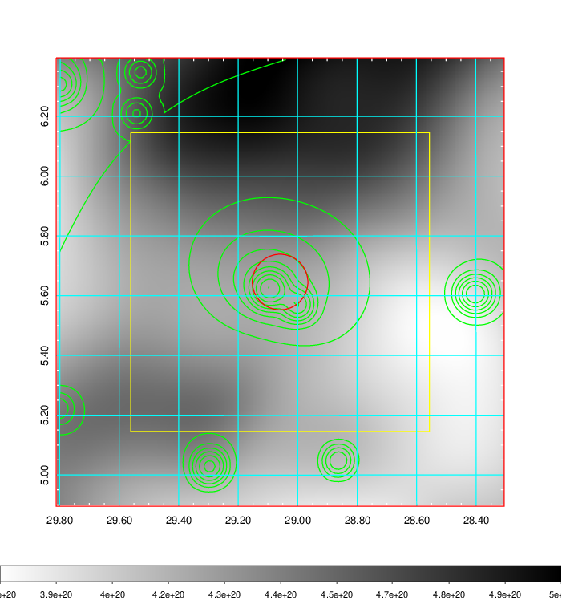    | 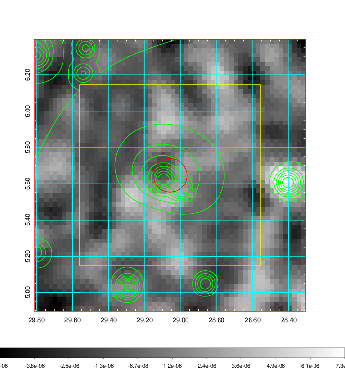 |

|[Redshift Histogram](../image/93/93_zg.pdf) | [DSS image(z1)](../image/93/93_dss_z1.pdf)      |  [DSS image(z2)](../image/93/93_dss_z2.pdf)    |
|-------------------|--------------------|-------------------|
|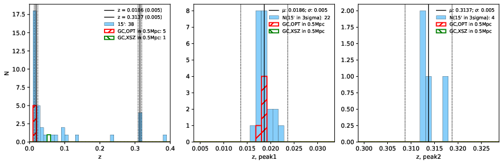 |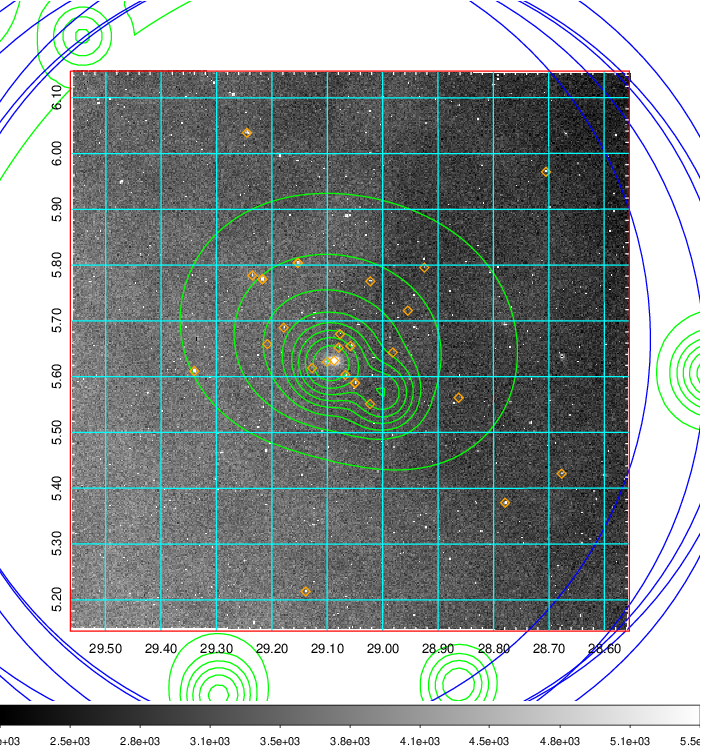  Blue circle for optical clusters;  Magenta circle for XSZ clusters;  all with r=1Mpc;  Only GC with Delta_z<0.01 are shown. | 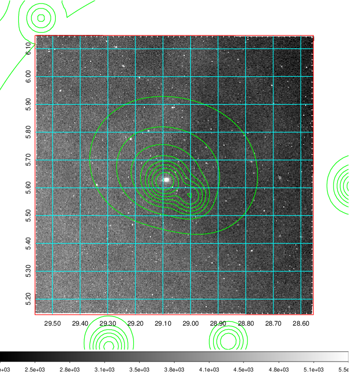 Blue circle for optical clusters;  Magenta circle for XSZ clusters;  all with r=1Mpc;  Only GC with Delta_z<0.01 are shown.  |

|[Previous-identified clusters](../image/93/93_gc.pdf) | [2MASS image](../image/93/93_2mass.pdf)      |[SDSS image](../image/93/93_sdss.pdf)   |
|-------------------|-------------------|-------------------|
|  Green, magenta, and blue circles  for optical, X-ray and SZ clusters  respectively, with redshift of clusters  labelled. The radius of circles  are 1Mpc.|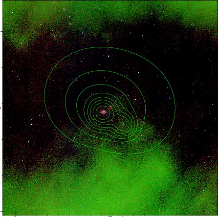  | 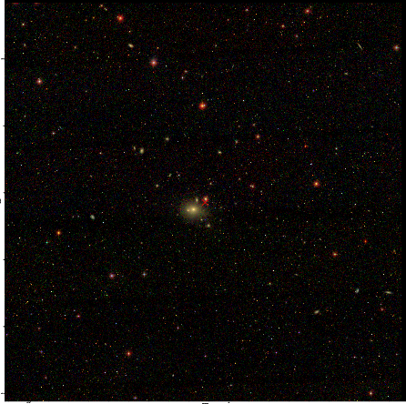  |

