

### 930

|Name|RAJ2000[deg]|DEJ2000[deg] |Ext[arcmin]| Ext,ml | z | z_src| C|GC(XSZ,Delta_z<0.01)| GC(OPT,Delta_z<0.01)|GC| R_sig[arcmin] | R500[arcmin] | R500[Mpc]| CRsig[c/s] | CR500[c/s] |L500[1E44 erg/s]|F500[1E-12 erg/s/cm^2]| M500[1E14 Msun]|Tx[keV]|Cnt_sig|Beta|Rc[arcmin]|Comment|Alias|
|---|---|---|---|---|---|------|---|--------|---------|----------|---|---|---|---|---|---|---|---|---|---|---|---|---|---|
|930| 354.134| 21.163| 1.69| 168.07| 0.0561(0.005)| z1, z_xsz| B| L03, MCXC, PSZ2, Tar, XB| A, N, W| A, C, F20, L03, MCXC, N, PSZ2, SPI, Tar, W, XB| 14.650| 13.698| 0.895| 0.598(0.047)| 0.592(0.046)| 0.808(0.032)| 10.756(0.421)| 2.15(0.04)| 3.49(0.04)| 278.0| 0.903(-0.091+0.067)| 4.014(-0.533+0.387)| -| k154|

|[RASS image](../image/930/930_img.pdf)|[filtered image](../image/930/930_fil.pdf)|[Segment image](../image/930/930_seg.pdf)|
|-------------------|--------------------|-------------------|
| 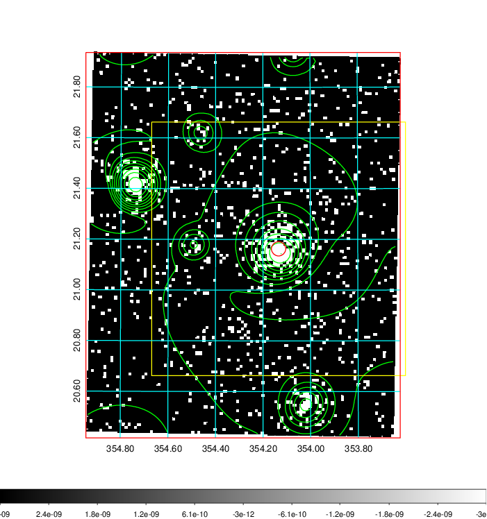  | 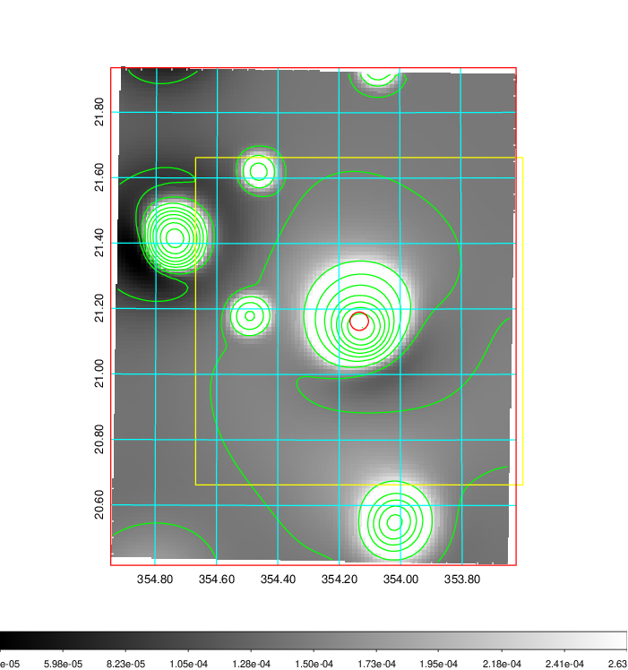   | 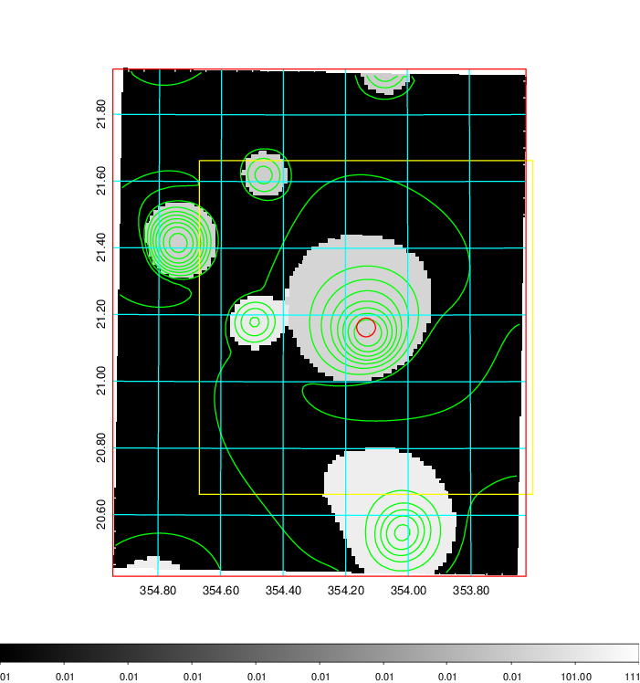  |

|[Exposure image](../image/930/930_mex.pdf)| [nH image](../image/930/930_nh.pdf)| [Planck image](../image/930/930_p.pdf)|
|-------------------|--------------------|-------------------|
|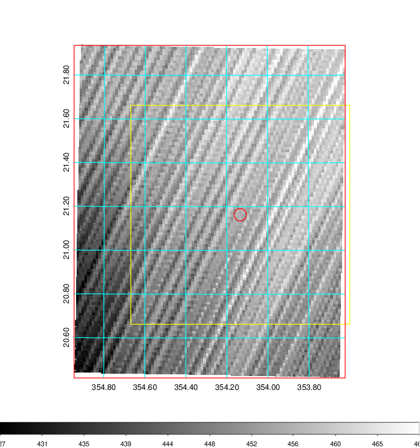   | 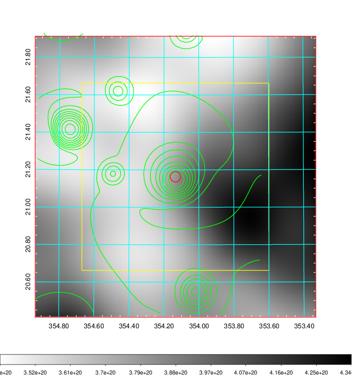    | 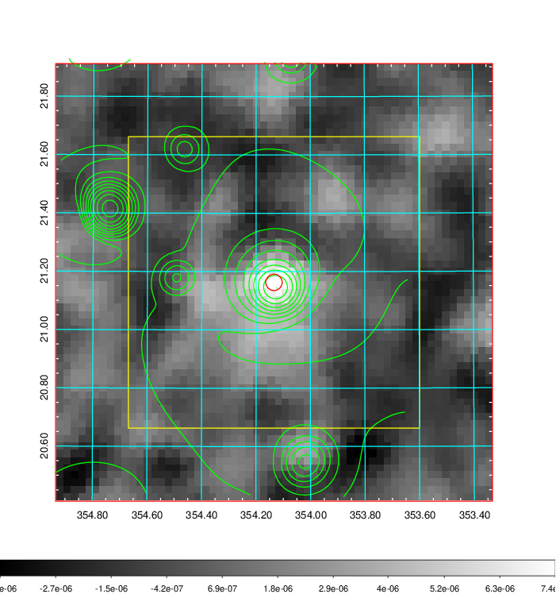 |

|[Redshift Histogram](../image/930/930_zg.pdf) | [DSS image(z1)](../image/930/930_dss_z1.pdf)      |  [DSS image(z2)](../image/930/930_dss_z2.pdf)    |
|-------------------|--------------------|-------------------|
|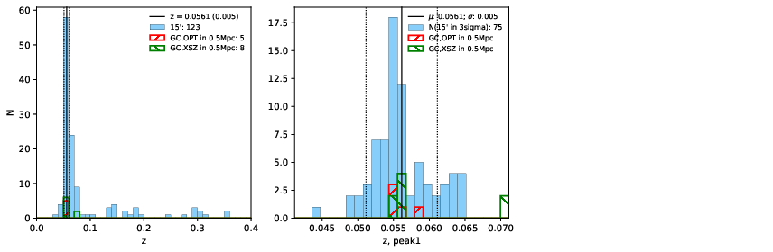 |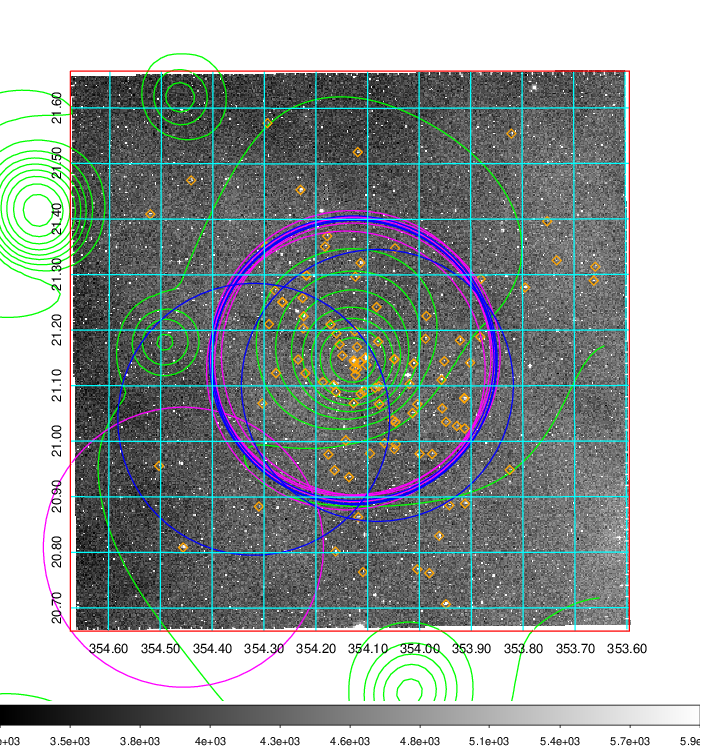  Blue circle for optical clusters;  Magenta circle for XSZ clusters;  all with r=1Mpc;  Only GC with Delta_z<0.01 are shown. | 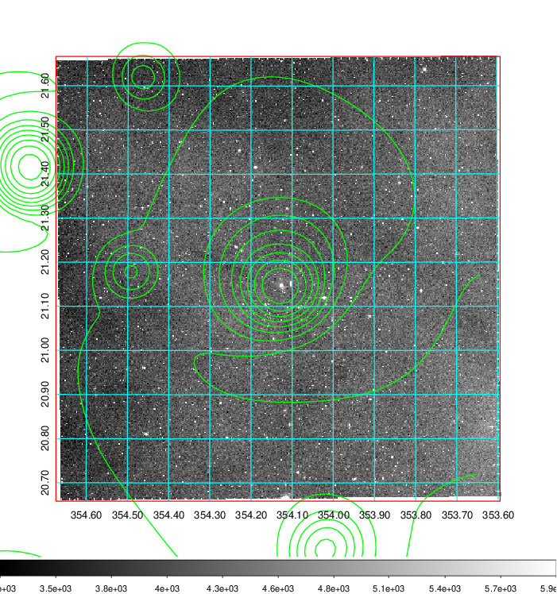 Blue circle for optical clusters;  Magenta circle for XSZ clusters;  all with r=1Mpc;  Only GC with Delta_z<0.01 are shown.  |

|[Previous-identified clusters](../image/930/930_gc.pdf) | [2MASS image](../image/930/930_2mass.pdf)      |[SDSS image](../image/930/930_sdss.pdf)   |
|-------------------|-------------------|-------------------|
|  Green, magenta, and blue circles  for optical, X-ray and SZ clusters  respectively, with redshift of clusters  labelled. The radius of circles  are 1Mpc.|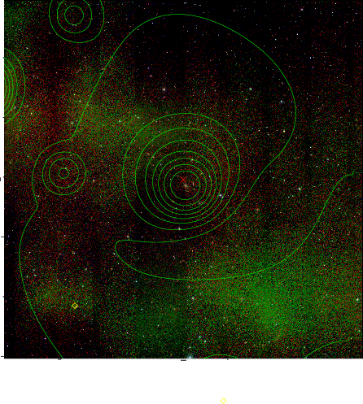  | 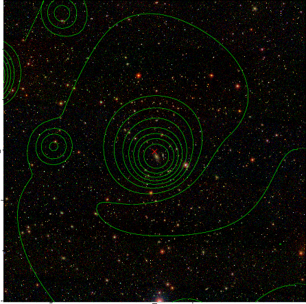  |

