

### 931

|Name|RAJ2000[deg]|DEJ2000[deg] |Ext[arcmin]| Ext,ml | z | z_src| C|GC(XSZ,Delta_z<0.01)| GC(OPT,Delta_z<0.01)|GC| R_sig[arcmin] | R500[arcmin] | R500[Mpc]| CRsig[c/s] | CR500[c/s] |L500[1E44 erg/s]|F500[1E-12 erg/s/cm^2]| M500[1E14 Msun]|Tx[keV]|Cnt_sig|Beta|Rc[arcmin]|Comment|Alias|
|---|---|---|---|---|---|------|---|--------|---------|----------|---|---|---|---|---|---|---|---|---|---|---|---|---|---|
|931| 354.599| 26.996| 7.93| 863.02| 0.0309(0.005)| z1, z_xsz| B| L03, MCXC, PSZ2, Tar, XB| A, N, W| A, C, F20, L03, MCXC, N, PSZ2, SPI, Tar, W, XB, XCS| 22.231| 21.000| 0.779| 0.971(0.061)| 0.962(0.061)| 0.367(0.012)| 16.696(0.558)| 1.38(0.02)| 2.64(0.03)| 625.1| 0.972(-0.038+0.021)| 12.471(-0.532+0.358)| -| k564|

|[RASS image](../image/931/931_img.pdf)|[filtered image](../image/931/931_fil.pdf)|[Segment image](../image/931/931_seg.pdf)|
|-------------------|--------------------|-------------------|
| 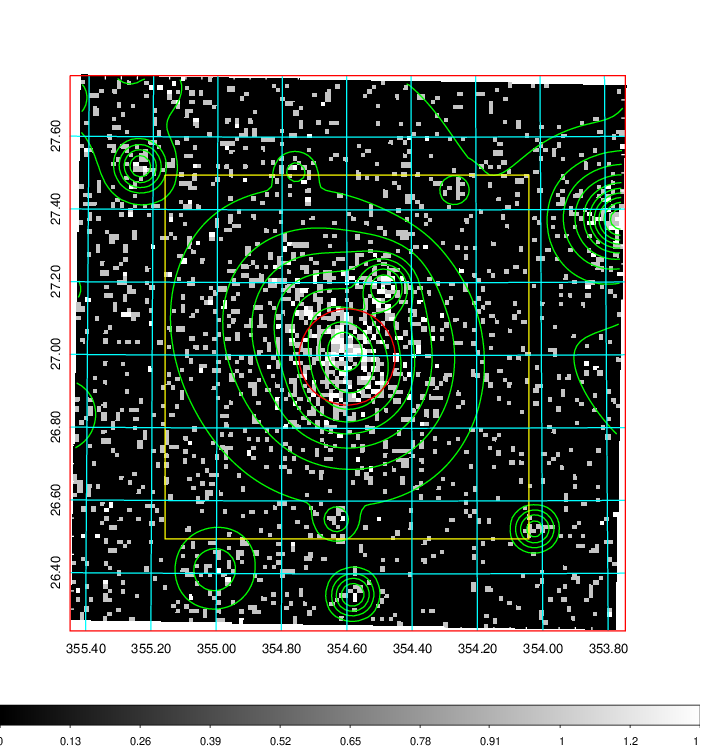  | 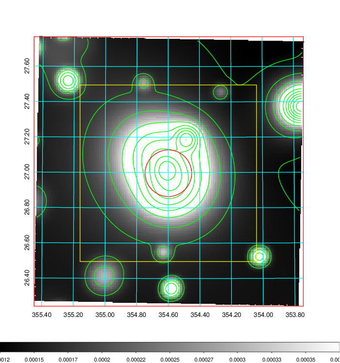   | 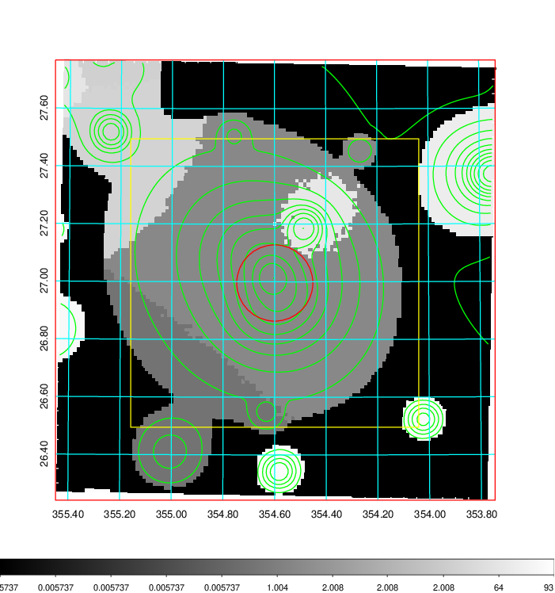  |

|[Exposure image](../image/931/931_mex.pdf)| [nH image](../image/931/931_nh.pdf)| [Planck image](../image/931/931_p.pdf)|
|-------------------|--------------------|-------------------|
|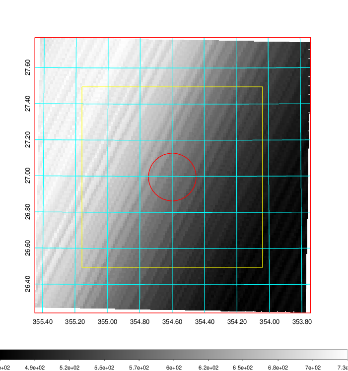   | 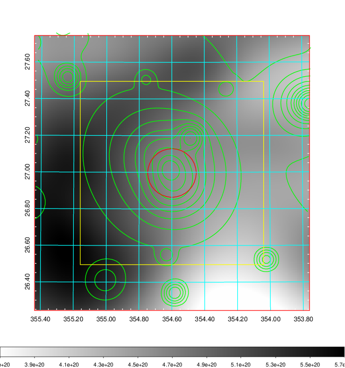    | 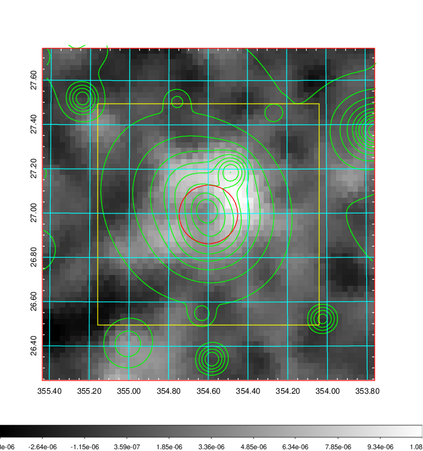 |

|[Redshift Histogram](../image/931/931_zg.pdf) | [DSS image(z1)](../image/931/931_dss_z1.pdf)      |  [DSS image(z2)](../image/931/931_dss_z2.pdf)    |
|-------------------|--------------------|-------------------|
|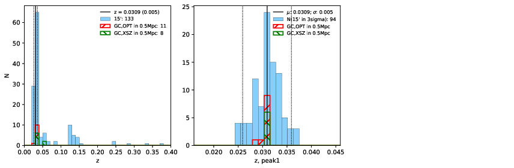 |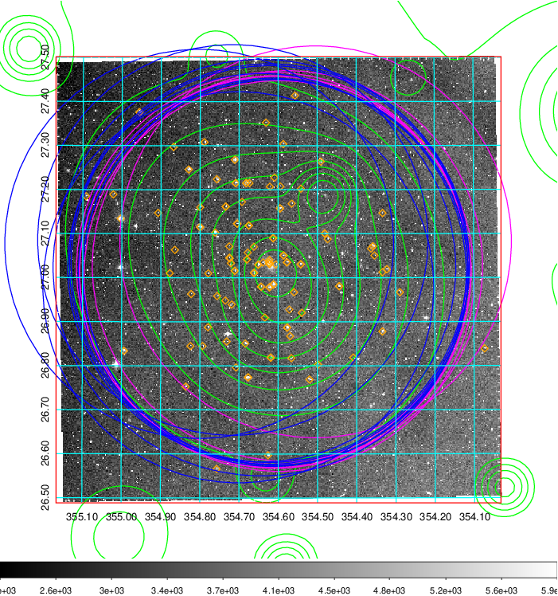  Blue circle for optical clusters;  Magenta circle for XSZ clusters;  all with r=1Mpc;  Only GC with Delta_z<0.01 are shown. | 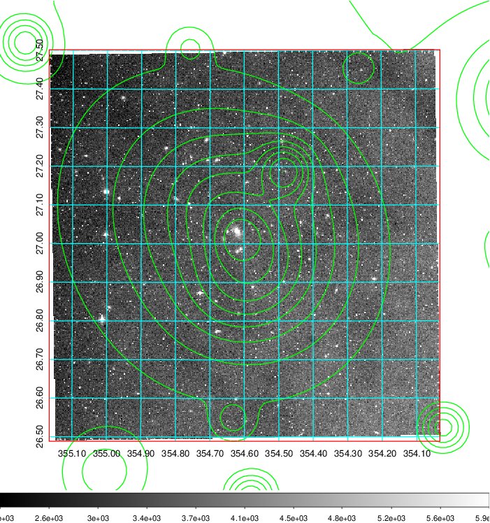 Blue circle for optical clusters;  Magenta circle for XSZ clusters;  all with r=1Mpc;  Only GC with Delta_z<0.01 are shown.  |

|[Previous-identified clusters](../image/931/931_gc.pdf) | [2MASS image](../image/931/931_2mass.pdf)      |[SDSS image](../image/931/931_sdss.pdf)   |
|-------------------|-------------------|-------------------|
|  Green, magenta, and blue circles  for optical, X-ray and SZ clusters  respectively, with redshift of clusters  labelled. The radius of circles  are 1Mpc.|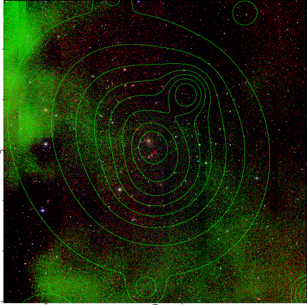  | 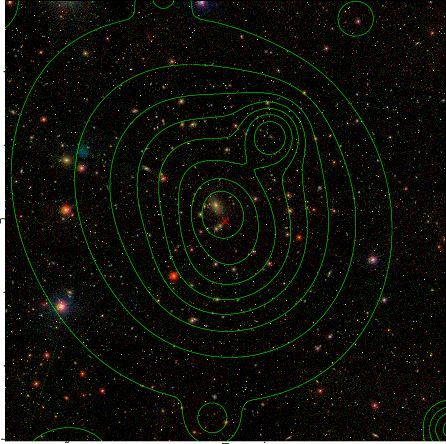  |

