

### 933

|Name|RAJ2000[deg]|DEJ2000[deg] |Ext[arcmin]| Ext,ml | z | z_src| C|GC(XSZ,Delta_z<0.01)| GC(OPT,Delta_z<0.01)|GC| R_sig[arcmin] | R500[arcmin] | R500[Mpc]| CRsig[c/s] | CR500[c/s] |L500[1E44 erg/s]|F500[1E-12 erg/s/cm^2]| M500[1E14 Msun]|Tx[keV]|Cnt_sig|Beta|Rc[arcmin]|Comment|Alias|
|---|---|---|---|---|---|------|---|--------|---------|----------|---|---|---|---|---|---|---|---|---|---|---|---|---|---|
|933| 356.079| -4.377| 2.25| 185.42| 0.0790(0.005)| z1, z_xsz| B| F20, MCXC, PSZ2, Tar| N, RM| C, F20, MCXC, N, PSZ2, Tar, W| 14.162| 11.716| 1.049| 0.679(0.054)| 0.660(0.052)| 1.902(0.068)| 12.369(0.444)| 3.54(0.06)| 4.79(0.05)| 210.2| 0.828(-0.100+0.106)| 4.418(-0.746+0.707)| -| k260|

|[RASS image](../image/933/933_img.pdf)|[filtered image](../image/933/933_fil.pdf)|[Segment image](../image/933/933_seg.pdf)|
|-------------------|--------------------|-------------------|
| 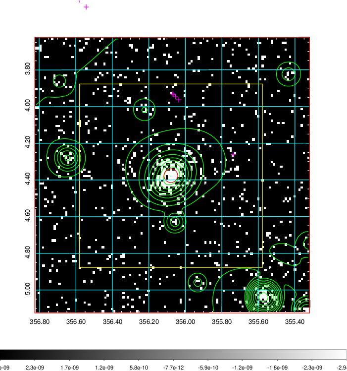  | 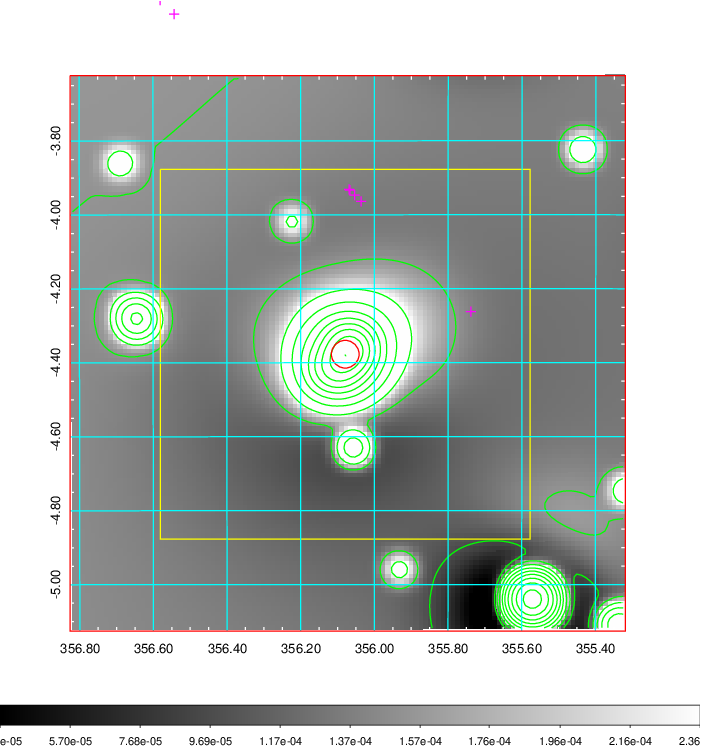   | 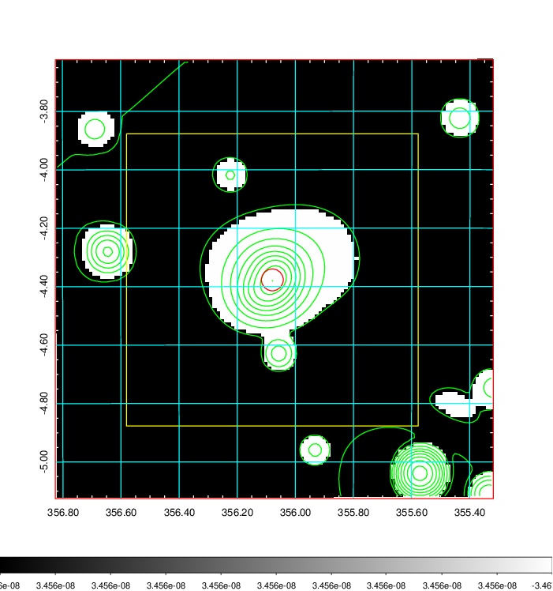  |

|[Exposure image](../image/933/933_mex.pdf)| [nH image](../image/933/933_nh.pdf)| [Planck image](../image/933/933_p.pdf)|
|-------------------|--------------------|-------------------|
|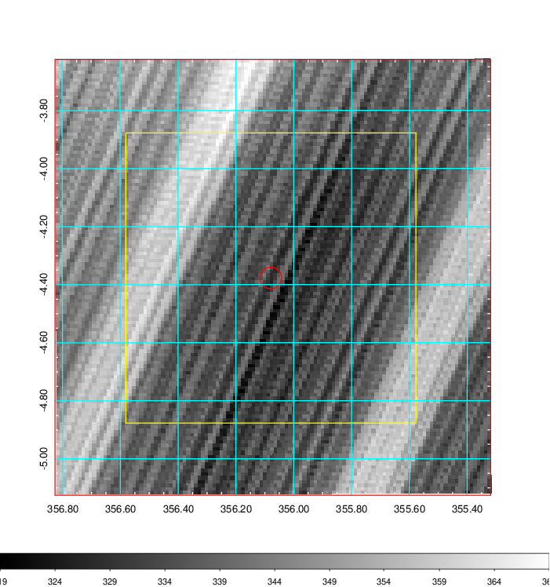   | 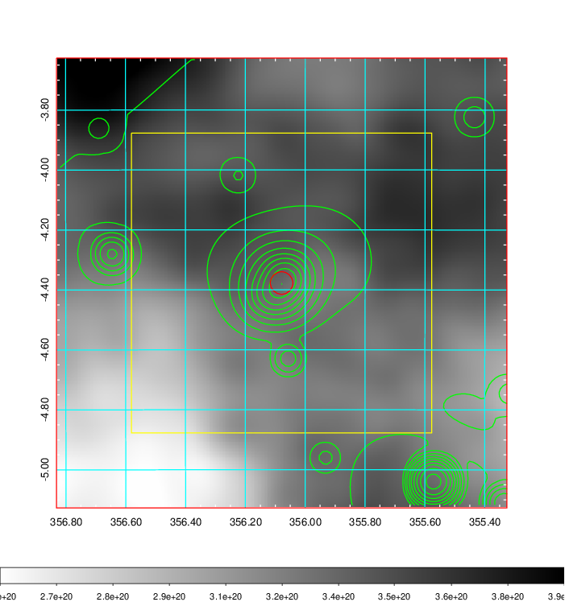    | 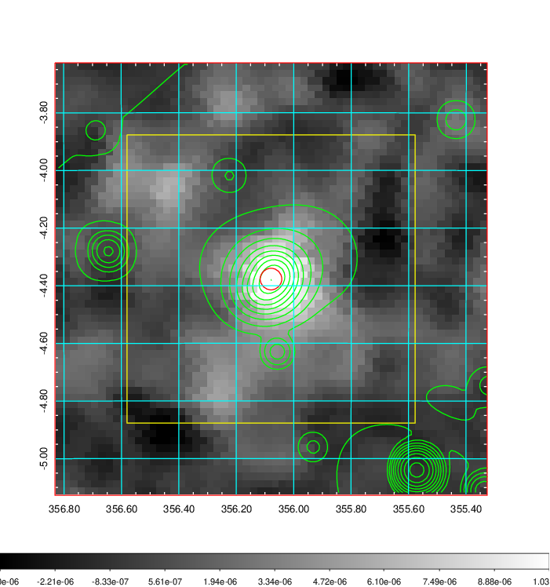 |

|[Redshift Histogram](../image/933/933_zg.pdf) | [DSS image(z1)](../image/933/933_dss_z1.pdf)      |  [DSS image(z2)](../image/933/933_dss_z2.pdf)    |
|-------------------|--------------------|-------------------|
|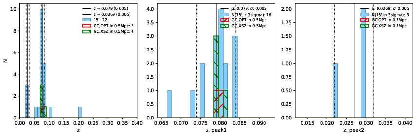 |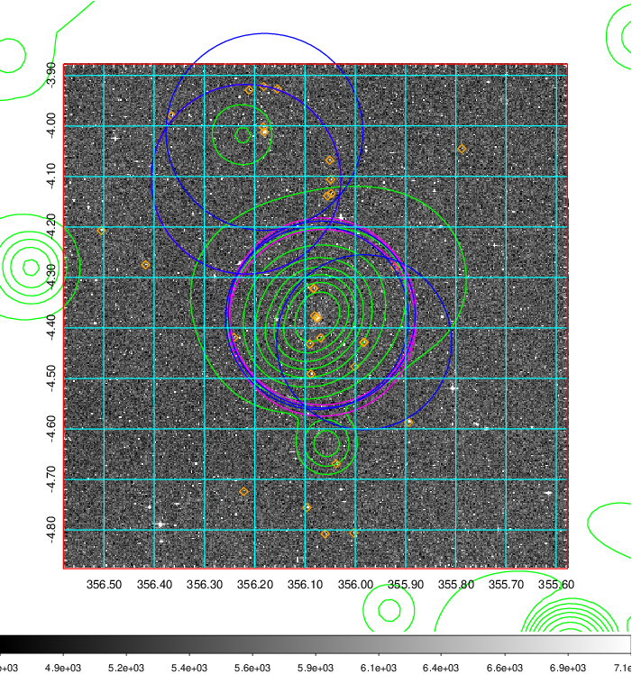  Blue circle for optical clusters;  Magenta circle for XSZ clusters;  all with r=1Mpc;  Only GC with Delta_z<0.01 are shown. | 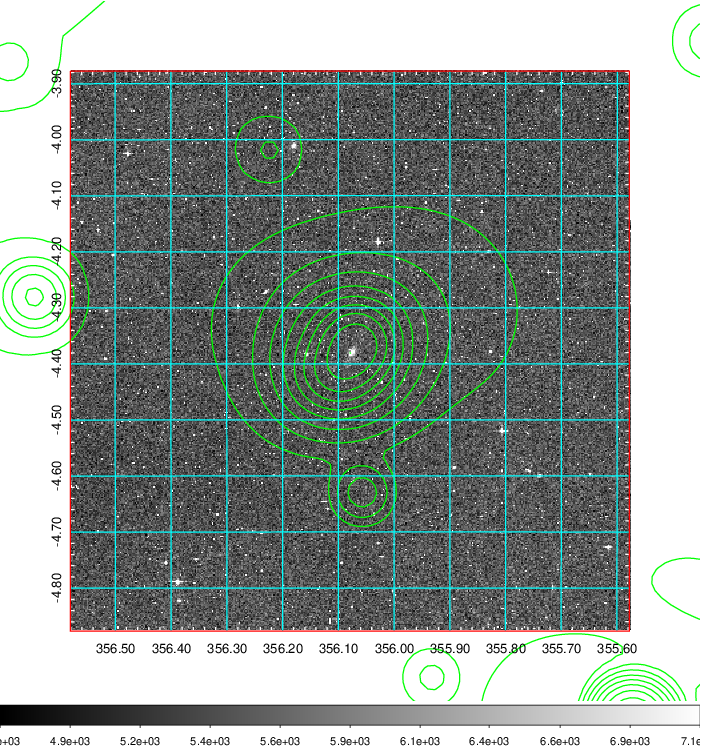 Blue circle for optical clusters;  Magenta circle for XSZ clusters;  all with r=1Mpc;  Only GC with Delta_z<0.01 are shown.  |

|[Previous-identified clusters](../image/933/933_gc.pdf) | [2MASS image](../image/933/933_2mass.pdf)      |[SDSS image](../image/933/933_sdss.pdf)   |
|-------------------|-------------------|-------------------|
|  Green, magenta, and blue circles  for optical, X-ray and SZ clusters  respectively, with redshift of clusters  labelled. The radius of circles  are 1Mpc.|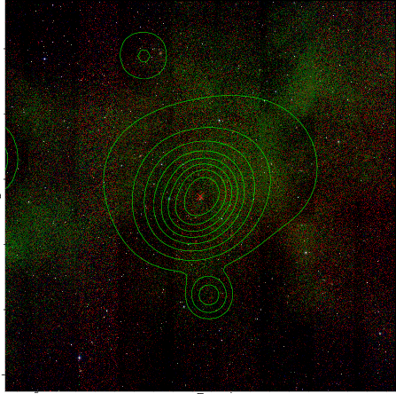  | 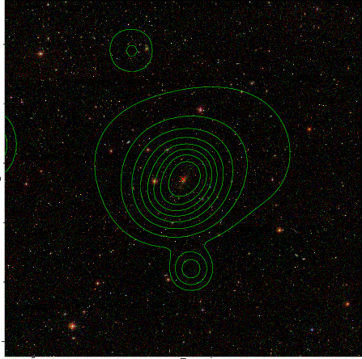  |

