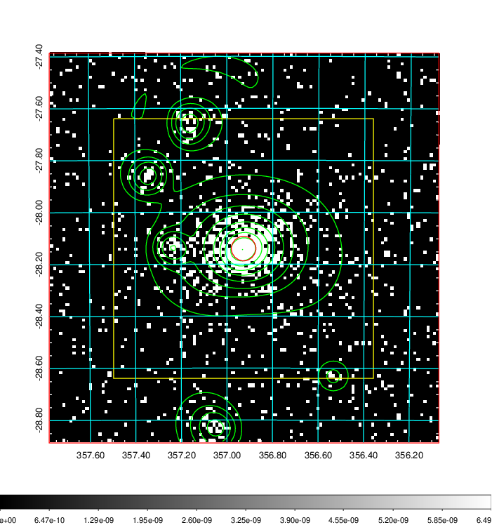
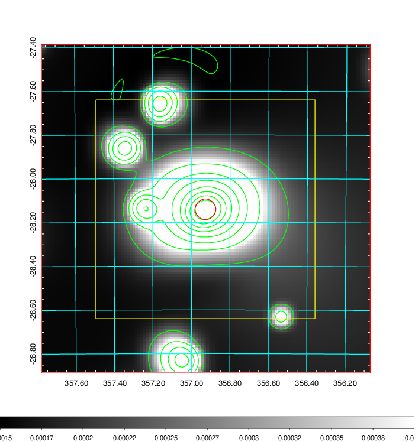
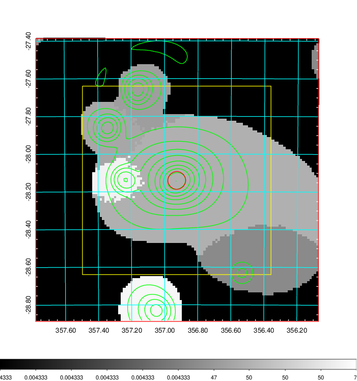
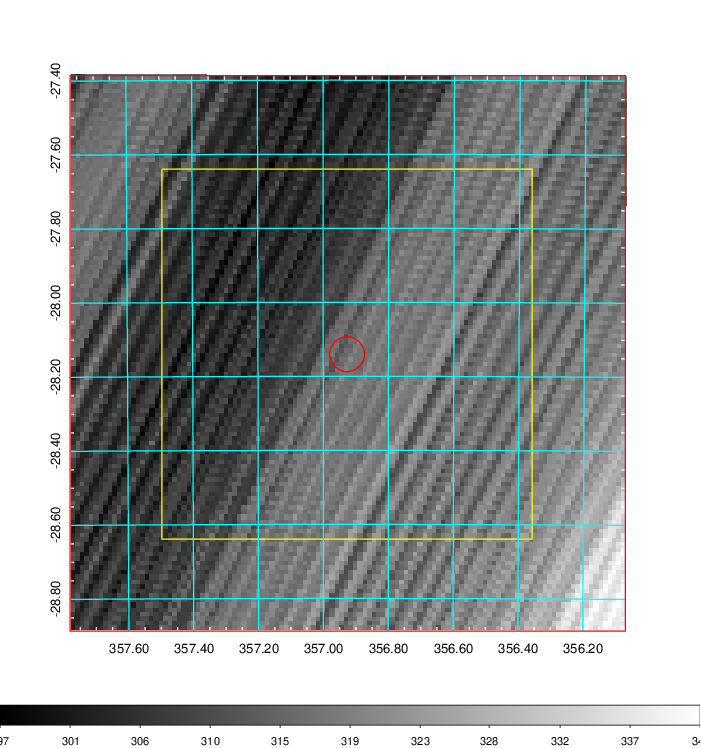
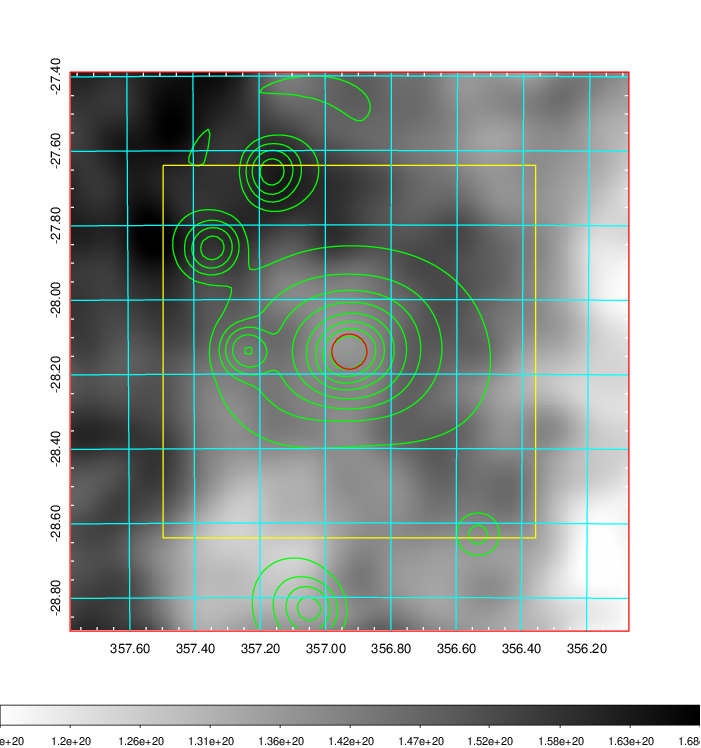
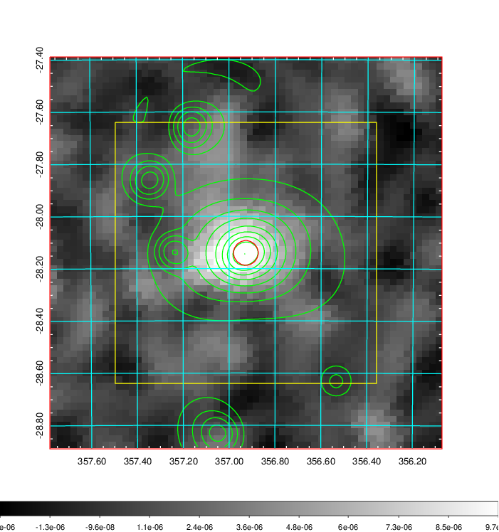
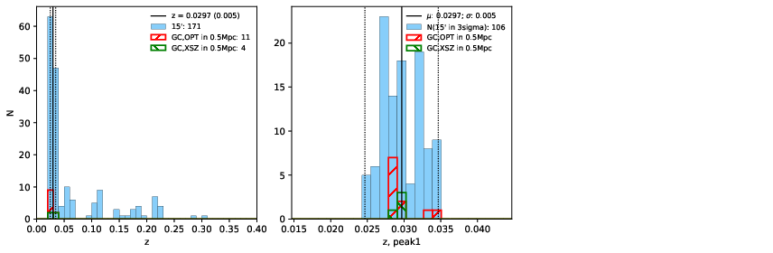
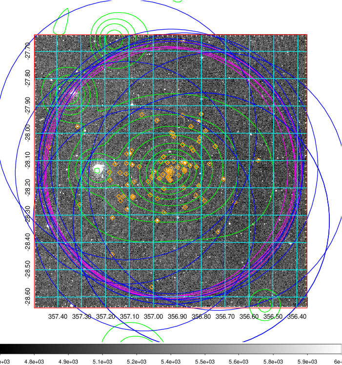
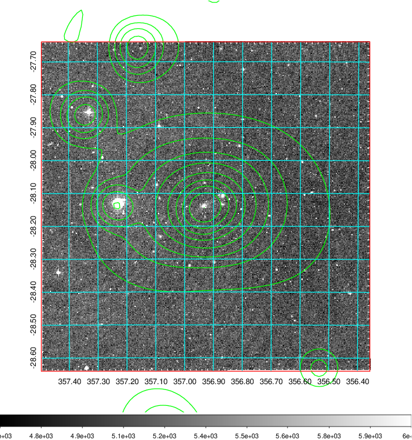
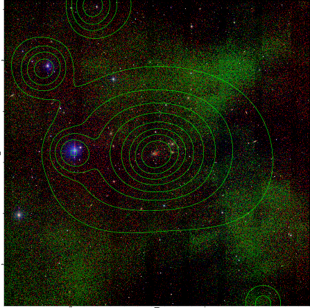

### 935

|Name|RAJ2000[deg]|DEJ2000[deg] |Ext[arcmin]| Ext,ml | z | z_src| C|GC(XSZ,Delta_z<0.01)| GC(OPT,Delta_z<0.01)|GC| R_sig[arcmin] | R500[arcmin] | R500[Mpc]| CRsig[c/s] | CR500[c/s] |L500[1E44 erg/s]|F500[1E-12 erg/s/cm^2]| M500[1E14 Msun]|Tx[keV]|Cnt_sig|Beta|Rc[arcmin]|Comment|Alias|
|---|---|---|---|---|---|------|---|--------|---------|----------|---|---|---|---|---|---|---|---|---|---|---|---|---|---|
|935| 356.927| -28.140| 2.84| 1119.40| 0.0297(0.005)| z1, z_xsz| B| MCXC, PSZ2, Tar, XB| A, N| A, MCXC, N, PSZ2, Tar, W, XB| 35.650| 26.767| 0.955| 3.072(0.137)| 2.950(0.131)| 1.176(0.028)| 58.087(1.399)| 2.55(0.03)| 3.85(0.03)| 1001.5| 0.614(-0.010+0.010)| 3.093(-0.159+0.166)| -| k359|

|[RASS image](../image/935/935_img.pdf)|[filtered image](../image/935/935_fil.pdf)|[Segment image](../image/935/935_seg.pdf)|
|-------------------|--------------------|-------------------|
|   |    |   |

|[Exposure image](../image/935/935_mex.pdf)| [nH image](../image/935/935_nh.pdf)| [Planck image](../image/935/935_p.pdf)|
|-------------------|--------------------|-------------------|
|   |     |  |

|[Redshift Histogram](../image/935/935_zg.pdf) | [DSS image(z1)](../image/935/935_dss_z1.pdf)      |  [DSS image(z2)](../image/935/935_dss_z2.pdf)    |
|-------------------|--------------------|-------------------|
| |  Blue circle for optical clusters;  Magenta circle for XSZ clusters;  all with r=1Mpc;  Only GC with Delta_z<0.01 are shown. |  Blue circle for optical clusters;  Magenta circle for XSZ clusters;  all with r=1Mpc;  Only GC with Delta_z<0.01 are shown.  |

|[known Abell/XSZ clusters](../image/935/935_gc.pdf) | [2MASS image](../image/935/935_2mass.pdf)      |
|-------------------|-------------------|
|  Magenta, blue and green circles  for optical, X-ray and SZ clusters  respectively, with redshift of clusters  labelled. The radius of circles  are 1Mpc.|  |

|[ATLAS image](../image/935/935_s.pdf)        |
|-------------------|
|   |
