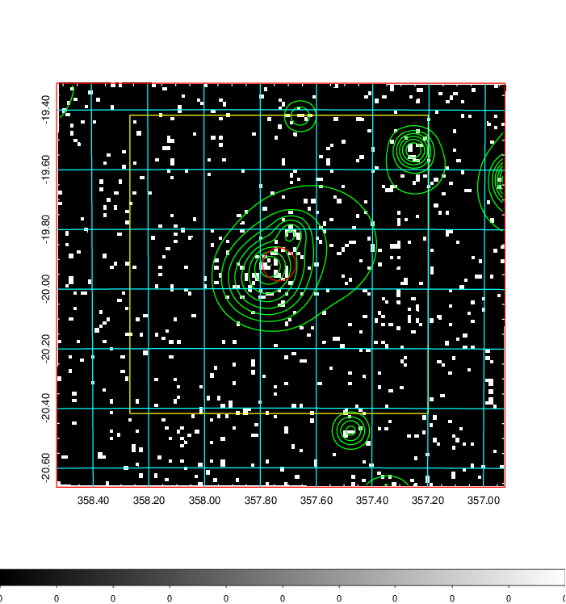
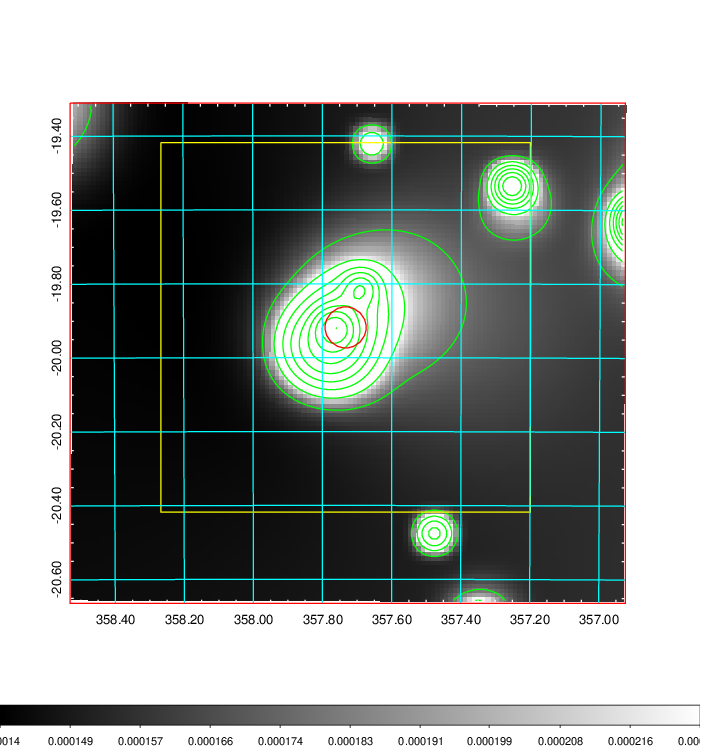
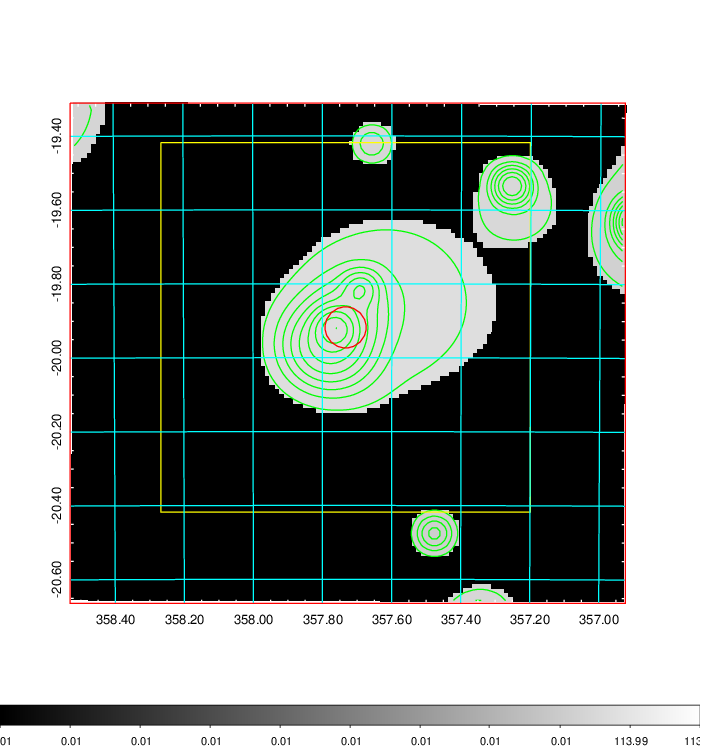
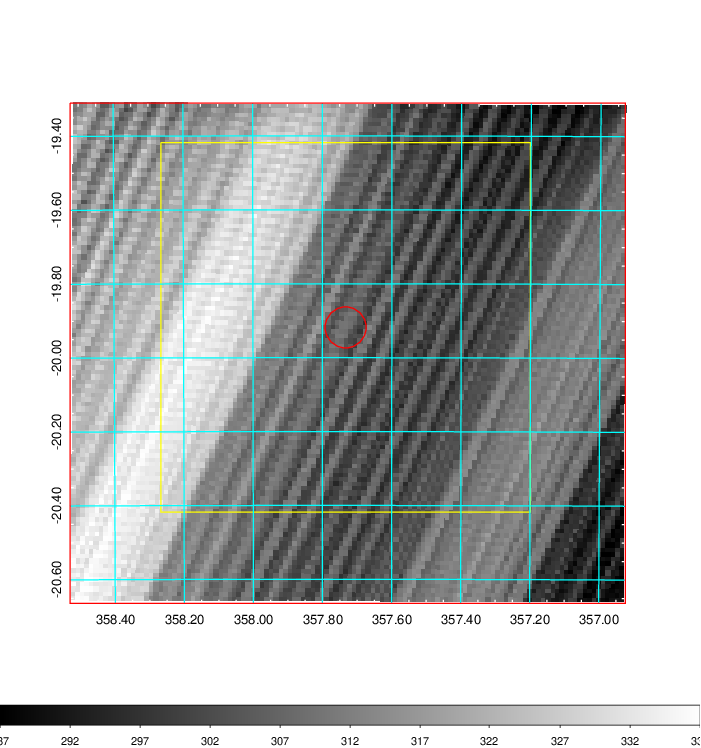
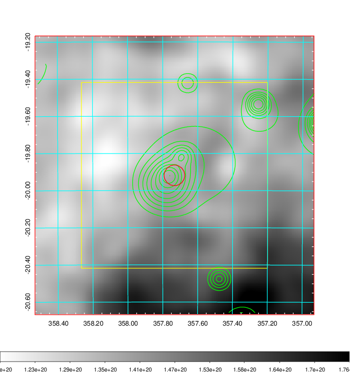
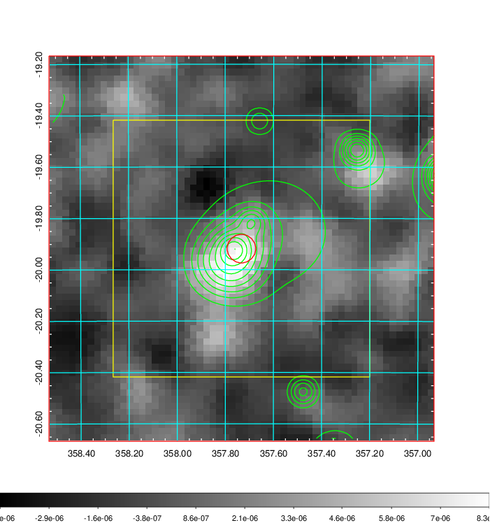
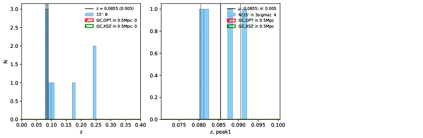
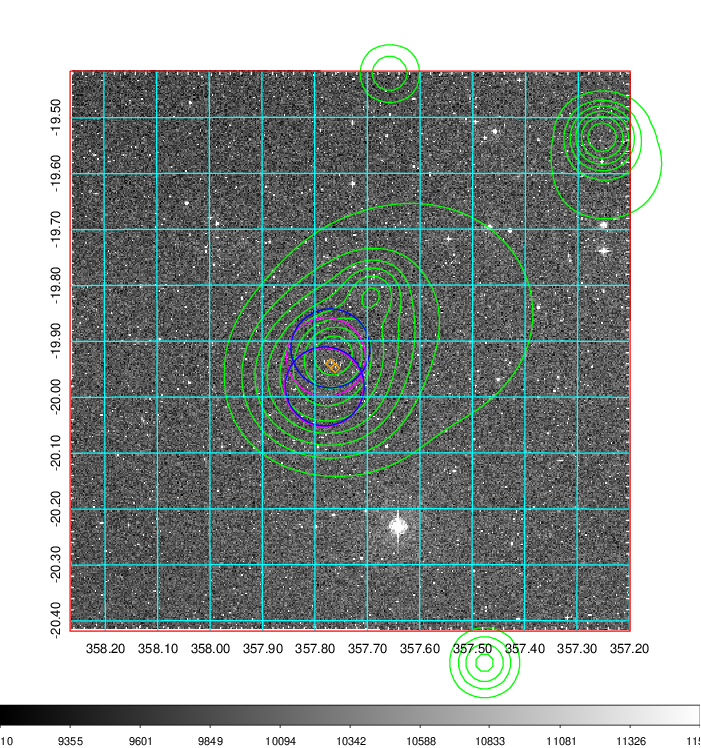
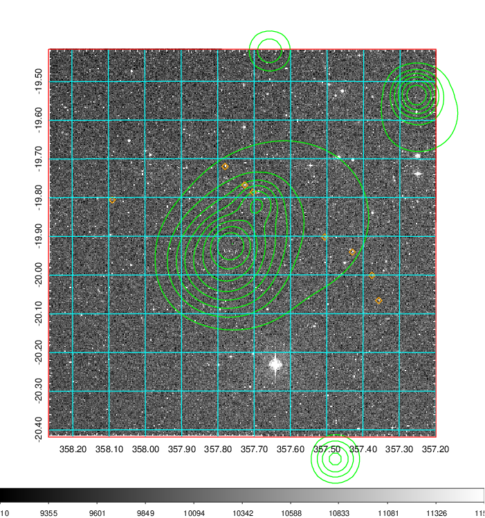
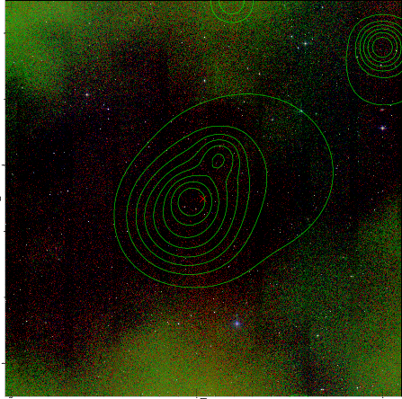

### 937

|Name|RAJ2000[deg]|DEJ2000[deg] |Ext[arcmin]| Ext,ml | z | z_src| C|GC(XSZ,Delta_z<0.01)| GC(OPT,Delta_z<0.01)|GC| R_sig[arcmin] | R500[arcmin] | R500[Mpc]| CRsig[c/s] | CR500[c/s] |L500[1E44 erg/s]|F500[1E-12 erg/s/cm^2]| M500[1E14 Msun]|Tx[keV]|Cnt_sig|Beta|Rc[arcmin]|Comment|Alias|
|---|---|---|---|---|---|------|---|--------|---------|----------|---|---|---|---|---|---|---|---|---|---|---|---|---|---|
|937| 357.733| -19.918| 3.34| 27.21| 0.2478(0.000)| -| G| -| -| N, PSZ2, Tar, W| 11.238| 4.558| 1.062| 0.104(0.037)| 0.094(0.034)| 3.610(1.087)| 1.939(0.584)| 4.38(0.62)| 5.78(0.53)| 46.5| 0.847(-0.162+0.108)| 5.936(-1.428+1.152)| An SZ cluster with $z$ = 0.2477 and offset = 0.63 Mpc (2.65 arcmin)| k409|

|[RASS image](../image/937/937_img.pdf)|[filtered image](../image/937/937_fil.pdf)|[Segment image](../image/937/937_seg.pdf)|
|-------------------|--------------------|-------------------|
|   |    |   |

|[Exposure image](../image/937/937_mex.pdf)| [nH image](../image/937/937_nh.pdf)| [Planck image](../image/937/937_p.pdf)|
|-------------------|--------------------|-------------------|
|   |     |  |

|[Redshift Histogram](../image/937/937_zg.pdf) | [DSS image(z1)](../image/937/937_dss_z1.pdf)      |  [DSS image(z2)](../image/937/937_dss_z2.pdf)    |
|-------------------|--------------------|-------------------|
| |  Blue circle for optical clusters;  Magenta circle for XSZ clusters;  all with r=1Mpc;  Only GC with Delta_z<0.01 are shown. |  Blue circle for optical clusters;  Magenta circle for XSZ clusters;  all with r=1Mpc;  Only GC with Delta_z<0.01 are shown.  |

|[known Abell/XSZ clusters](../image/937/937_gc.pdf) | [2MASS image](../image/937/937_2mass.pdf)      |
|-------------------|-------------------|
|  Magenta, blue and green circles  for optical, X-ray and SZ clusters  respectively, with redshift of clusters  labelled. The radius of circles  are 1Mpc.|  |

|[ATLAS image](../image/937/937_s.pdf)        |
|-------------------|
|   |
