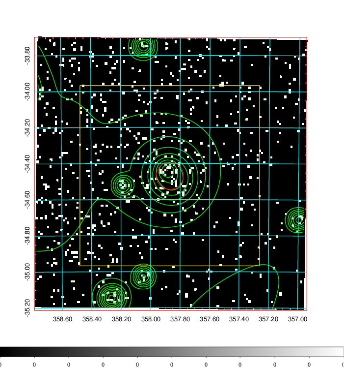
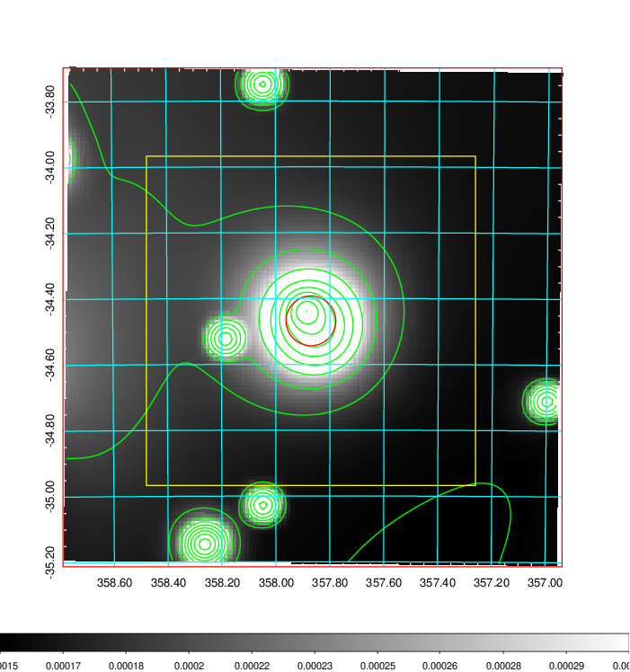
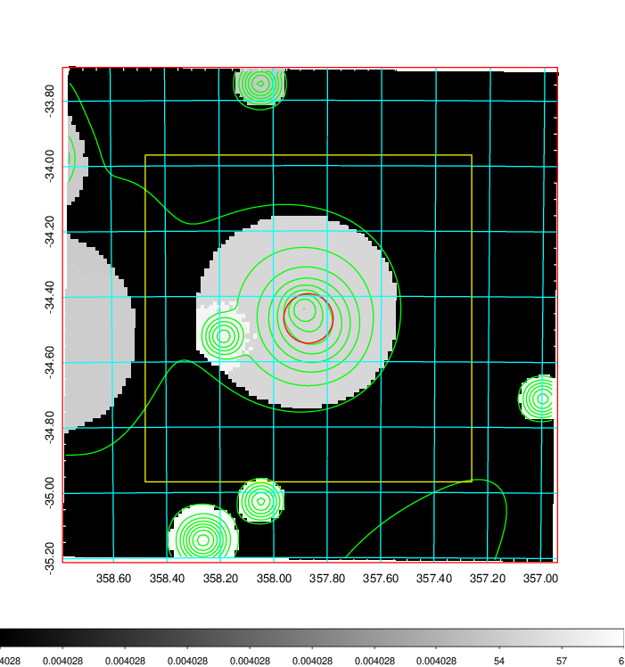
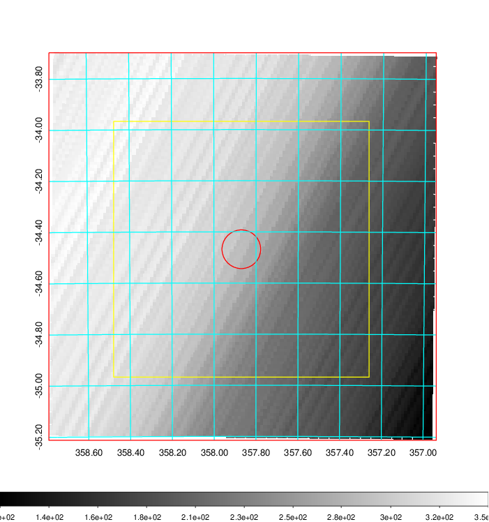
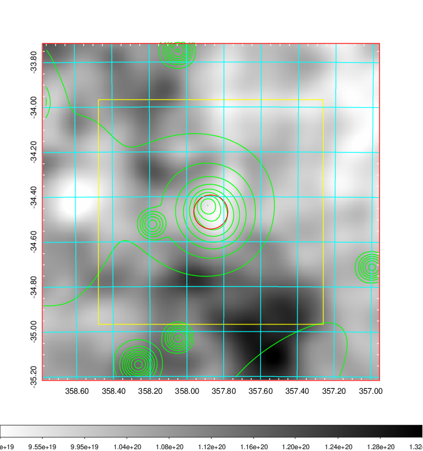
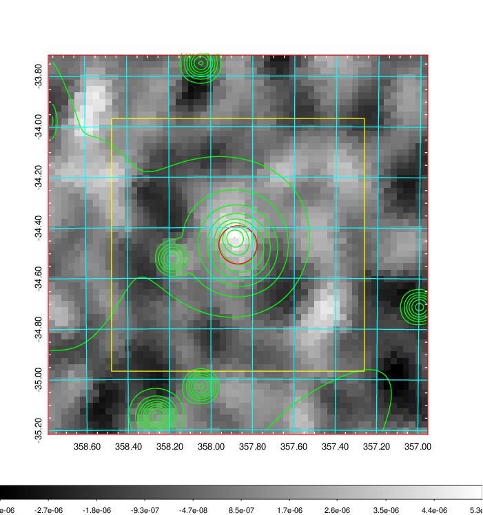
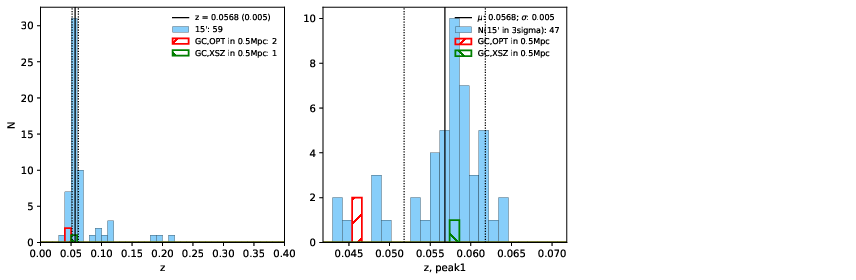
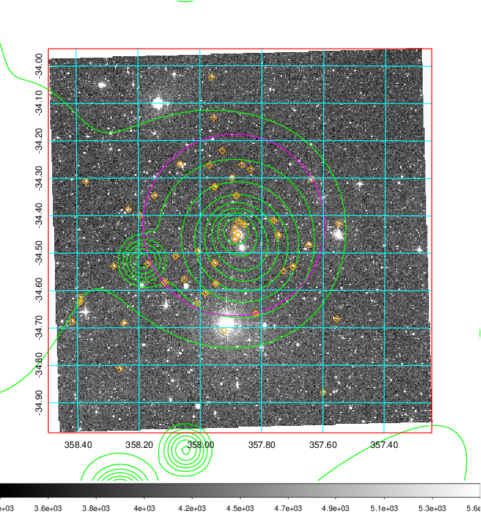
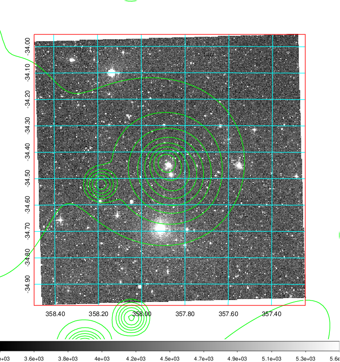
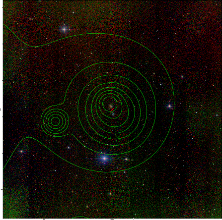

### 938

|Name|RAJ2000[deg]|DEJ2000[deg] |Ext[arcmin]| Ext,ml | z | z_src| C|GC(XSZ,Delta_z<0.01)| GC(OPT,Delta_z<0.01)|GC| R_sig[arcmin] | R500[arcmin] | R500[Mpc]| CRsig[c/s] | CR500[c/s] |L500[1E44 erg/s]|F500[1E-12 erg/s/cm^2]| M500[1E14 Msun]|Tx[keV]|Cnt_sig|Beta|Rc[arcmin]|Comment|Alias|
|---|---|---|---|---|---|------|---|--------|---------|----------|---|---|---|---|---|---|---|---|---|---|---|---|---|---|
|938| 357.870| -34.468| 4.54| 30.32| 0.0568(0.005)| z1, z_xsz| B| Tar| -| A, N, Tar| 13.675| 10.292| 0.680| 0.169(0.045)| 0.162(0.044)| 0.242(0.059)| 3.147(0.768)| 0.94(0.12)| 2.10(0.17)| 52.9| 0.706(-0.144+0.185)| 6.518(-1.887+2.094)| -| t232|

|[RASS image](../image/938/938_img.pdf)|[filtered image](../image/938/938_fil.pdf)|[Segment image](../image/938/938_seg.pdf)|
|-------------------|--------------------|-------------------|
|   |    |   |

|[Exposure image](../image/938/938_mex.pdf)| [nH image](../image/938/938_nh.pdf)| [Planck image](../image/938/938_p.pdf)|
|-------------------|--------------------|-------------------|
|   |     |  |

|[Redshift Histogram](../image/938/938_zg.pdf) | [DSS image(z1)](../image/938/938_dss_z1.pdf)      |  [DSS image(z2)](../image/938/938_dss_z2.pdf)    |
|-------------------|--------------------|-------------------|
| |  Blue circle for optical clusters;  Magenta circle for XSZ clusters;  all with r=1Mpc;  Only GC with Delta_z<0.01 are shown. |  Blue circle for optical clusters;  Magenta circle for XSZ clusters;  all with r=1Mpc;  Only GC with Delta_z<0.01 are shown.  |

|[known Abell/XSZ clusters](../image/938/938_gc.pdf) | [2MASS image](../image/938/938_2mass.pdf)      |
|-------------------|-------------------|
|  Magenta, blue and green circles  for optical, X-ray and SZ clusters  respectively, with redshift of clusters  labelled. The radius of circles  are 1Mpc.|  |

|[ATLAS image](../image/938/938_s.pdf)        |
|-------------------|
|   |
