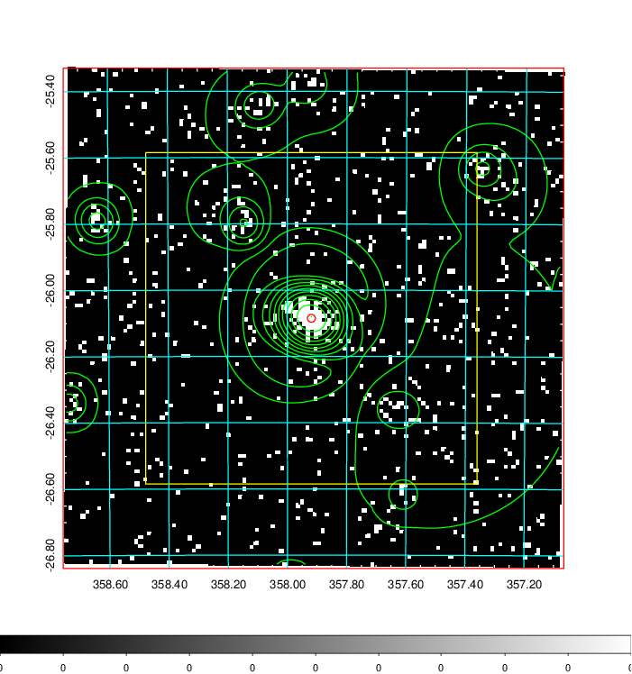
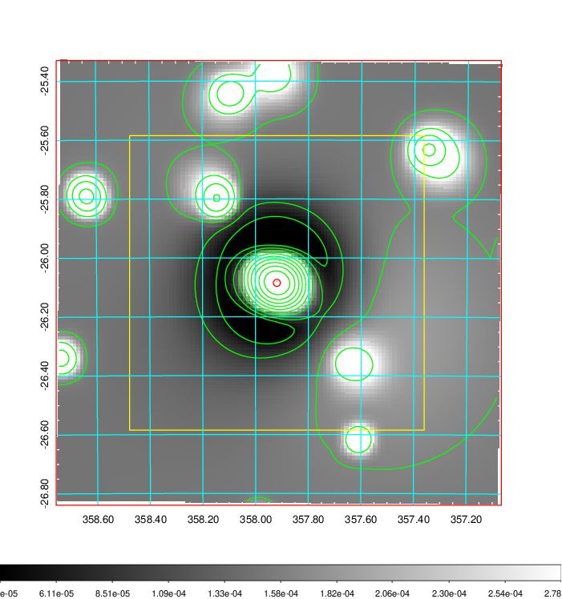
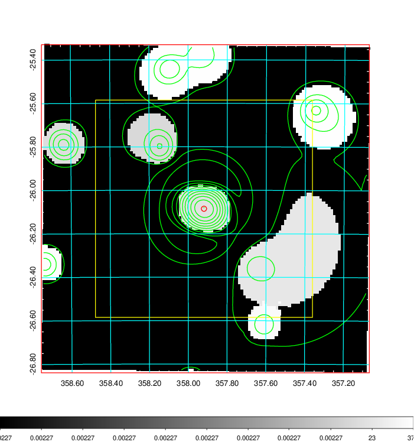
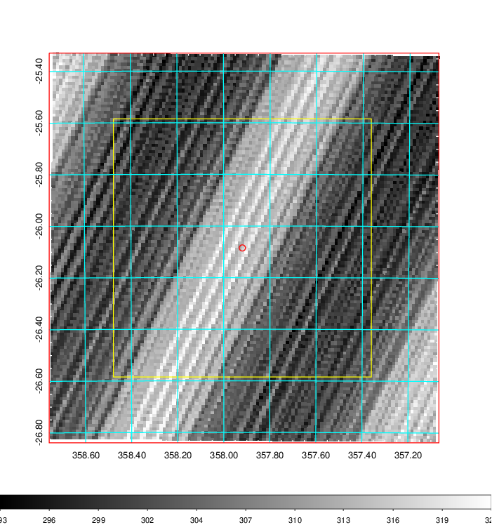
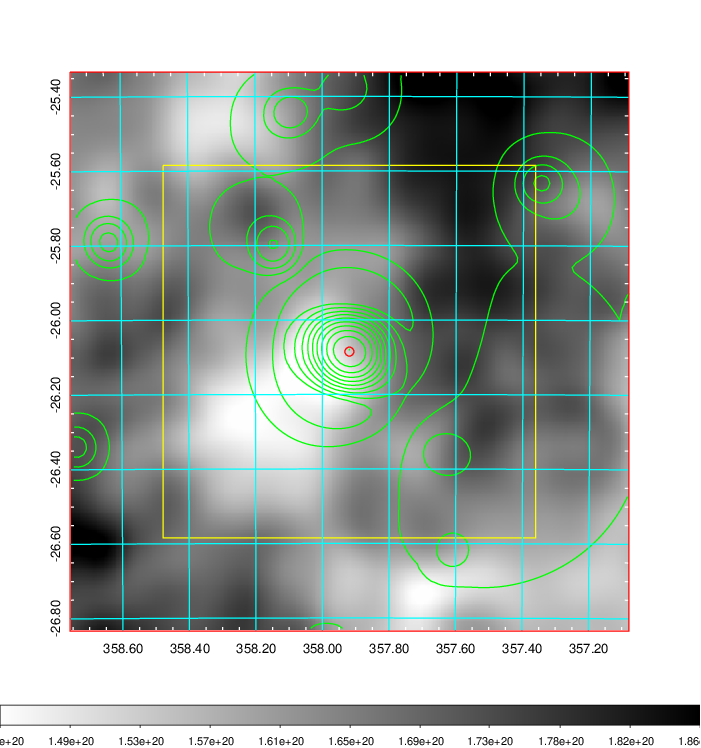
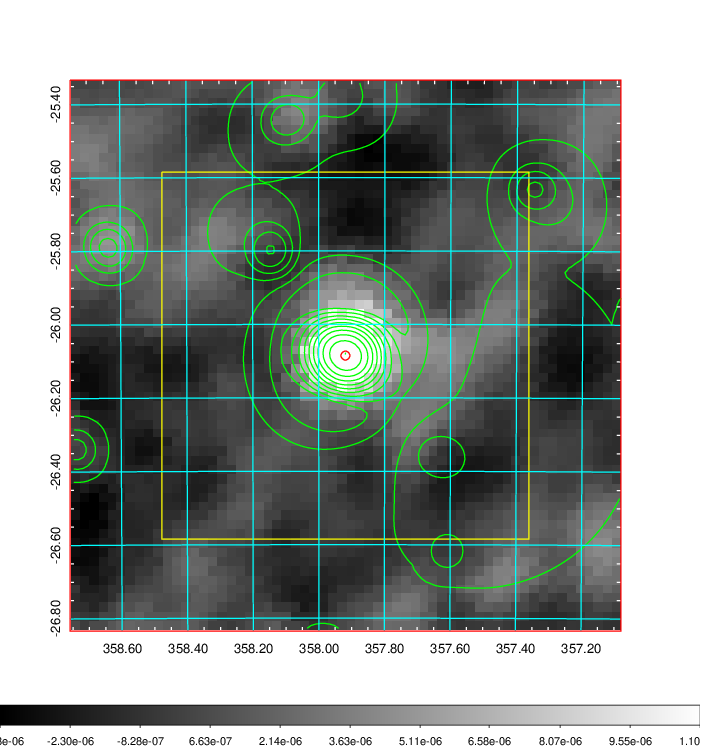
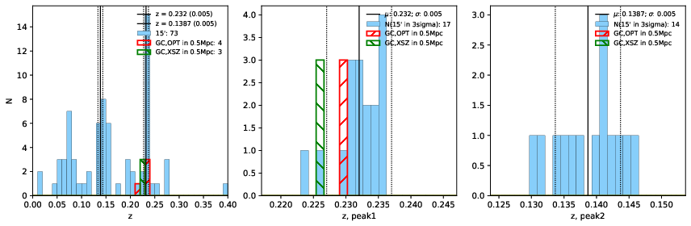
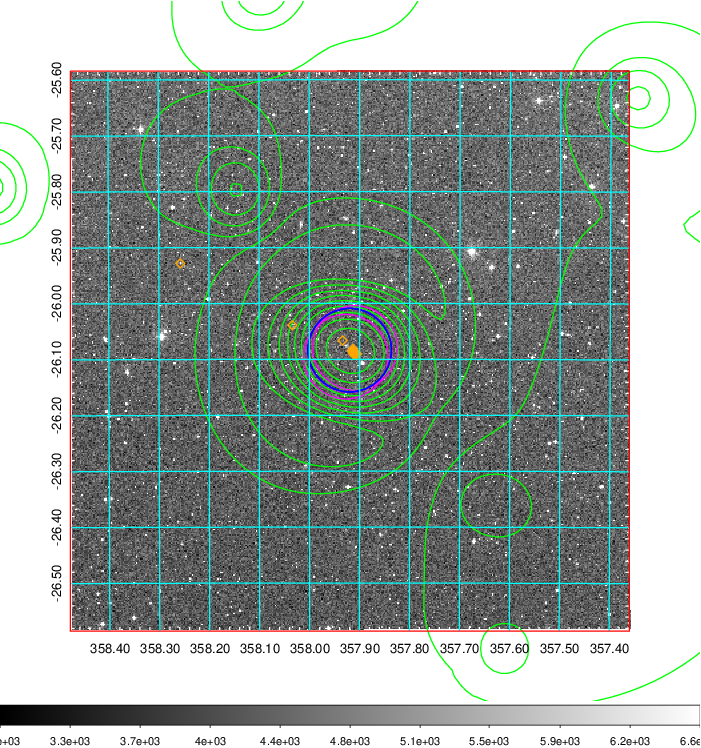
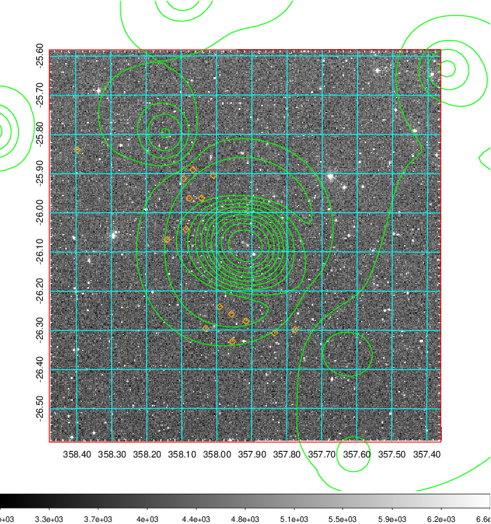
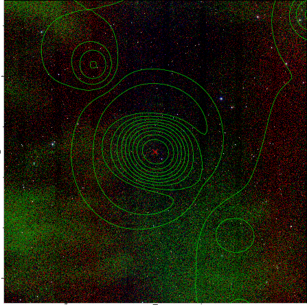

### 939

|Name|RAJ2000[deg]|DEJ2000[deg] |Ext[arcmin]| Ext,ml | z | z_src| C|GC(XSZ,Delta_z<0.01)| GC(OPT,Delta_z<0.01)|GC| R_sig[arcmin] | R500[arcmin] | R500[Mpc]| CRsig[c/s] | CR500[c/s] |L500[1E44 erg/s]|F500[1E-12 erg/s/cm^2]| M500[1E14 Msun]|Tx[keV]|Cnt_sig|Beta|Rc[arcmin]|Comment|Alias|
|---|---|---|---|---|---|------|---|--------|---------|----------|---|---|---|---|---|---|---|---|---|---|---|---|---|---|
|939| 357.919| -26.085| 0.73| 28.77| 0.2320(0.005)| z1, z_xsz| B| MCXC, PSZ2, Tar| A| A, MCXC, N, PSZ2, Tar, W| 4.900| 6.556| 1.455| 0.439(0.050)| 0.465(0.052)| 15.262(0.613)| 9.514(0.382)| 11.05(0.20)| 10.17(0.12)| 140.4| 0.934(-0.078+0.048)| 2.292(-0.314+0.237)| -| k005|

|[RASS image](../image/939/939_img.pdf)|[filtered image](../image/939/939_fil.pdf)|[Segment image](../image/939/939_seg.pdf)|
|-------------------|--------------------|-------------------|
|   |    |   |

|[Exposure image](../image/939/939_mex.pdf)| [nH image](../image/939/939_nh.pdf)| [Planck image](../image/939/939_p.pdf)|
|-------------------|--------------------|-------------------|
|   |     |  |

|[Redshift Histogram](../image/939/939_zg.pdf) | [DSS image(z1)](../image/939/939_dss_z1.pdf)      |  [DSS image(z2)](../image/939/939_dss_z2.pdf)    |
|-------------------|--------------------|-------------------|
| |  Blue circle for optical clusters;  Magenta circle for XSZ clusters;  all with r=1Mpc;  Only GC with Delta_z<0.01 are shown. |  Blue circle for optical clusters;  Magenta circle for XSZ clusters;  all with r=1Mpc;  Only GC with Delta_z<0.01 are shown.  |

|[known Abell/XSZ clusters](../image/939/939_gc.pdf) | [2MASS image](../image/939/939_2mass.pdf)      |
|-------------------|-------------------|
|  Magenta, blue and green circles  for optical, X-ray and SZ clusters  respectively, with redshift of clusters  labelled. The radius of circles  are 1Mpc.|  |

|[ATLAS image](../image/939/939_s.pdf)        |
|-------------------|
|   |
