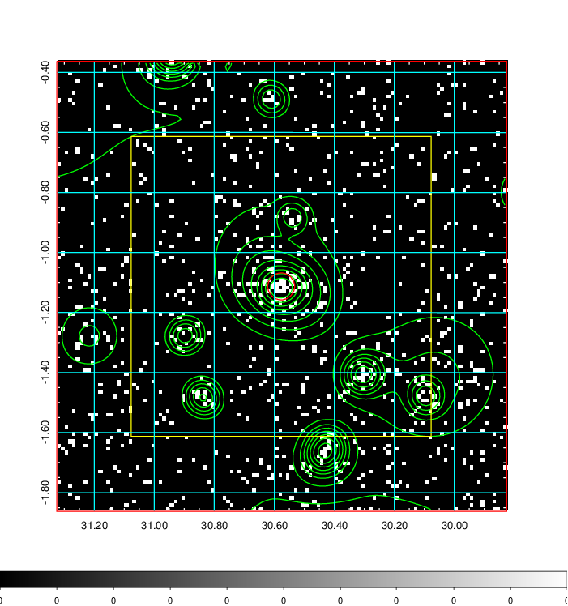
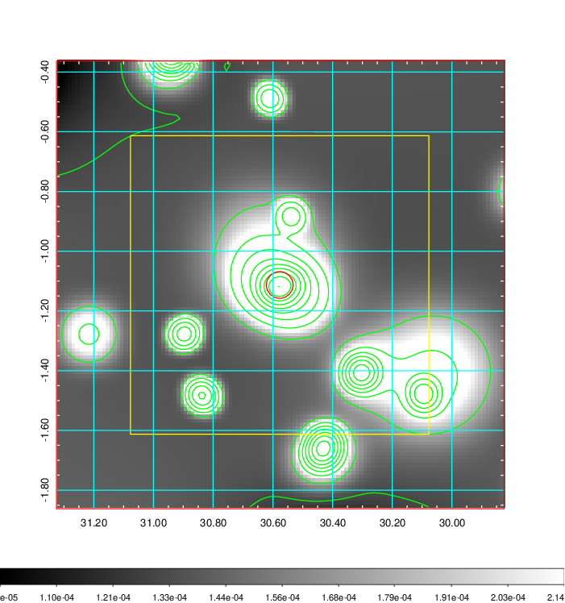
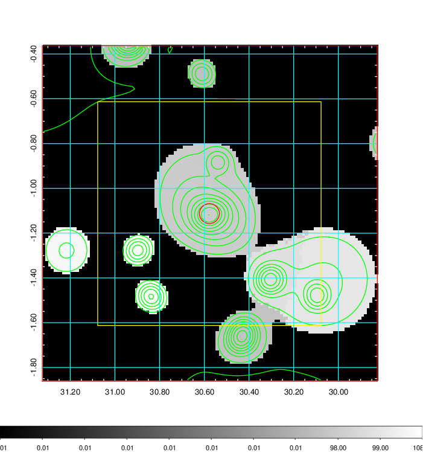
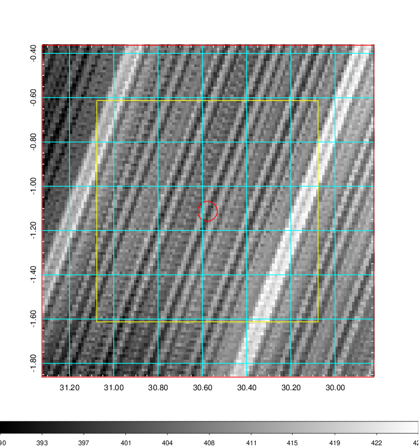
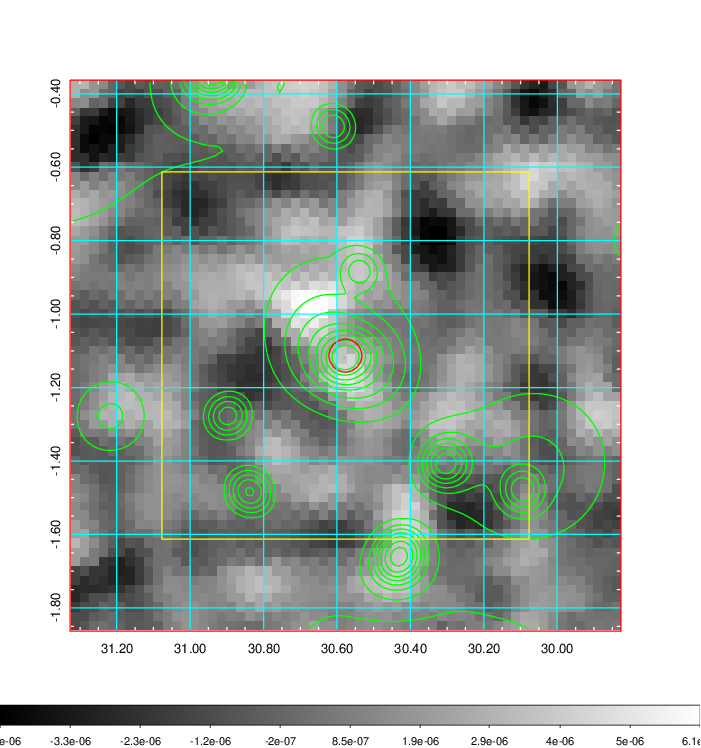
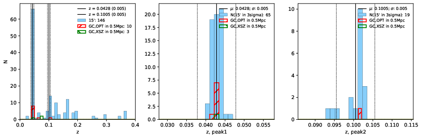
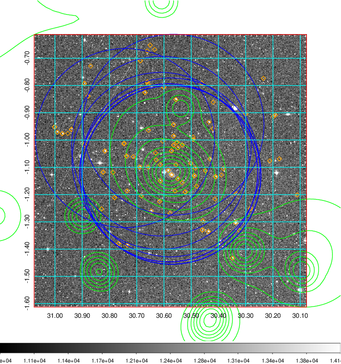
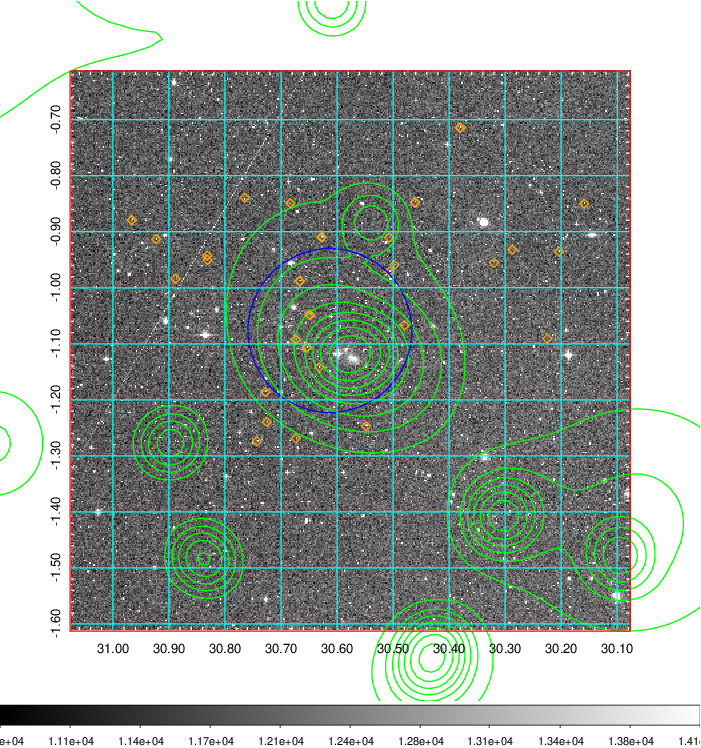
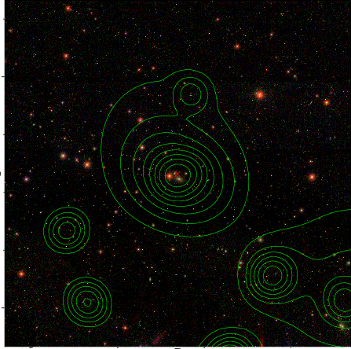

### 94

|Name|RAJ2000[deg]|DEJ2000[deg] |Ext[arcmin]| Ext,ml | z | z_src| C|GC(XSZ,Delta_z<0.01)| GC(OPT,Delta_z<0.01)|GC| R_sig[arcmin] | R500[arcmin] | R500[Mpc]| CRsig[c/s] | CR500[c/s] |L500[1E44 erg/s]|F500[1E-12 erg/s/cm^2]| M500[1E14 Msun]|Tx[keV]|Cnt_sig|Beta|Rc[arcmin]|Comment|Alias|
|---|---|---|---|---|---|------|---|--------|---------|----------|---|---|---|---|---|---|---|---|---|---|---|---|---|---|
|94| 30.577| -1.113| 2.69| 46.51| 0.0428(0.005)| z1, z_xsz| B| MCXC| A, N, W| A, C, F20, MCXC, N, SPI, W| 13.675| 12.547| 0.635| 0.203(0.036)| 0.201(0.036)| 0.148(0.018)| 3.458(0.424)| 0.76(0.05)| 1.83(0.07)| 87.1| 0.737(-0.133+0.159)| 4.238(-1.242+1.215)| -| k337|

|[RASS image](../image/94/94_img.pdf)|[filtered image](../image/94/94_fil.pdf)|[Segment image](../image/94/94_seg.pdf)|
|-------------------|--------------------|-------------------|
|   |    |   |

|[Exposure image](../image/94/94_mex.pdf)| [nH image](../image/94/94_nh.pdf)| [Planck image](../image/94/94_p.pdf)|
|-------------------|--------------------|-------------------|
|   |     |  |

|[Redshift Histogram](../image/94/94_zg.pdf) | [DSS image(z1)](../image/94/94_dss_z1.pdf)      |  [DSS image(z2)](../image/94/94_dss_z2.pdf)    |
|-------------------|--------------------|-------------------|
| |  Blue circle for optical clusters;  Magenta circle for XSZ clusters;  all with r=1Mpc;  Only GC with Delta_z<0.01 are shown. |  Blue circle for optical clusters;  Magenta circle for XSZ clusters;  all with r=1Mpc;  Only GC with Delta_z<0.01 are shown.  |

|[known Abell/XSZ clusters](../image/94/94_gc.pdf) | [2MASS image](../image/94/94_2mass.pdf)      |[SDSS image](../image/94/94_sdss.pdf)   |
|-------------------|-------------------|-------------------|
|  Magenta, blue and green circles  for optical, X-ray and SZ clusters  respectively, with redshift of clusters  labelled. The radius of circles  are 1Mpc.|  |   |

|[DES image](../image/94/94_des.pdf)   |
|-------------------|
|   |
