

### 940

|Name|RAJ2000[deg]|DEJ2000[deg] |Ext[arcmin]| Ext,ml | z | z_src| C|GC(XSZ,Delta_z<0.01)| GC(OPT,Delta_z<0.01)|GC| R_sig[arcmin] | R500[arcmin] | R500[Mpc]| CRsig[c/s] | CR500[c/s] |L500[1E44 erg/s]|F500[1E-12 erg/s/cm^2]| M500[1E14 Msun]|Tx[keV]|Cnt_sig|Beta|Rc[arcmin]|Comment|Alias|
|---|---|---|---|---|---|------|---|--------|---------|----------|---|---|---|---|---|---|---|---|---|---|---|---|---|---|
|940| 358.561| -10.410| 1.85| 107.61| 0.0763(0.005)| z1, z_xsz| B| F20, L03, MCXC, PSZ2, Tar, XB| A, N, W| A, F20, L03, MCXC, N, PSZ2, Tar, W, XB| 24.700| 11.639| 1.010| 0.644(0.074)| 0.592(0.068)| 1.607(0.100)| 11.249(0.698)| 3.15(0.10)| 4.45(0.09)| 224.4| 0.555(-0.023+0.026)| 1.990(-0.319+0.347)| -| k184|

|[RASS image](../image/940/940_img.pdf)|[filtered image](../image/940/940_fil.pdf)|[Segment image](../image/940/940_seg.pdf)|
|-------------------|--------------------|-------------------|
| 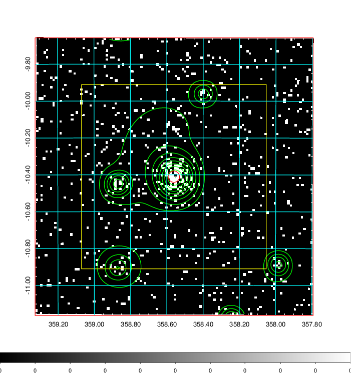  | 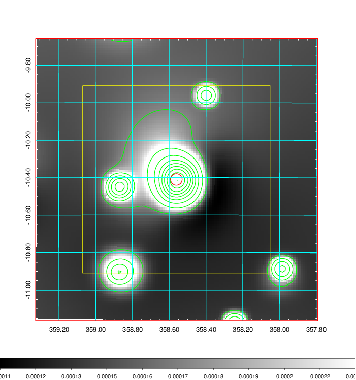   | 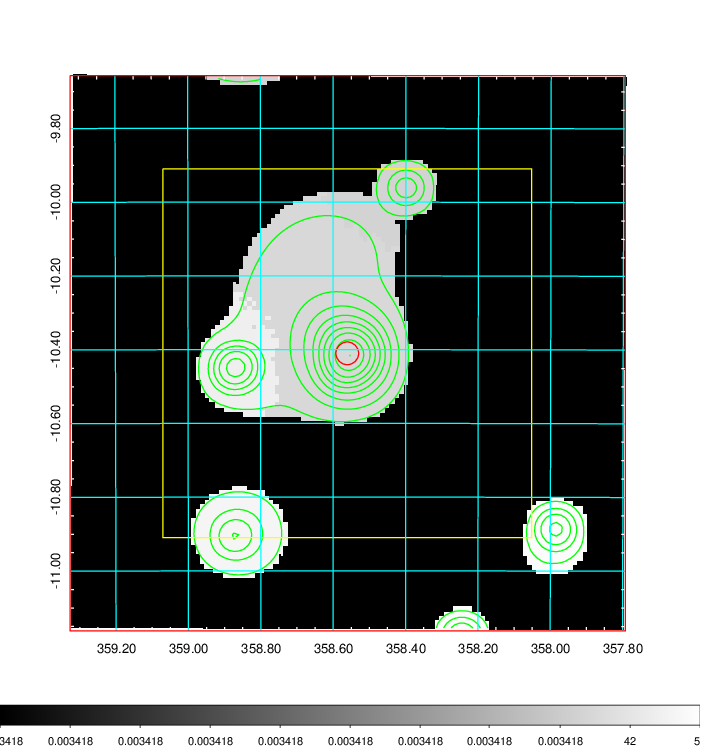  |

|[Exposure image](../image/940/940_mex.pdf)| [nH image](../image/940/940_nh.pdf)| [Planck image](../image/940/940_p.pdf)|
|-------------------|--------------------|-------------------|
|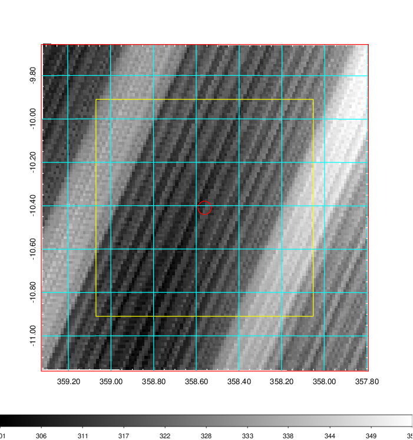   | 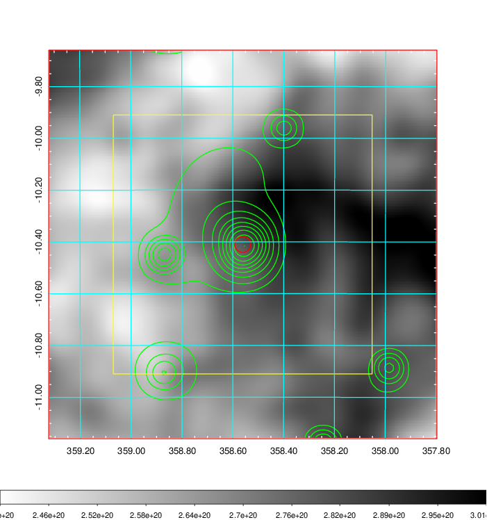    | 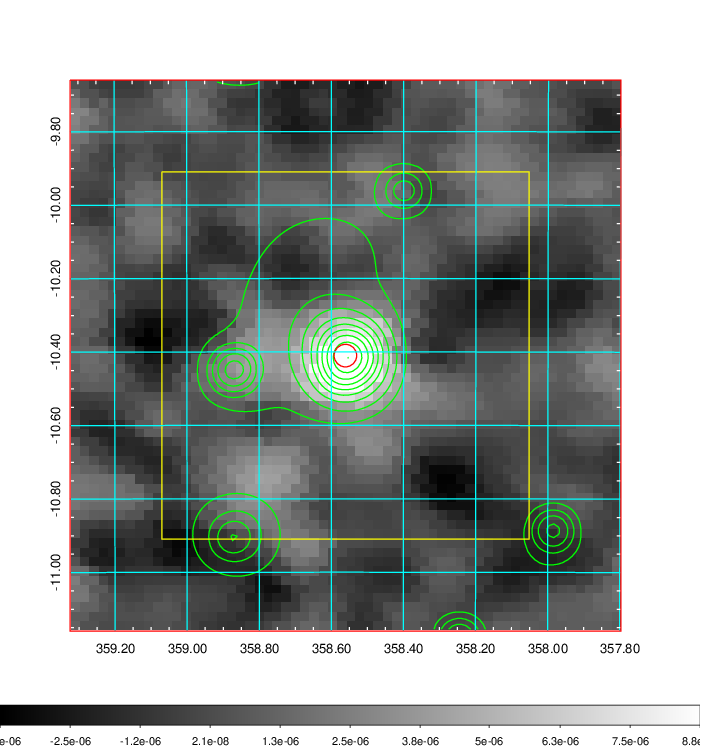 |

|[Redshift Histogram](../image/940/940_zg.pdf) | [DSS image(z1)](../image/940/940_dss_z1.pdf)      |  [DSS image(z2)](../image/940/940_dss_z2.pdf)    |
|-------------------|--------------------|-------------------|
|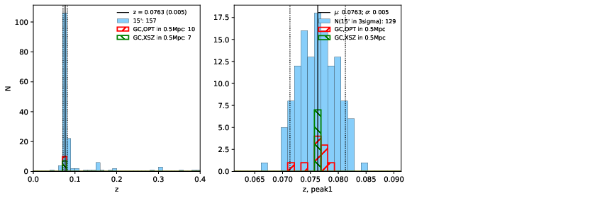 |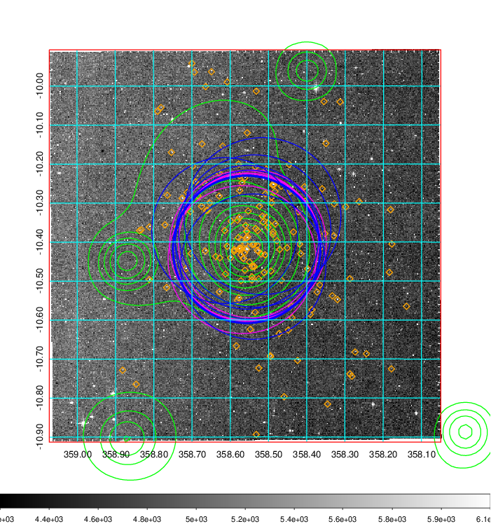  Blue circle for optical clusters;  Magenta circle for XSZ clusters;  all with r=1Mpc;  Only GC with Delta_z<0.01 are shown. | 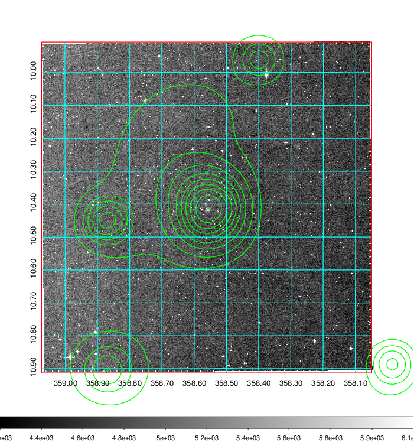 Blue circle for optical clusters;  Magenta circle for XSZ clusters;  all with r=1Mpc;  Only GC with Delta_z<0.01 are shown.  |

|[Previous-identified clusters](../image/940/940_gc.pdf) | [2MASS image](../image/940/940_2mass.pdf)      |[SDSS image](../image/940/940_sdss.pdf)   |
|-------------------|-------------------|-------------------|
|  Green, magenta, and blue circles  for optical, X-ray and SZ clusters  respectively, with redshift of clusters  labelled. The radius of circles  are 1Mpc.|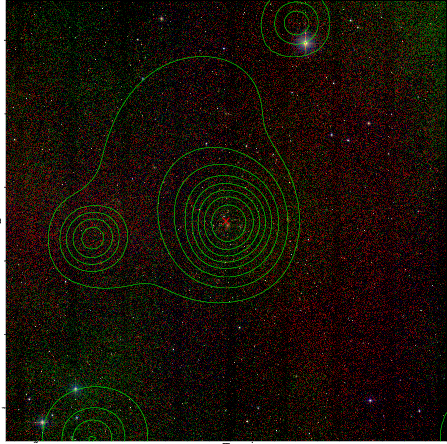  | 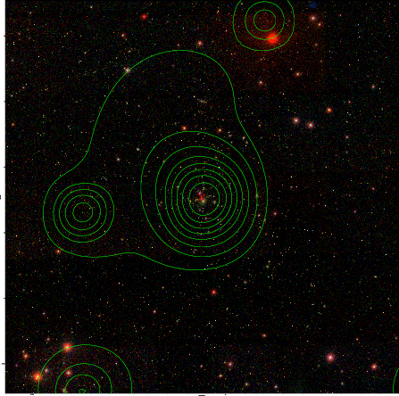  |

|[ATLAS image](../image/940/940_s.pdf)        |
|-------------------|
| 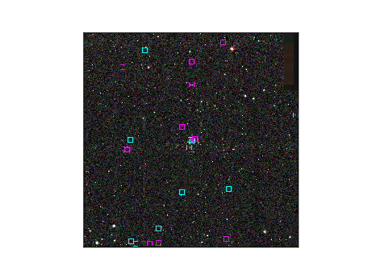  |
