

### 941

|Name|RAJ2000[deg]|DEJ2000[deg] |Ext[arcmin]| Ext,ml | z | z_src| C|GC(XSZ,Delta_z<0.01)| GC(OPT,Delta_z<0.01)|GC| R_sig[arcmin] | R500[arcmin] | R500[Mpc]| CRsig[c/s] | CR500[c/s] |L500[1E44 erg/s]|F500[1E-12 erg/s/cm^2]| M500[1E14 Msun]|Tx[keV]|Cnt_sig|Beta|Rc[arcmin]|Comment|Alias|
|---|---|---|---|---|---|------|---|--------|---------|----------|---|---|---|---|---|---|---|---|---|---|---|---|---|---|
|941| 358.929| 11.352| 3.03| 96.70| 0.0725(0.006)| z1, z_xsz| B| F20, L03, MCXC, PSZ2, SPI, Tar, XB| A, N, RM, W| A, F20, L03, MCXC, N, PSZ2, SPI, Tar, W, XB| 31.119| 10.266| 0.850| 0.310(0.059)| 0.279(0.053)| 0.634(0.059)| 4.940(0.459)| 1.87(0.09)| 3.23(0.10)| 184.8| 0.845(-0.086+0.091)| 5.897(-0.891+0.851)| -| k381|

|[RASS image](../image/941/941_img.pdf)|[filtered image](../image/941/941_fil.pdf)|[Segment image](../image/941/941_seg.pdf)|
|-------------------|--------------------|-------------------|
| 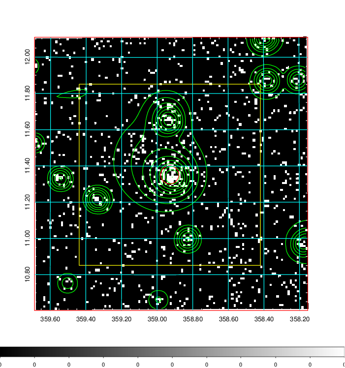  | 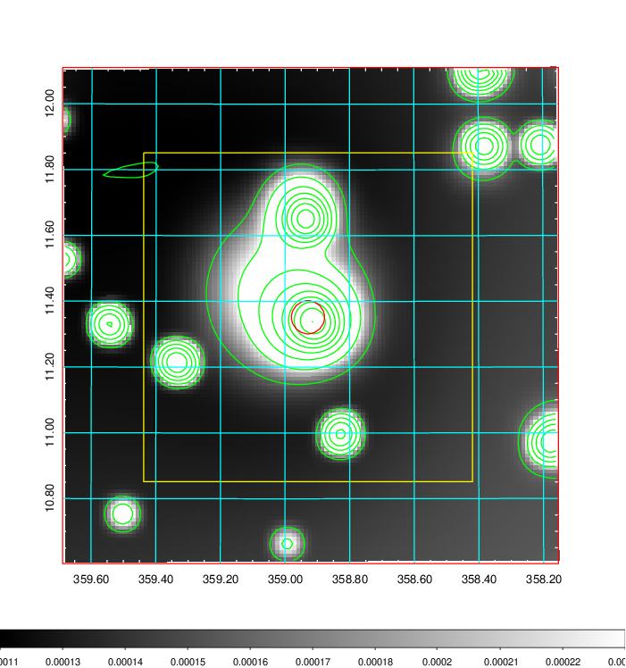   | 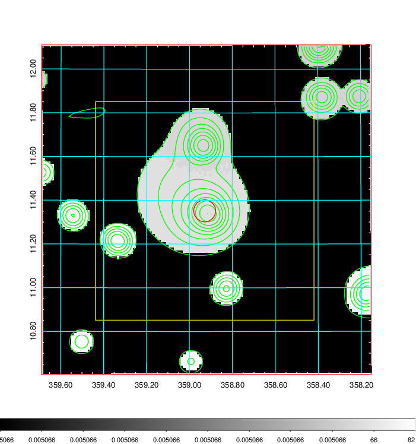  |

|[Exposure image](../image/941/941_mex.pdf)| [nH image](../image/941/941_nh.pdf)| [Planck image](../image/941/941_p.pdf)|
|-------------------|--------------------|-------------------|
|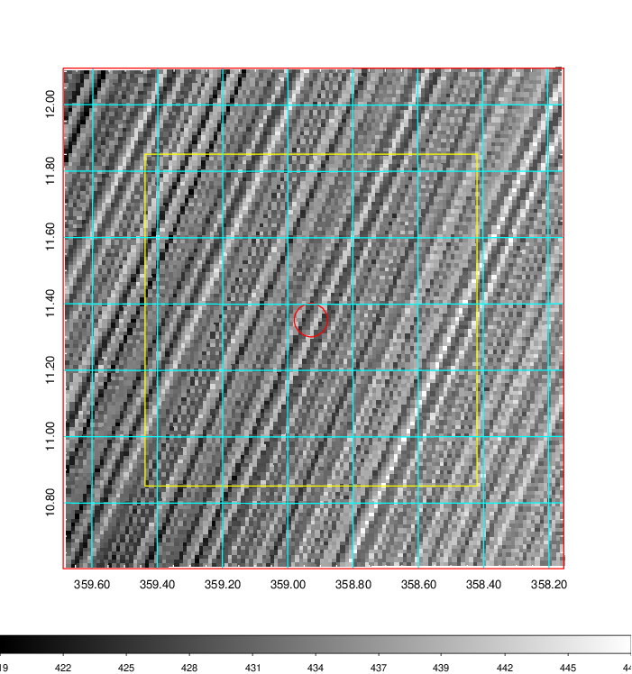   | 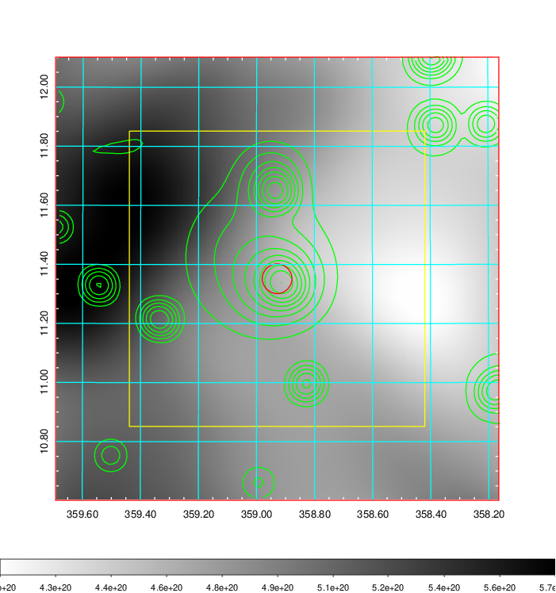    | 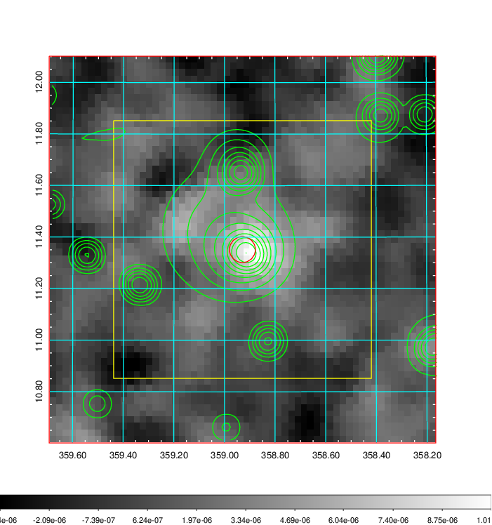 |

|[Redshift Histogram](../image/941/941_zg.pdf) | [DSS image(z1)](../image/941/941_dss_z1.pdf)      |  [DSS image(z2)](../image/941/941_dss_z2.pdf)    |
|-------------------|--------------------|-------------------|
|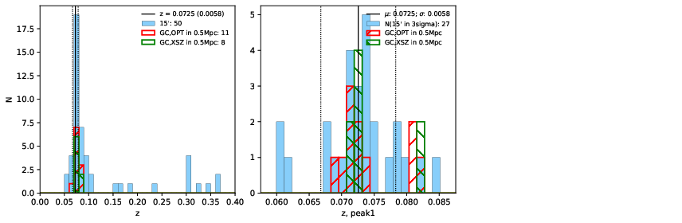 |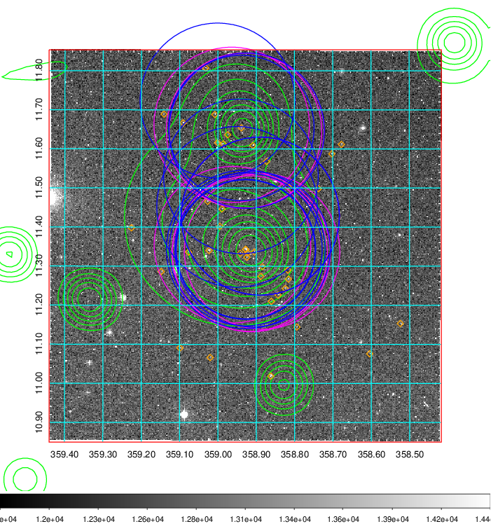  Blue circle for optical clusters;  Magenta circle for XSZ clusters;  all with r=1Mpc;  Only GC with Delta_z<0.01 are shown. | 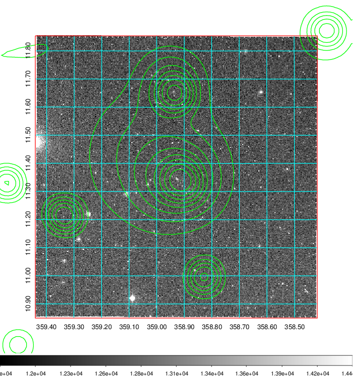 Blue circle for optical clusters;  Magenta circle for XSZ clusters;  all with r=1Mpc;  Only GC with Delta_z<0.01 are shown.  |

|[Previous-identified clusters](../image/941/941_gc.pdf) | [2MASS image](../image/941/941_2mass.pdf)      |[SDSS image](../image/941/941_sdss.pdf)   |
|-------------------|-------------------|-------------------|
|  Green, magenta, and blue circles  for optical, X-ray and SZ clusters  respectively, with redshift of clusters  labelled. The radius of circles  are 1Mpc.|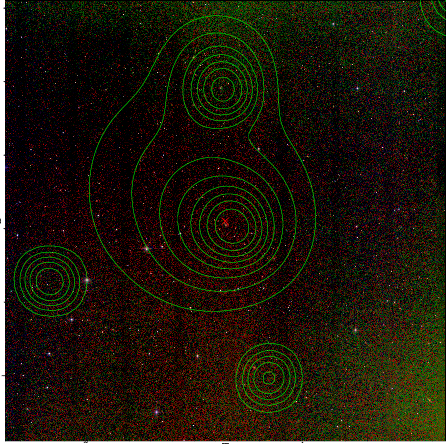  | 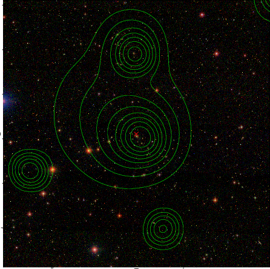  |

