

### 942

|Name|RAJ2000[deg]|DEJ2000[deg] |Ext[arcmin]| Ext,ml | z | z_src| C|GC(XSZ,Delta_z<0.01)| GC(OPT,Delta_z<0.01)|GC| R_sig[arcmin] | R500[arcmin] | R500[Mpc]| CRsig[c/s] | CR500[c/s] |L500[1E44 erg/s]|F500[1E-12 erg/s/cm^2]| M500[1E14 Msun]|Tx[keV]|Cnt_sig|Beta|Rc[arcmin]|Comment|Alias|
|---|---|---|---|---|---|------|---|--------|---------|----------|---|---|---|---|---|---|---|---|---|---|---|---|---|---|
|942| 359.237| -34.746| 2.15| 504.32| 0.0492(0.005)| z1, z_xsz| B| MCXC, PSZ2, Tar, XB| A, N, W| A, MCXC, N, PSZ2, Tar, W, XB| 18.281| 18.052| 1.043| 1.677(0.098)| 1.673(0.098)| 1.931(0.056)| 33.763(0.979)| 3.38(0.05)| 4.61(0.04)| 563.1| 0.780(-0.036+0.042)| 4.043(-0.328+0.365)| -| k246|

|[RASS image](../image/942/942_img.pdf)|[filtered image](../image/942/942_fil.pdf)|[Segment image](../image/942/942_seg.pdf)|
|-------------------|--------------------|-------------------|
| 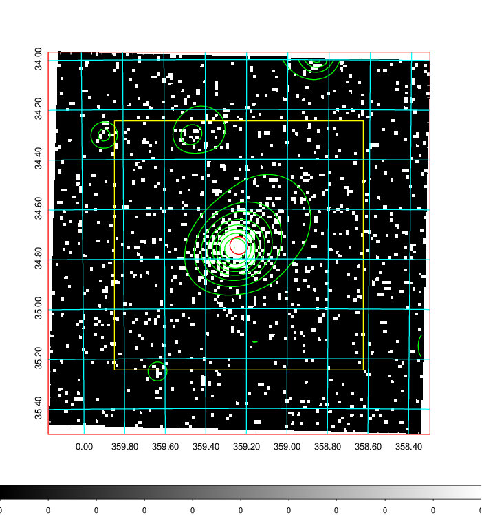  | 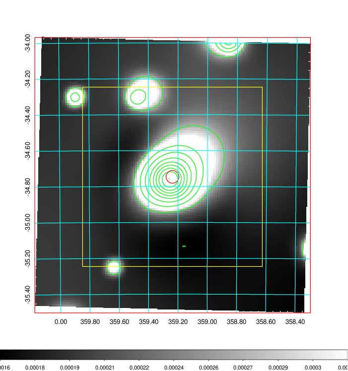   | 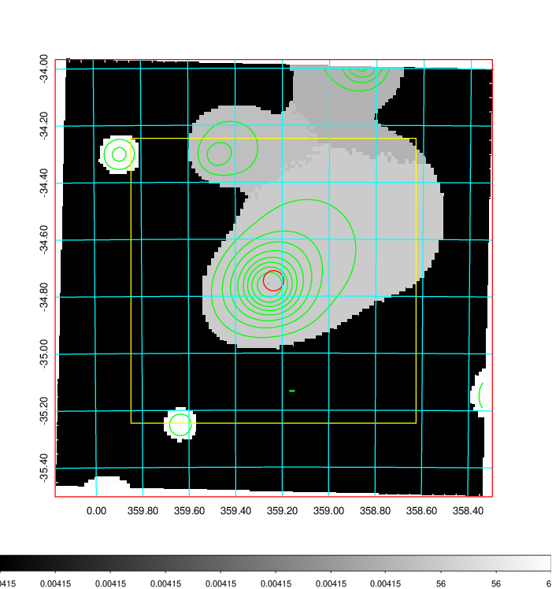  |

|[Exposure image](../image/942/942_mex.pdf)| [nH image](../image/942/942_nh.pdf)| [Planck image](../image/942/942_p.pdf)|
|-------------------|--------------------|-------------------|
|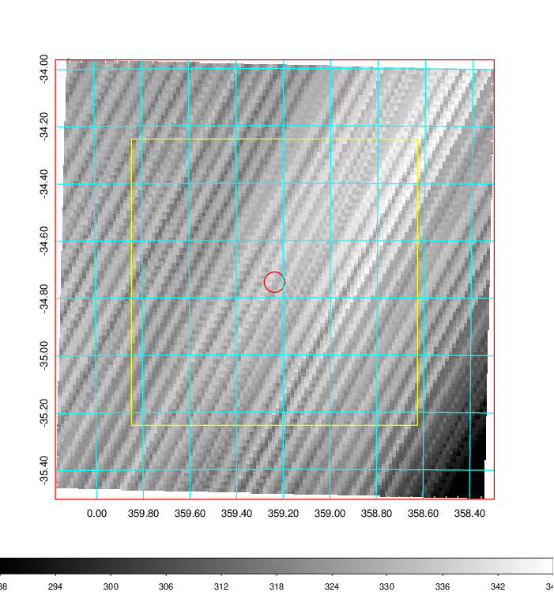   | 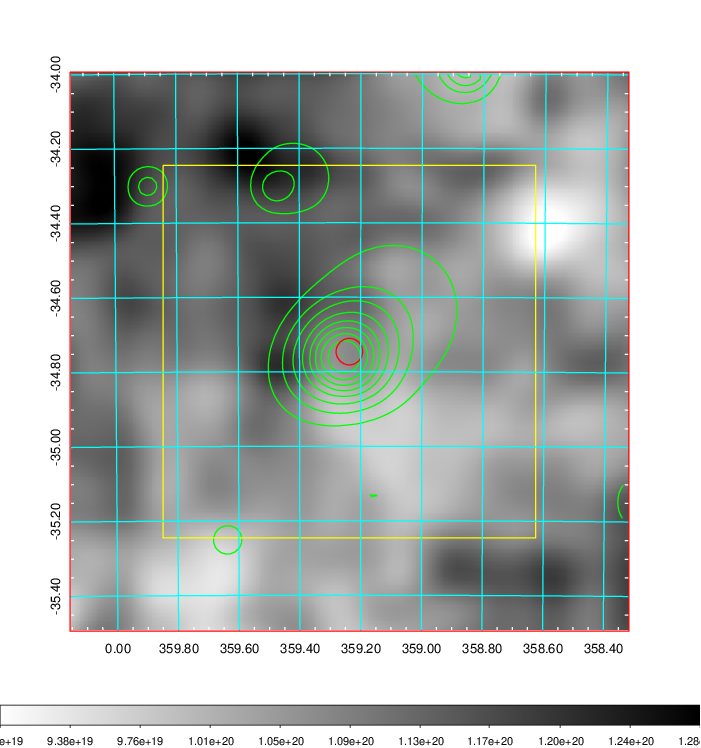    | 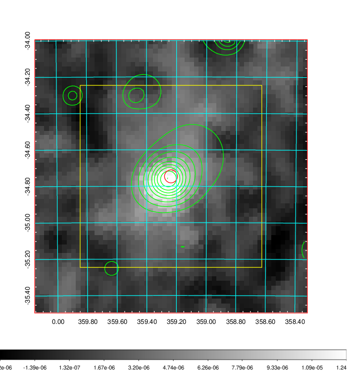 |

|[Redshift Histogram](../image/942/942_zg.pdf) | [DSS image(z1)](../image/942/942_dss_z1.pdf)      |  [DSS image(z2)](../image/942/942_dss_z2.pdf)    |
|-------------------|--------------------|-------------------|
|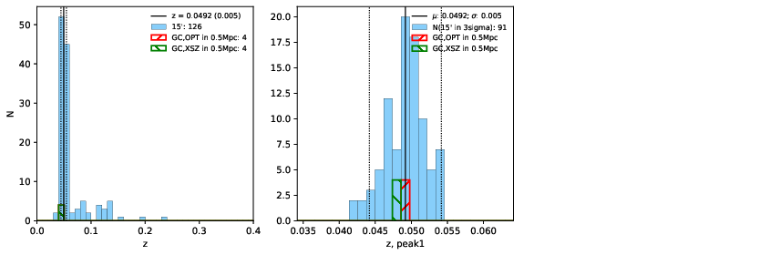 |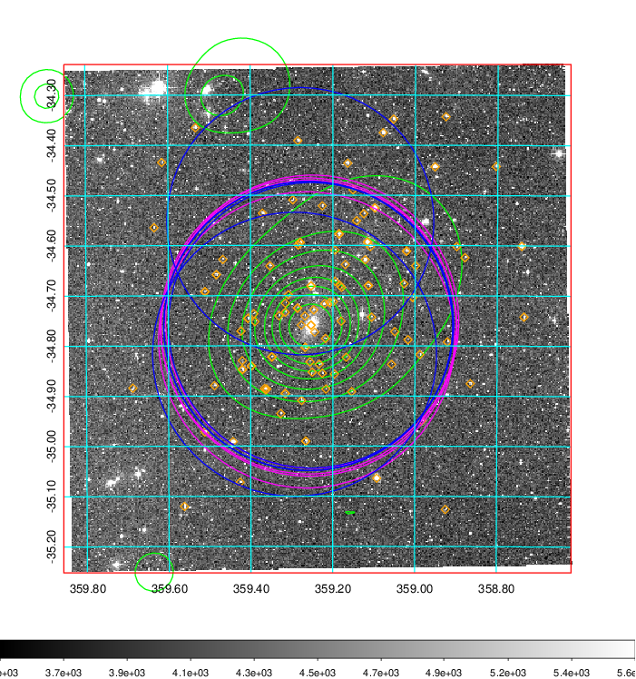  Blue circle for optical clusters;  Magenta circle for XSZ clusters;  all with r=1Mpc;  Only GC with Delta_z<0.01 are shown. | 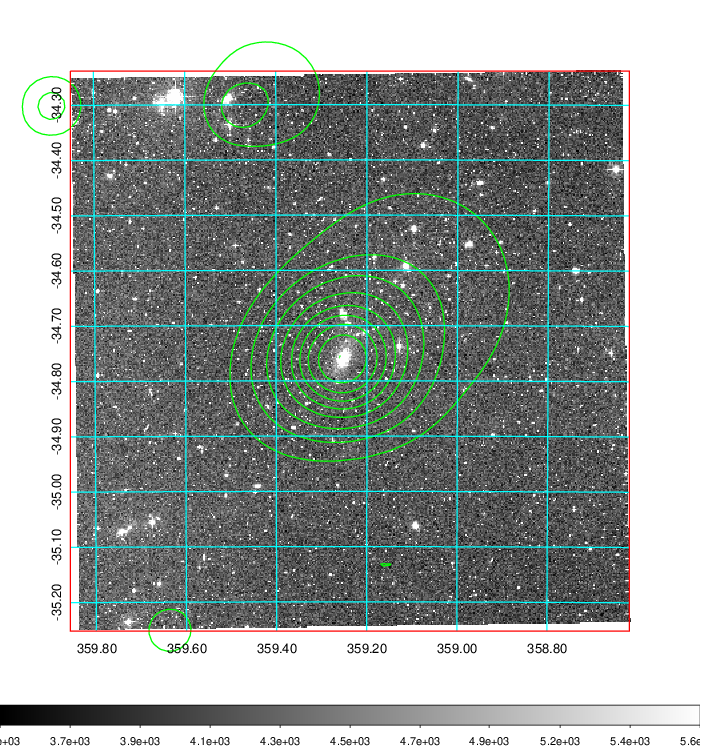 Blue circle for optical clusters;  Magenta circle for XSZ clusters;  all with r=1Mpc;  Only GC with Delta_z<0.01 are shown.  |

|[Previous-identified clusters](../image/942/942_gc.pdf) | [2MASS image](../image/942/942_2mass.pdf)      |
|-------------------|-------------------|
|  Green, magenta, and blue circles  for optical, X-ray and SZ clusters  respectively, with redshift of clusters  labelled. The radius of circles  are 1Mpc.|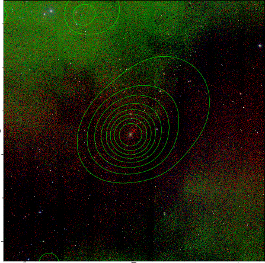  |

|[ATLAS image](../image/942/942_s.pdf)        |
|-------------------|
| 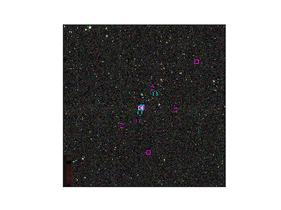  |
