

### 943

|Name|RAJ2000[deg]|DEJ2000[deg] |Ext[arcmin]| Ext,ml | z | z_src| C|GC(XSZ,Delta_z<0.01)| GC(OPT,Delta_z<0.01)|GC| R_sig[arcmin] | R500[arcmin] | R500[Mpc]| CRsig[c/s] | CR500[c/s] |L500[1E44 erg/s]|F500[1E-12 erg/s/cm^2]| M500[1E14 Msun]|Tx[keV]|Cnt_sig|Beta|Rc[arcmin]|Comment|Alias|
|---|---|---|---|---|---|------|---|--------|---------|----------|---|---|---|---|---|---|---|---|---|---|---|---|---|---|
|943| 359.706| -60.663| 2.89| 45.04| 0.0994(0.005)| z1, z_xsz| B| MCXC, PSZ2, Tar| A, N, W| A, MCXC, N, PSZ2, Tar, W| 49.015| 8.557| 0.942| 0.304(0.131)| 0.267(0.116)| 1.341(0.312)| 5.360(1.247)| 2.61(0.30)| 4.00(0.29)| 72.6| 0.962(-0.054+0.028)| 4.981(-0.430+0.410)| -| k362|

|[RASS image](../image/943/943_img.pdf)|[filtered image](../image/943/943_fil.pdf)|[Segment image](../image/943/943_seg.pdf)|
|-------------------|--------------------|-------------------|
| 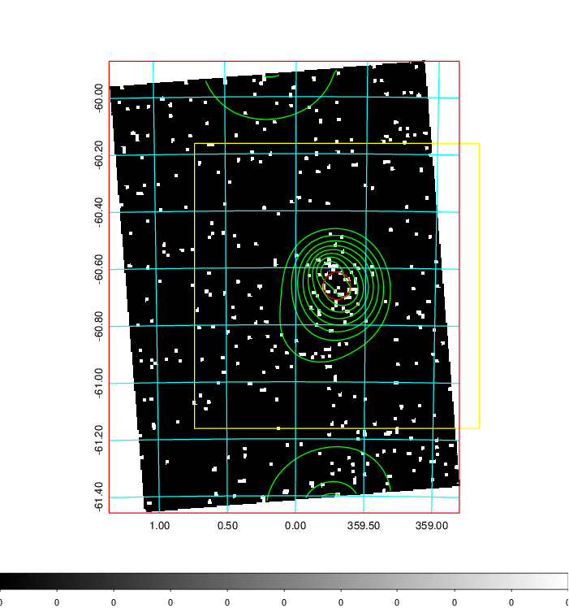  | 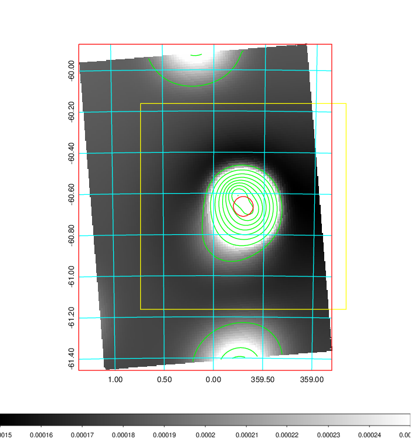   | 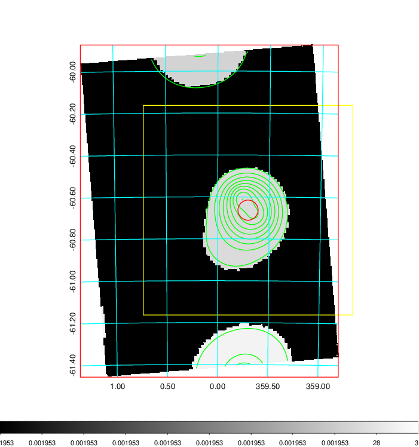  |

|[Exposure image](../image/943/943_mex.pdf)| [nH image](../image/943/943_nh.pdf)| [Planck image](../image/943/943_p.pdf)|
|-------------------|--------------------|-------------------|
|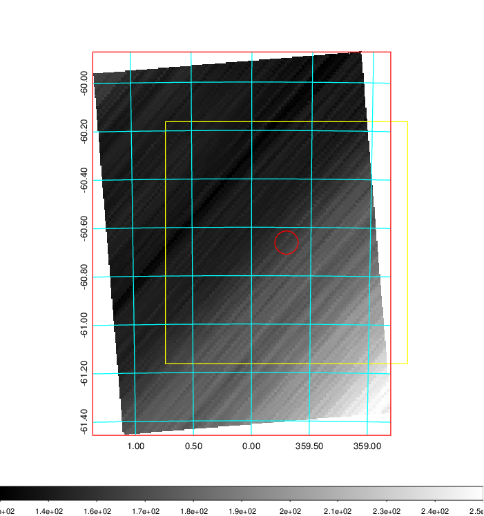   | 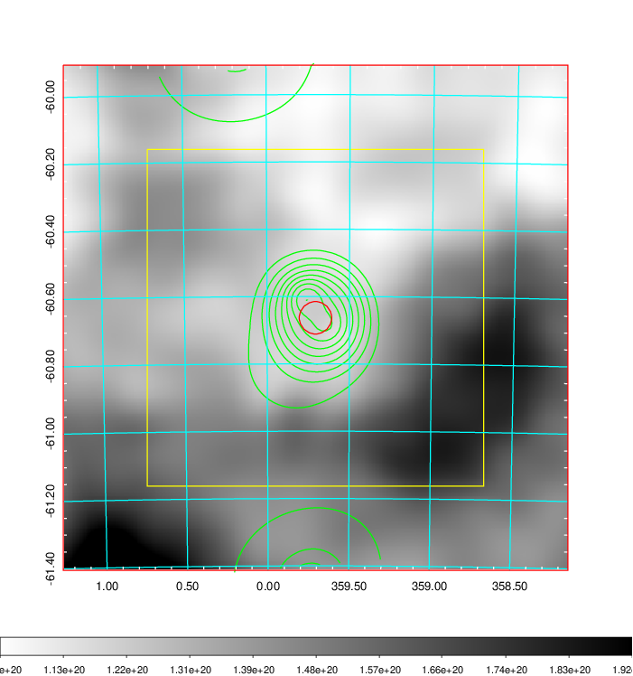    | 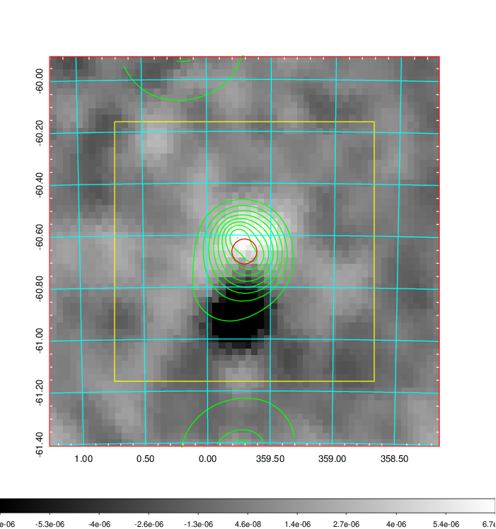 |

|[Redshift Histogram](../image/943/943_zg.pdf) | [DSS image(z1)](../image/943/943_dss_z1.pdf)      |  [DSS image(z2)](../image/943/943_dss_z2.pdf)    |
|-------------------|--------------------|-------------------|
|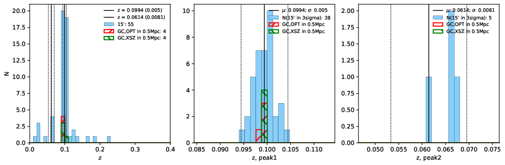 |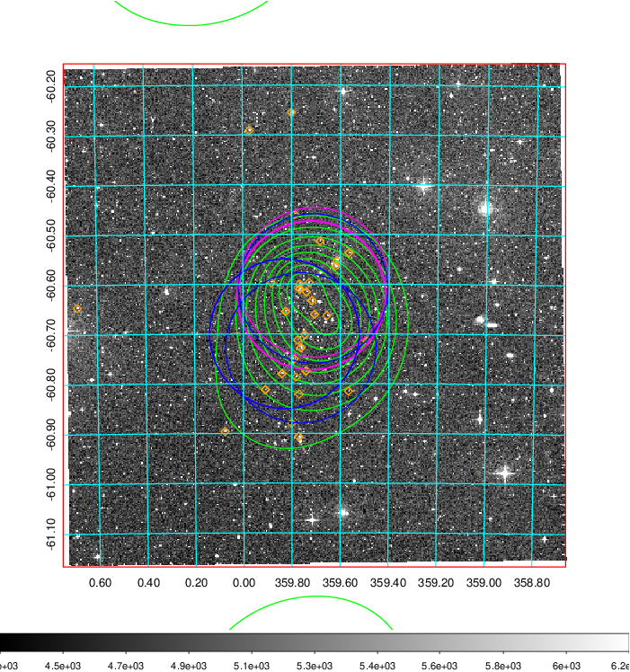  Blue circle for optical clusters;  Magenta circle for XSZ clusters;  all with r=1Mpc;  Only GC with Delta_z<0.01 are shown. | 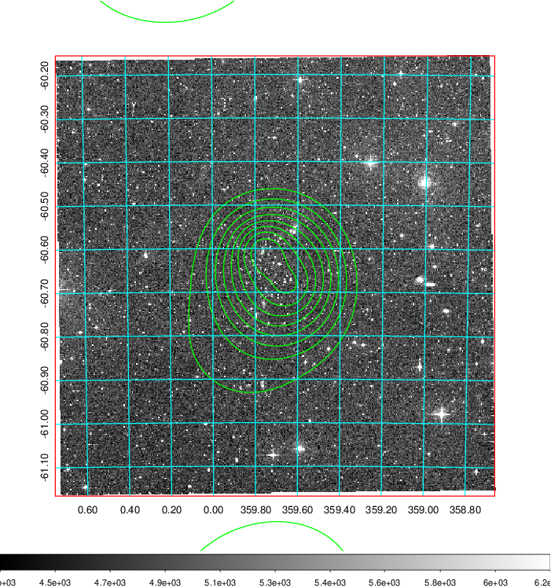 Blue circle for optical clusters;  Magenta circle for XSZ clusters;  all with r=1Mpc;  Only GC with Delta_z<0.01 are shown.  |

|[Previous-identified clusters](../image/943/943_gc.pdf) | [2MASS image](../image/943/943_2mass.pdf)      |
|-------------------|-------------------|
|  Green, magenta, and blue circles  for optical, X-ray and SZ clusters  respectively, with redshift of clusters  labelled. The radius of circles  are 1Mpc.|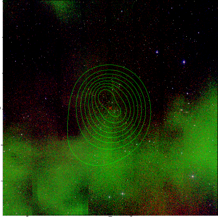  |

|[DES image](../image/943/943_des.pdf)   |
|-------------------|
| 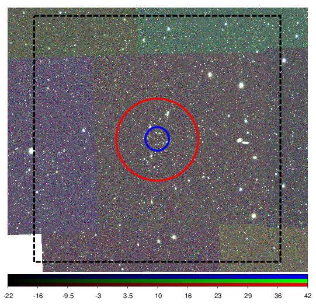  |
