

### 96

|Name|RAJ2000[deg]|DEJ2000[deg] |Ext[arcmin]| Ext,ml | z | z_src| C|GC(XSZ,Delta_z<0.01)| GC(OPT,Delta_z<0.01)|GC| R_sig[arcmin] | R500[arcmin] | R500[Mpc]| CRsig[c/s] | CR500[c/s] |L500[1E44 erg/s]|F500[1E-12 erg/s/cm^2]| M500[1E14 Msun]|Tx[keV]|Cnt_sig|Beta|Rc[arcmin]|Comment|Alias|
|---|---|---|---|---|---|------|---|--------|---------|----------|---|---|---|---|---|---|---|---|---|---|---|---|---|---|
|96| 32.373| 19.758| 2.76| 36.67| 0.0617(0.005)| z1, z_xsz| B| MCXC, Tar| A, N, W| A, MCXC, N, Tar, W| 11.725| 10.801| 0.771| 0.220(0.047)| 0.217(0.046)| 0.334(0.033)| 3.647(0.362)| 1.38(0.07)| 2.66(0.08)| 65.7| 0.723(-0.138+0.170)| 3.630(-1.215+1.253)| -| k343|

|[RASS image](../image/96/96_img.pdf)|[filtered image](../image/96/96_fil.pdf)|[Segment image](../image/96/96_seg.pdf)|
|-------------------|--------------------|-------------------|
| 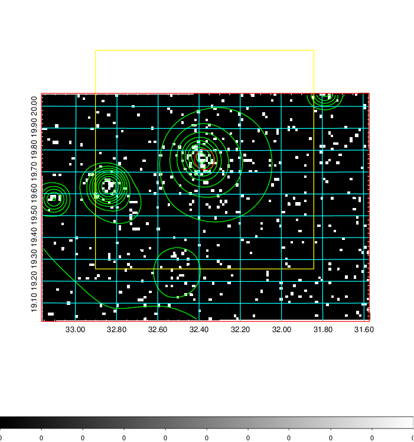  | 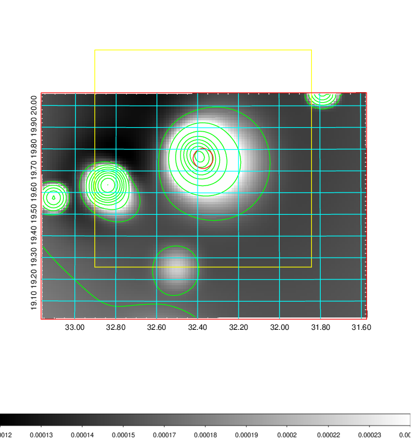   | 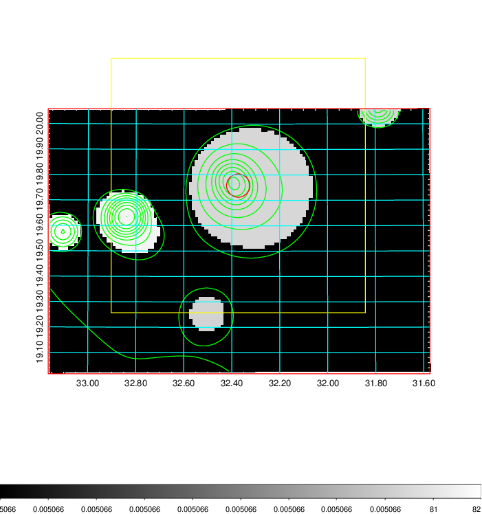  |

|[Exposure image](../image/96/96_mex.pdf)| [nH image](../image/96/96_nh.pdf)| [Planck image](../image/96/96_p.pdf)|
|-------------------|--------------------|-------------------|
|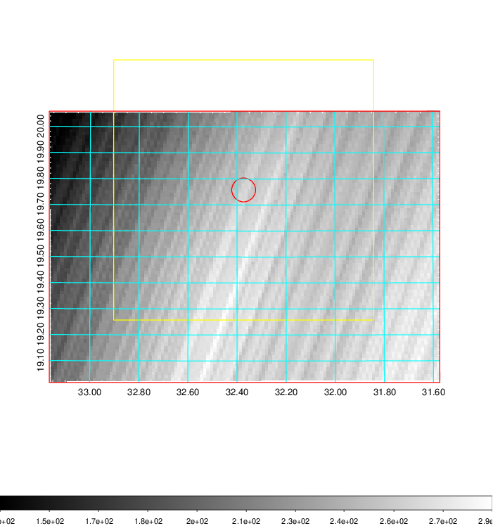   | 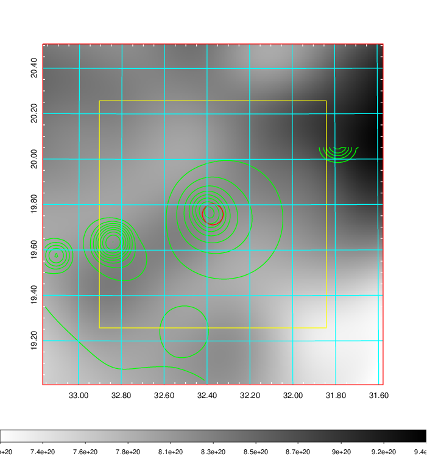    | 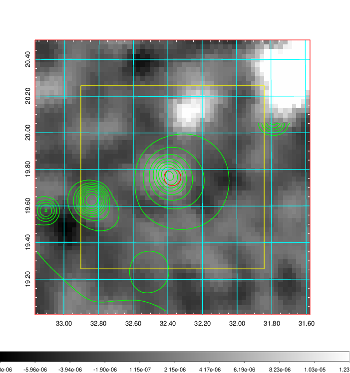 |

|[Redshift Histogram](../image/96/96_zg.pdf) | [DSS image(z1)](../image/96/96_dss_z1.pdf)      |  [DSS image(z2)](../image/96/96_dss_z2.pdf)    |
|-------------------|--------------------|-------------------|
|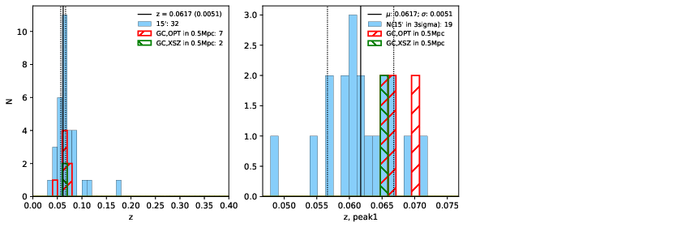 |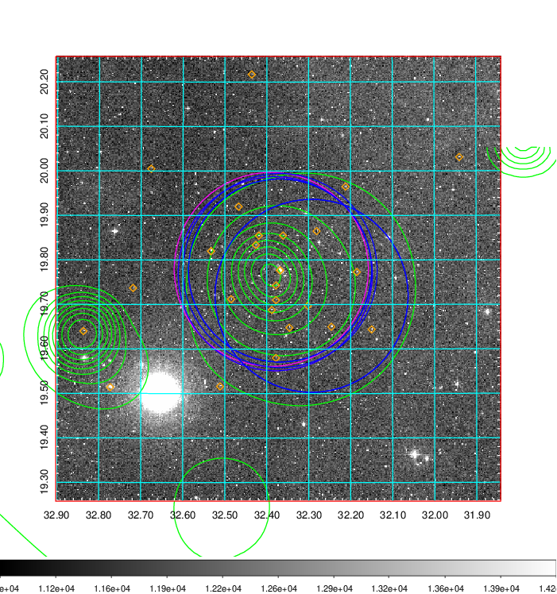  Blue circle for optical clusters;  Magenta circle for XSZ clusters;  all with r=1Mpc;  Only GC with Delta_z<0.01 are shown. | 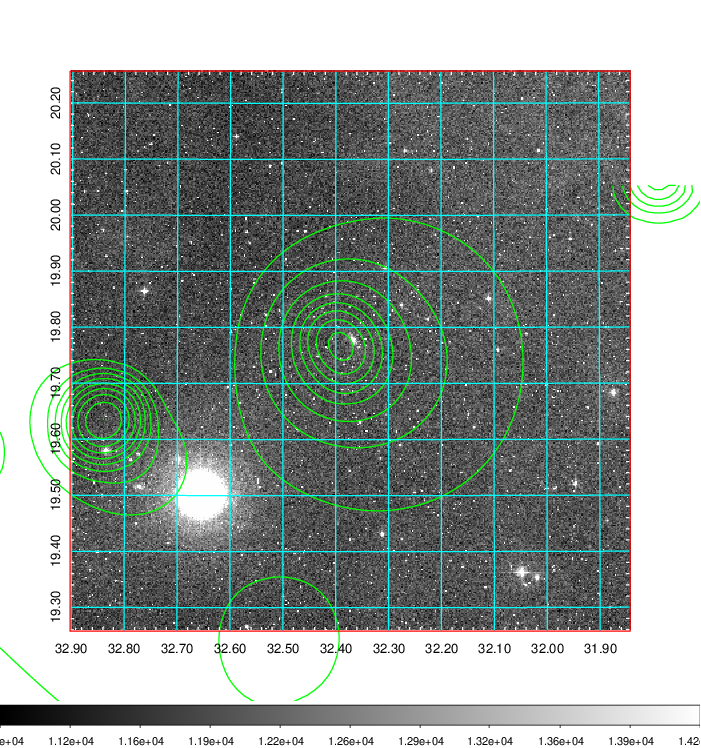 Blue circle for optical clusters;  Magenta circle for XSZ clusters;  all with r=1Mpc;  Only GC with Delta_z<0.01 are shown.  |

|[known Abell/XSZ clusters](../image/96/96_gc.pdf) | [2MASS image](../image/96/96_2mass.pdf)      |[SDSS image](../image/96/96_sdss.pdf)   |
|-------------------|-------------------|-------------------|
|  Magenta, blue and green circles  for optical, X-ray and SZ clusters  respectively, with redshift of clusters  labelled. The radius of circles  are 1Mpc.|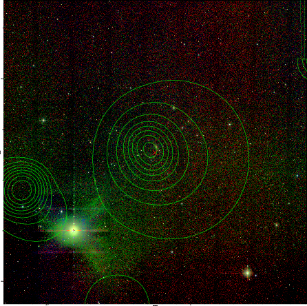  | 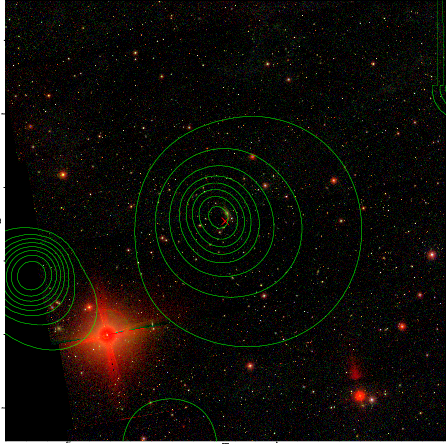  |

