

### 97

|Name|RAJ2000[deg]|DEJ2000[deg] |Ext[arcmin]| Ext,ml | z | z_src| C|GC(XSZ,Delta_z<0.01)| GC(OPT,Delta_z<0.01)|GC| R_sig[arcmin] | R500[arcmin] | R500[Mpc]| CRsig[c/s] | CR500[c/s] |L500[1E44 erg/s]|F500[1E-12 erg/s/cm^2]| M500[1E14 Msun]|Tx[keV]|Cnt_sig|Beta|Rc[arcmin]|Comment|Alias|
|---|---|---|---|---|---|------|---|--------|---------|----------|---|---|---|---|---|---|---|---|---|---|---|---|---|---|
|97| 33.225| -47.140| 2.47| 32.20| 0.1175(0.000)| z_xsz| B| MCXC, PSZ2, Tar| A, N, W| A, B15, MCXC, N, PSZ2, Tar, W| 13.675| 7.118| 0.907| 0.174(0.035)| 0.161(0.032)| 1.133(0.174)| 3.164(0.485)| 2.38(0.18)| 3.79(0.18)| 110.4| 0.555(-0.041+0.090)| 2.514(-0.536+0.943)| -| k293|

|[RASS image](../image/97/97_img.pdf)|[filtered image](../image/97/97_fil.pdf)|[Segment image](../image/97/97_seg.pdf)|
|-------------------|--------------------|-------------------|
| 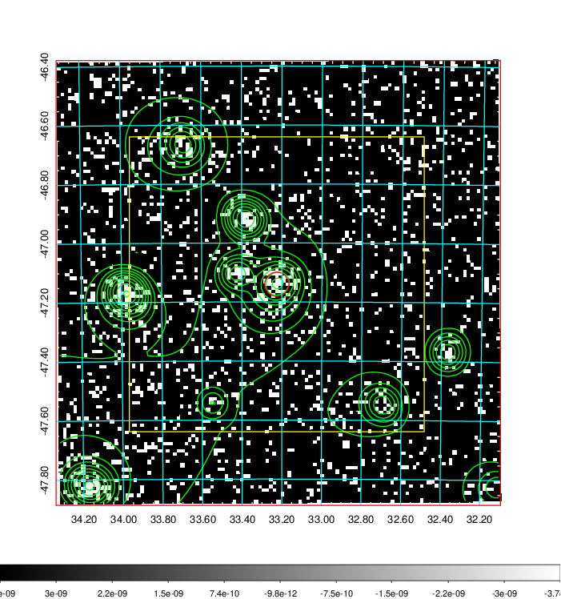  | 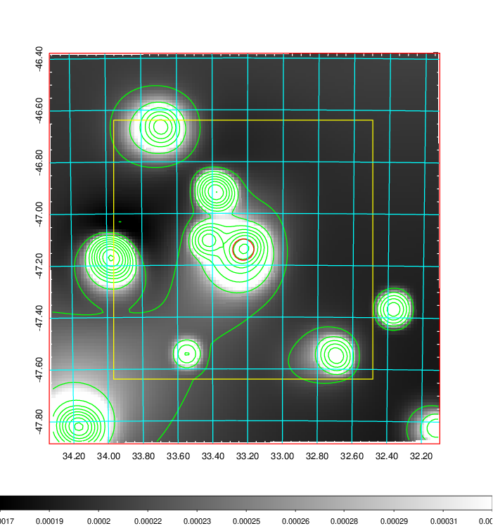   | 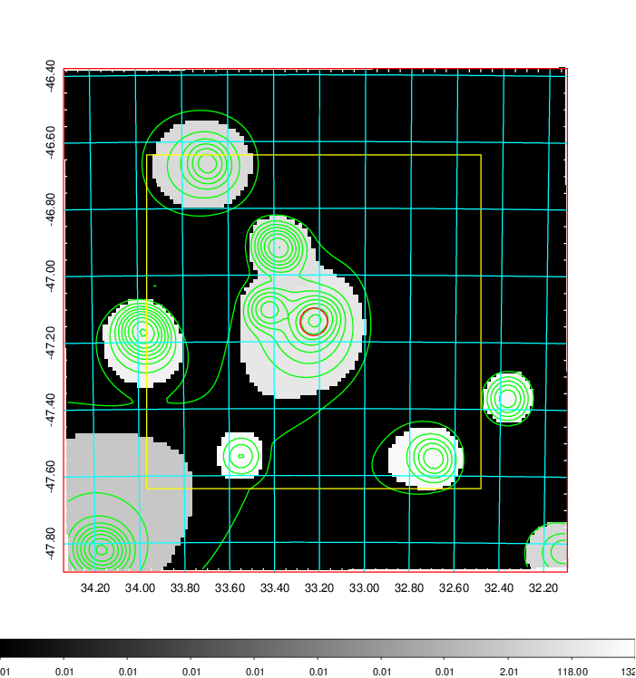  |

|[Exposure image](../image/97/97_mex.pdf)| [nH image](../image/97/97_nh.pdf)| [Planck image](../image/97/97_p.pdf)|
|-------------------|--------------------|-------------------|
|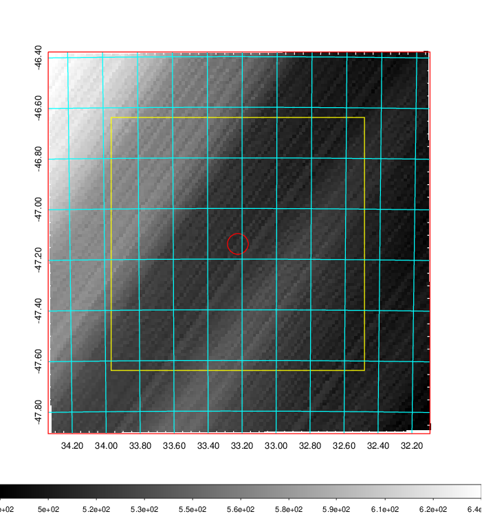   | 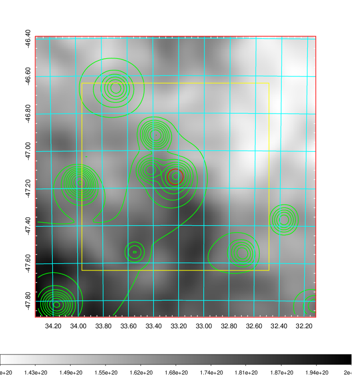    | 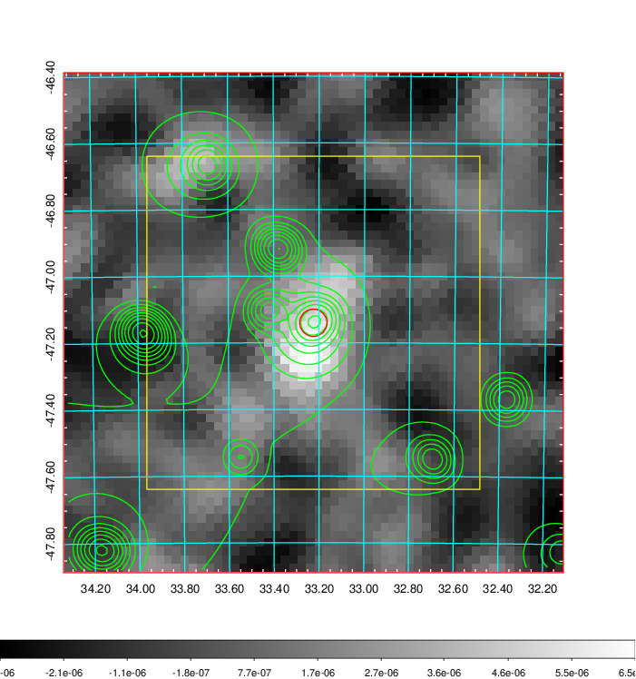 |

|[Redshift Histogram](../image/97/97_zg.pdf) | [DSS image(z1)](../image/97/97_dss_z1.pdf)      |  [DSS image(z2)](../image/97/97_dss_z2.pdf)    |
|-------------------|--------------------|-------------------|
|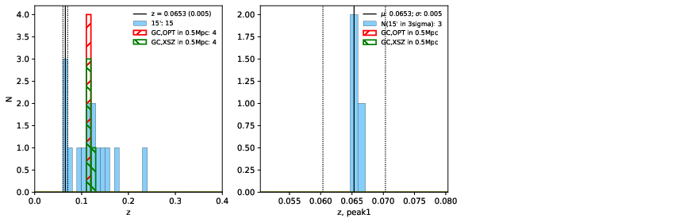 |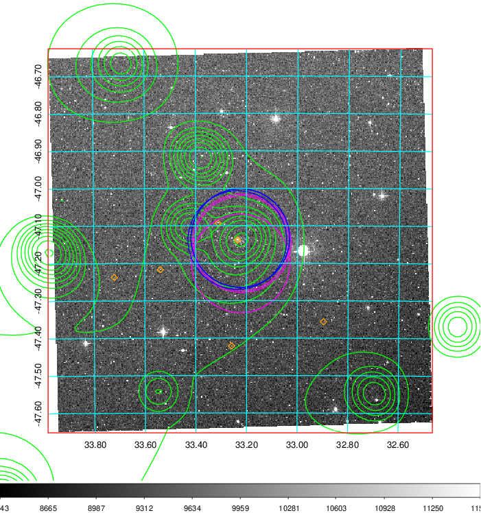  Blue circle for optical clusters;  Magenta circle for XSZ clusters;  all with r=1Mpc;  Only GC with Delta_z<0.01 are shown. | 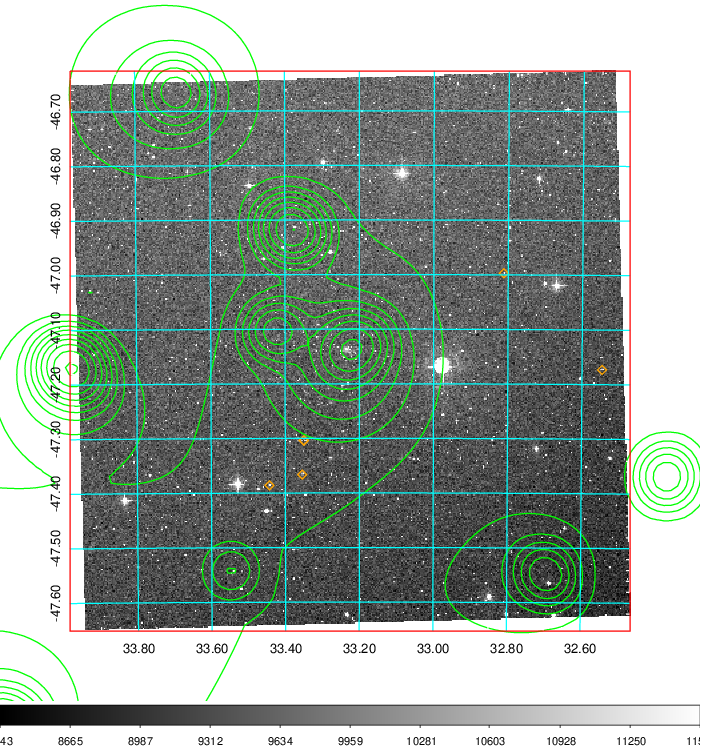 Blue circle for optical clusters;  Magenta circle for XSZ clusters;  all with r=1Mpc;  Only GC with Delta_z<0.01 are shown.  |

|[Previous-identified clusters](../image/97/97_gc.pdf) | [2MASS image](../image/97/97_2mass.pdf)      |
|-------------------|-------------------|
|  Green, magenta, and blue circles  for optical, X-ray and SZ clusters  respectively, with redshift of clusters  labelled. The radius of circles  are 1Mpc.|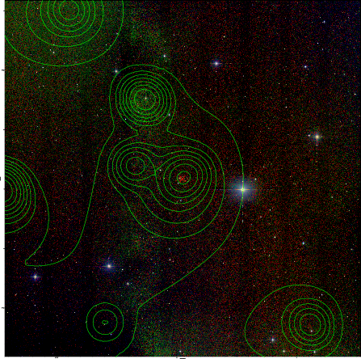  |

|[DES image](../image/97/97_des.pdf)   |
|-------------------|
| 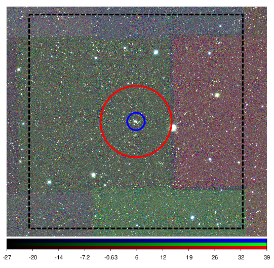  |
