

### 99

|Name|RAJ2000[deg]|DEJ2000[deg] |Ext[arcmin]| Ext,ml | z | z_src| C|GC(XSZ,Delta_z<0.01)| GC(OPT,Delta_z<0.01)|GC| R_sig[arcmin] | R500[arcmin] | R500[Mpc]| CRsig[c/s] | CR500[c/s] |L500[1E44 erg/s]|F500[1E-12 erg/s/cm^2]| M500[1E14 Msun]|Tx[keV]|Cnt_sig|Beta|Rc[arcmin]|Comment|Alias|
|---|---|---|---|---|---|------|---|--------|---------|----------|---|---|---|---|---|---|---|---|---|---|---|---|---|---|
|99| 34.275| -52.746| 1.72| 25.35| 0.3416(0.000)| z_xsz| B| B15, H13, MCXC, Tar| N| B15, H13, MCXC, N, PSZ2, Tar, W| 7.338| 4.378| 1.277| 0.147(0.036)| 0.138(0.034)| 10.828(1.172)| 2.778(0.301)| 8.45(0.41)| 8.96(0.28)| 55.3| 0.902(-0.111+0.070)| 4.142(-0.665+0.525)| -| k161|

|[RASS image](../image/99/99_img.pdf)|[filtered image](../image/99/99_fil.pdf)|[Segment image](../image/99/99_seg.pdf)|
|-------------------|--------------------|-------------------|
| 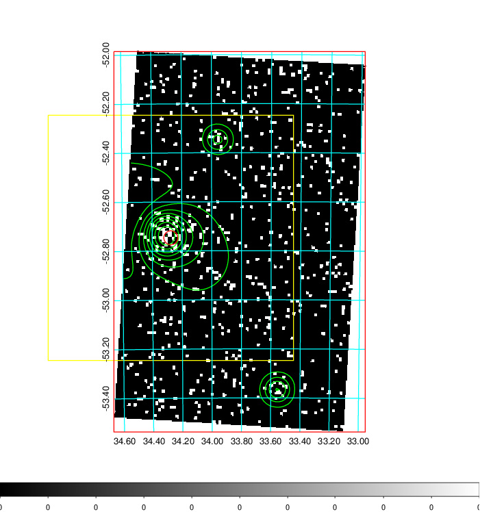  | 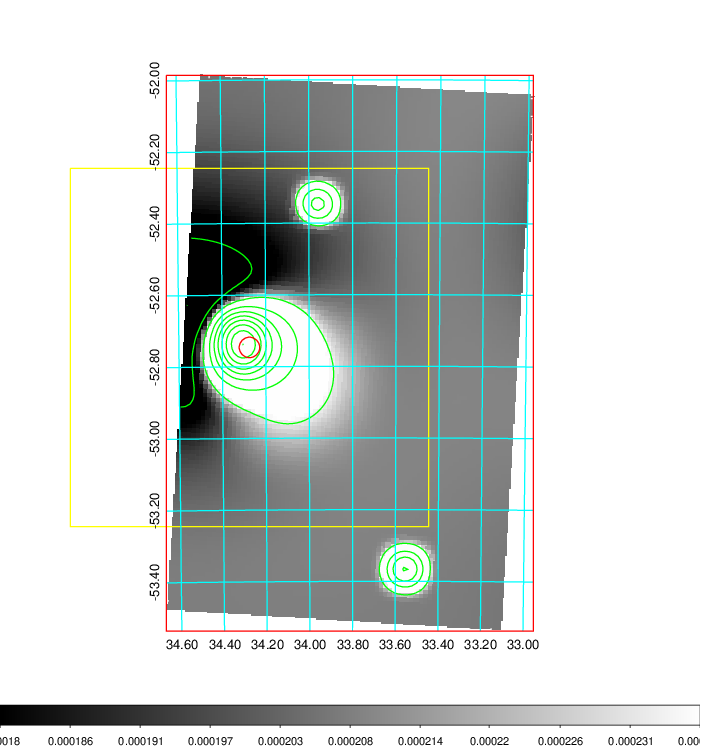   | 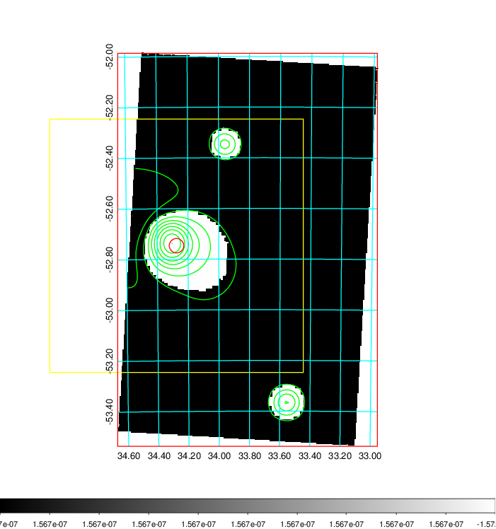  |

|[Exposure image](../image/99/99_mex.pdf)| [nH image](../image/99/99_nh.pdf)| [Planck image](../image/99/99_p.pdf)|
|-------------------|--------------------|-------------------|
|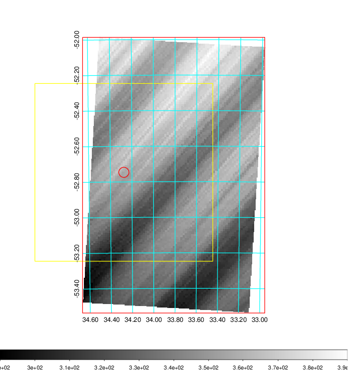   | 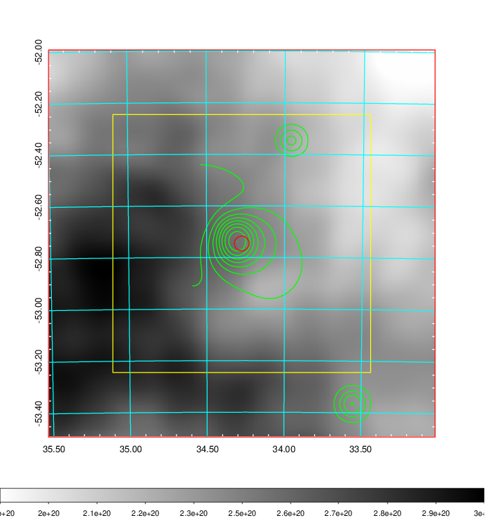    | 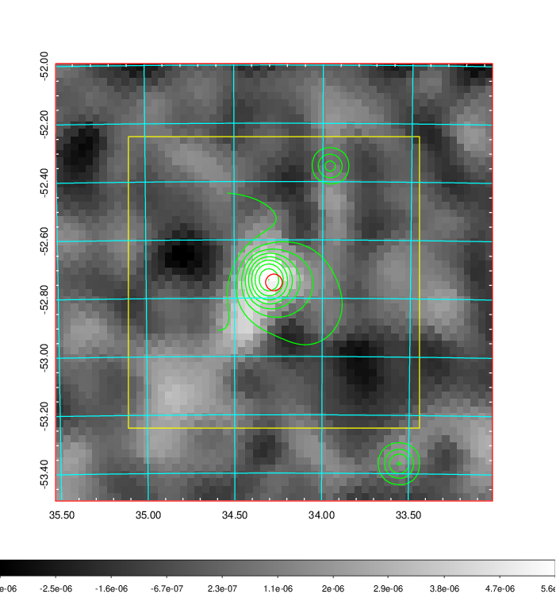 |

|[Redshift Histogram](../image/99/99_zg.pdf) | [DSS image(z1)](../image/99/99_dss_z1.pdf)      |  [DSS image(z2)](../image/99/99_dss_z2.pdf)    |
|-------------------|--------------------|-------------------|
|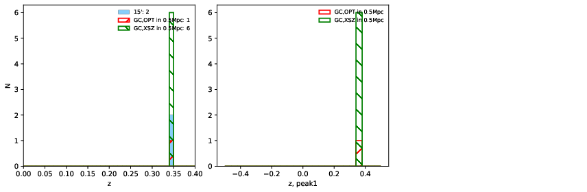 |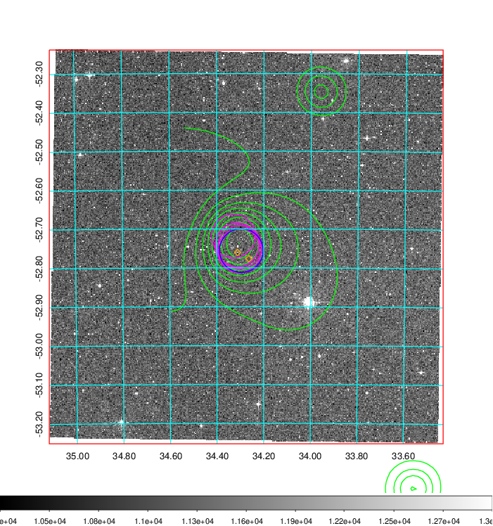  Blue circle for optical clusters;  Magenta circle for XSZ clusters;  all with r=1Mpc;  Only GC with Delta_z<0.01 are shown. | 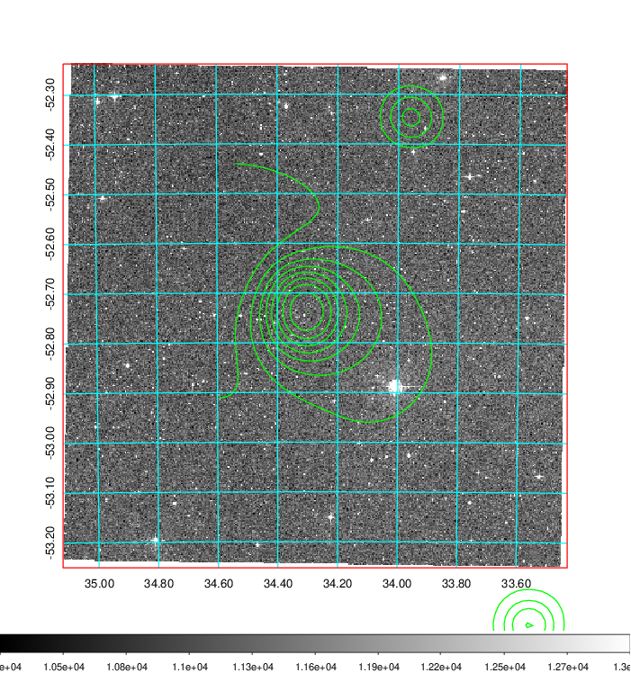 Blue circle for optical clusters;  Magenta circle for XSZ clusters;  all with r=1Mpc;  Only GC with Delta_z<0.01 are shown.  |

|[Previous-identified clusters](../image/99/99_gc.pdf) | [2MASS image](../image/99/99_2mass.pdf)      |
|-------------------|-------------------|
|  Green, magenta, and blue circles  for optical, X-ray and SZ clusters  respectively, with redshift of clusters  labelled. The radius of circles  are 1Mpc.|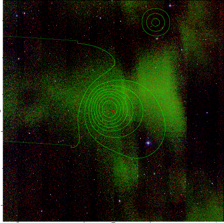  |

|[DES image](../image/99/99_des.pdf)   |
|-------------------|
| 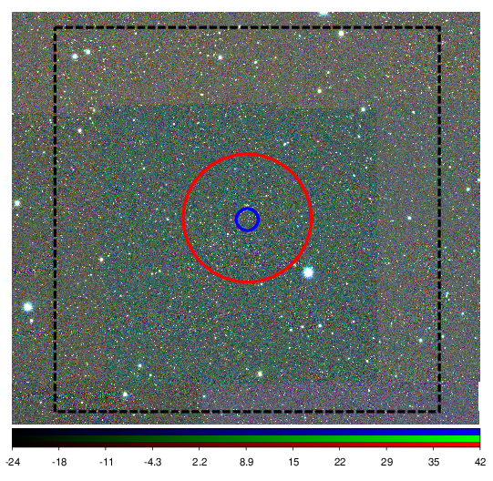  |
